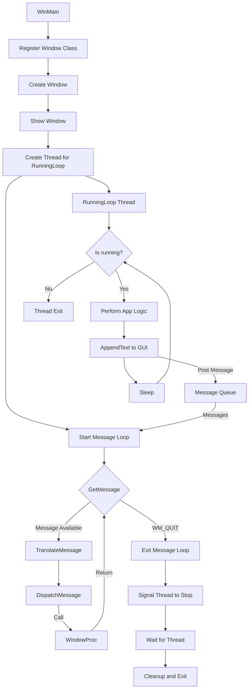

# Windows GUI Programming in C: A Comprehensive Guide

Certainly! I'll expand and update the Introduction to Windows GUI Programming section to better reflect the multi-threaded nature of the program and include more relevant concepts.

## 1. Introduction to Windows GUI Programming (Updated)

Windows GUI programming in C involves creating applications with graphical user interfaces using the Windows API (Application Programming Interface). This approach allows developers to create native Windows applications with custom windows, controls, and event handling. Modern Windows GUI applications often incorporate multi-threading to improve responsiveness and performance.

### Key Concepts:

1. **Window Procedure**: A callback function that processes messages for a window. It's the core of event handling in Windows GUI applications.

2. **Message Loop**: A loop that retrieves messages from the application's message queue and dispatches them to the appropriate window procedures. This runs in the main thread of the application.

3. **Window Class**: A structure that defines the properties of a window, including its window procedure.

4. **HWND**: A handle to a window, used to identify and manipulate windows. It's a key concept in the handle-based architecture of Windows.

5. **Messages**: Notifications sent by Windows or by the application itself to communicate events or request actions. These form the basis of the event-driven nature of Windows applications.

6. **Multi-threading**: The use of multiple threads of execution within a single application. This allows for concurrent processing and improved responsiveness.

7. **Thread Synchronization**: Mechanisms to coordinate the execution of multiple threads and manage access to shared resources.

8. **GUI Controls**: Pre-built user interface elements like buttons, text boxes, and edit controls that can be easily incorporated into applications.

9. **Device Context (DC)**: An abstraction representing a drawing surface and its associated attributes, used for all drawing operations.

10. **Resource Management**: Proper allocation and deallocation of Windows resources (handles, DCs, etc.) to prevent leaks and ensure efficient operation.

11. **Windows Styles and Extended Styles**: Flags that control the appearance and behavior of windows and controls.

### Advanced Concepts:

1. **Subclassing**: A technique to extend or modify the behavior of standard Windows controls.

2. **Custom Controls**: Creating entirely new types of controls for specialized functionality.

3. **DPI Awareness**: Ensuring the application displays correctly on high-DPI displays.

4. **Theming**: Applying visual styles to applications, including support for light and dark modes.

5. **Asynchronous I/O**: Performing input/output operations without blocking the main thread.

6. **Inter-Process Communication (IPC)**: Allowing different applications or processes to communicate and share data.

### Programming Model:

Windows GUI programming follows an event-driven, message-based model:

1. The application creates and registers a window class.
2. It creates one or more windows based on this class.
3. The main thread enters a message loop, continuously retrieving and dispatching messages.
4. The window procedure handles these messages, defining the application's behavior.
5. Concurrently, background threads can perform ongoing tasks, updating the GUI when necessary.

### Multi-threaded Considerations:

1. **Thread Safety**: Ensuring that shared resources are accessed safely from multiple threads.
2. **UI Thread vs. Worker Threads**: Keeping the UI responsive by offloading time-consuming tasks to worker threads.
3. **Thread Communication**: Using appropriate mechanisms (e.g., PostMessage, SendMessage) to communicate between threads.
4. **Synchronization Objects**: Utilizing mutexes, semaphores, and events to coordinate thread execution.

### Development Environment:

Windows GUI applications in C are typically developed using:
- Microsoft Visual Studio (most common)
- MinGW (Minimalist GNU for Windows)
- Other IDEs with Windows SDK support

The Windows SDK (Software Development Kit) provides the necessary headers, libraries, and tools for Windows development.

### Challenges and Considerations:

1. **Learning Curve**: The Windows API is vast and can be complex for beginners.
2. **Verbose Code**: Many operations require multiple API calls and extensive setup.
3. **Backward Compatibility**: Balancing the use of modern features with compatibility for older Windows versions.
4. **Memory Management**: Proper handling of dynamically allocated resources.
5. **Error Handling**: Robust error checking and handling for API calls.

By understanding these concepts and challenges, developers can create powerful, efficient, and responsive Windows GUI applications that take full advantage of the operating system's capabilities.

## 2. Program Flow

Here's a simplified diagram of the program flow:



#### Windows GUI Application Flow:

1. **Initialization Phase:**
   - WinMain function starts the application.
   - It registers the window class and creates the main window.
   - The window is then displayed.

2. **Thread Creation:**
   - A separate thread (RunningLoop) is created for background tasks.
   - This allows for concurrent processing alongside the GUI.

3. **Message Queue and Processing:**
   - The system-managed Message Queue is central to the application's event handling.
   - It receives messages from various sources:
     a. System-generated events (user input, system notifications)
     b. Application-generated messages (from the RunningLoop thread)

4. **Main Thread Operation:**
   - Enters the Message Loop, which continuously:
     a. Retrieves messages from the Queue (GetMessage)
     b. Translates certain messages (TranslateMessage)
     c. Dispatches messages to the appropriate Window Procedure (DispatchMessage)
   - The Window Procedure (WindowProc) handles these messages, defining the app's behavior.
   - This loop ensures the GUI remains responsive to user interactions.

5. **Background Thread Operation (RunningLoop):**
   - Runs concurrently with the main thread.
   - Performs ongoing application logic.
   - Periodically updates the GUI by posting messages to the Message Queue.
   - Uses synchronization mechanisms to safely interact with shared resources.

6. **Inter-thread Communication:**
   - The RunningLoop thread communicates with the GUI by posting messages to the Queue.
   - These messages are then processed by the main thread, ensuring thread-safe GUI updates.

7. **Application Termination:**
   - Triggered by a WM_QUIT message in the main thread.
   - The main thread signals the RunningLoop thread to stop.
   - It then waits for the RunningLoop to finish before final cleanup and exit.

This structure creates a responsive application capable of handling user interface events promptly while performing continuous background operations. The Message Queue acts as a central hub, coordinating communications between the system, the main thread, and the background thread, ensuring smooth and efficient operation of the Windows GUI application.
## 3. Key Components of the Program

### 3.1 WinMain Function

```c
int WINAPI WinMain(HINSTANCE hInstance, HINSTANCE hPrevInstance, LPSTR lpCmdLine, int nCmdShow)
```

This is the entry point for Windows GUI applications. It's equivalent to the `main()` function in console applications.

- `hInstance`: Handle to the current instance of the application.
- `hPrevInstance`: Always NULL in modern Windows (legacy parameter).
- `lpCmdLine`: Command line arguments.
- `nCmdShow`: Specifies how the window should be shown.

### 3.2 Window Class Registration

```c

// Initialize a WNDCLASS structure to zero. This sets all members to default values.
WNDCLASS wc = {};

// Set the window procedure for this window class.
// WindowProc is a function you define to handle messages for windows of this class.
wc.lpfnWndProc = WindowProc;

// Set the handle to the application instance.
// This is typically passed to your WinMain function.
wc.hInstance = hInstance;

// Set the name of the window class.
// This is a string that uniquely identifies this window class.
wc.lpszClassName = CLASS_NAME;

// Register the window class with the Windows system.
// This makes the class available for use when creating windows.
RegisterClass(&wc);
```

This defines the properties of the window, including the window procedure that will handle messages.

### 3.3 Window Creation

```c
HWND hwnd = CreateWindowEx(
    0,                  // Optional window styles
    CLASS_NAME,         // Window class
    "Window Title",     // Window text
    WS_OVERLAPPEDWINDOW, // Window style
    CW_USEDEFAULT, CW_USEDEFAULT, 800, 600, // Size and position
    NULL,       // Parent window    
    NULL,       // Menu
    hInstance,  // Instance handle
    NULL        // Additional application data
);
```

This creates an instance of the window based on the registered class.

### 3.4 Thread Creation

HANDLE hThread = CreateThread(NULL, 0, RunningLoop, NULL, 0, NULL);

This creates a separate thread to run the application's main logic, allowing it to operate independently of the GUI.
### 3.5 Message Loop

```c
MSG msg = {};
while (GetMessage(&msg, NULL, 0, 0))
{
    TranslateMessage(&msg);
    DispatchMessage(&msg);
}
```

- `MSG msg` = {}: Initializes a MSG structure to hold message information.
```c
typedef struct tagMSG {
    HWND   hwnd;     // Handle to the window that received the message
    UINT   message;  // Message identifier (e.g., WM_PAINT, WM_CLOSE)
    WPARAM wParam;   // Additional message-specific information
    LPARAM lParam;   // Additional message-specific information
    DWORD  time;     // Time at which the message was posted
    POINT  pt;       // Cursor position (in screen coordinates) when the message was posted
} MSG, *PMSG, *NPMSG, *LPMSG;
```

- `GetMessage(&msg, NULL, 0, 0)`:
	
	- Retrieves a message from the thread's message queue.
	
	- **Parameters**:
		- &msg: Pointer to MSG structure to receive message.
		- NULL: Handle to window whose messages are to be retrieved (NULL for all windows).
		- 0, 0: Range of message values to be retrieved (0, 0 for all messages).

- `TranslateMessage(&msg)`:

	- Translates virtual-key messages into character messages.

	- **Parameter**: 
		- Pointer to MSG structure containing message to translate.
		- Important for handling keyboard input, generating WM_CHAR messages.

- `DispatchMessage(&msg)`:

	- Dispatches a message to the appropriate window procedure.

	- **Parameter**: 
		- Pointer to MSG structure containing message to dispatch.
		- This is what actually calls your WindowProc function.

This loop retrieves messages from the application's message queue and dispatches them to the appropriate window procedure.

### 3.6 Window Procedure

```c
LRESULT CALLBACK WindowProc(HWND hwnd, UINT uMsg, WPARAM wParam, LPARAM lParam)
{
    switch (uMsg)
    {
        case WM_CREATE:
            // Window creation code
            return 0;
        case WM_DESTROY:
            PostQuitMessage(0);
            return 0;
        // ... other message handlers ...
    }
    return DefWindowProc(hwnd, uMsg, wParam, lParam);
}
```

- LRESULT: Return type, a 32-bit value returned by the window procedure.

- CALLBACK: Calling convention for Windows callback functions.

- **Parameters**:
	- HWND hwnd: Handle to the window.
	- UINT uMsg: Message identifier.
	- WPARAM wParam: Additional message-specific information.
	- LPARAM lParam: Additional message-specific information.

#### Inside WindowProc:

- `PostQuitMessage(0)`:
	- Posts a WM_QUIT message to the thread's message queue.
	- **Parameter**: 
		- Exit code (0 in this case).
		- Used to terminate the message loop and exit the application.

- `DefWindowProc(hwnd, uMsg, wParam, lParam)`:
	- Default window procedure that provides default processing for messages.
	- **Parameters** are the same as those received by WindowProc.
		- Handles messages not processed by your window procedure.

This function handles messages sent to the window. It's where you define how your application responds to various events.
### 3.7 RunningLoop Function

```c
DWORD WINAPI RunningLoop(LPVOID lpParam)
{
    while (running)
    {
        AppendText(hEdit, "\tMain code is Running\n");
        Sleep(1000); // Wait for 1 second
    }
    return 0;
}
```


This function runs in a separate thread, performing the application's main logic and updating the GUI periodically.

### 3.8 AppendText Function

```c
void AppendText(HWND hEdit, const char *newText)
{
    // ... (implementation details)
}
```

This function safely updates the GUI from the background thread, handling the necessary text formatting and buffer management.
## 4. Simplified Example with Color and Font Changes

Here's a minimal example that creates a window with a custom background color and font:

```c
#include <windows.h>

LRESULT CALLBACK WindowProc(HWND hwnd, UINT uMsg, WPARAM wParam, LPARAM lParam);

int WINAPI WinMain(HINSTANCE hInstance, HINSTANCE hPrevInstance, LPSTR lpCmdLine, int nCmdShow)
{
    // Register the window class
    const char CLASS_NAME[] = "Sample Window Class";
    
    WNDCLASS wc = {};
    wc.lpfnWndProc = WindowProc;
    wc.hInstance = hInstance;
    wc.lpszClassName = CLASS_NAME;
    RegisterClass(&wc);

    // Create the window
    HWND hwnd = CreateWindowEx(
        0,                              // Optional window styles
        CLASS_NAME,                     // Window class
        "Sample Window",                // Window text
        WS_OVERLAPPEDWINDOW,            // Window style
        CW_USEDEFAULT, CW_USEDEFAULT, 800, 600, // Size and position
        NULL,       // Parent window    
        NULL,       // Menu
        hInstance,  // Instance handle
        NULL        // Additional application data
    );

    if (hwnd == NULL) return 0;

    ShowWindow(hwnd, nCmdShow);

    // Run the message loop
    MSG msg = {};
    while (GetMessage(&msg, NULL, 0, 0))
    {
        TranslateMessage(&msg);
        DispatchMessage(&msg);
    }

    return 0;
}

LRESULT CALLBACK WindowProc(HWND hwnd, UINT uMsg, WPARAM wParam, LPARAM lParam)
{
    switch (uMsg)
    {
        case WM_DESTROY:
            PostQuitMessage(0);
            return 0;

        case WM_PAINT:
        {
            PAINTSTRUCT ps;
            HDC hdc = BeginPaint(hwnd, &ps);

            // Set background color
            SetBkColor(hdc, RGB(200, 220, 240)); // Light blue background

            // Set text color and font
            SetTextColor(hdc, RGB(0, 0, 0)); // Black text
            HFONT hFont = CreateFont(24, 0, 0, 0, FW_NORMAL, FALSE, FALSE, FALSE, 
                                     DEFAULT_CHARSET, OUT_OUTLINE_PRECIS, CLIP_DEFAULT_PRECIS, 
                                     CLEARTYPE_QUALITY, DEFAULT_PITCH | FF_DONTCARE, "Arial");
            SelectObject(hdc, hFont);

            // Draw some text
            TextOut(hdc, 10, 10, "Hello, Windows!", 15);

            EndPaint(hwnd, &ps);
            DeleteObject(hFont);
        }
        return 0;
    }
    return DefWindowProc(hwnd, uMsg, wParam, lParam);
}
```

This example demonstrates:
- Creating a basic window
- Setting a custom background color
- Changing the font and text color
- Drawing text on the window

## 5. Concepts Behind Windows GUI Programming

### 5.1 Event-Driven Programming

Windows GUI programming is event-driven. Instead of a linear flow, the program responds to events (messages) as they occur. This is why the message loop and window procedure are central to Windows applications.

### 5.2 Handle-Based Architecture

Windows uses handles (like `HWND`, `HDC`) to represent various objects. This abstraction allows Windows to manage resources efficiently and provide a consistent interface for different types of objects.

### 5.3 Device Context (DC)

The DC is an abstraction that represents a drawing surface and its associated attributes. It's used for all drawing operations in Windows.

### 5.4 WINAPI and Callback Functions

The Windows API is designed around callback functions. The window procedure is a prime example of this - you define the function, but Windows calls it when needed.

### 5.5 Multi-threaded Programming

Windows GUI applications often use multiple threads to improve responsiveness. The main thread handles GUI events, while background threads perform time-consuming operations. This requires careful synchronization to avoid race conditions and ensure thread-safe access to shared resources.

### 5.6 Inter-thread Communication
In multi-threaded applications, different threads need to communicate. This can be done through various mechanisms:

- Shared variables (with proper synchronization)
- Windows messages
- Synchronization objects (e.g., events, mutexes)

### 5.7 GUI Update from Background Threads

Updating GUI elements from background threads requires special care. Windows GUI controls are generally not thread-safe, so updates should be marshaled to the main thread, often using functions like PostMessage or SendMessage.

## 6. Advanced Concepts in the Original Program (Updated)

### 6.1 Multi-threading

The program uses a separate thread for the running loop, demonstrating a common pattern in Windows GUI applications:

```c
HANDLE hThread = CreateThread(NULL, 0, RunningLoop, NULL, 0, NULL);
```

This allows for continuous background operations without freezing the UI. The `RunningLoop` function runs in this separate thread, periodically updating the GUI.

### 6.2 Thread Synchronization

The program uses a global boolean variable `running` to control the execution of the background thread:

```c
bool running = true;
// ... later in the code ...
running = false; // Signal the running loop to stop
```

While simple, this approach requires careful consideration of memory visibility and potential race conditions in more complex scenarios.

### 6.3 Safe GUI Updates from Background Threads

The `AppendText` function is designed to safely update the GUI from the background thread. It uses `SetWindowText` to update the entire content of the edit control, which is generally safe to call from any thread.

### 6.4 Rich Edit Control

The program uses a Rich Edit control (`RICHEDIT50W`) which provides more advanced text handling capabilities than a standard edit control.

### 6.5 Dark Mode

The program implements a dark mode using `DwmSetWindowAttribute`:

```c
DwmSetWindowAttribute(hwnd, DWMWA_USE_IMMERSIVE_DARK_MODE, &value, sizeof(value));
```

This is a more modern Windows feature for creating dark-themed applications.

### 6.6 Text Buffer Management

The program maintains a text buffer to store the entire content of the edit control:

```c
char textBuffer[1024 * 10] = "";
```

This allows for efficient updates and scrolling, as the entire text doesn't need to be retrieved from the control each time it's updated.

### 6.7 Custom Message Formatting

The `AppendText` function includes custom logic to format messages, converting single newlines to carriage return + newline pairs:

```c
if (newText[i] == '\n')
{
    formattedText[j++] = '\r';
    formattedText[j++] = '\n';
}
```

This ensures proper line breaks in the Windows edit control.

Windows GUI programming in C offers powerful capabilities for creating native applications with fine-grained control over behavior and appearance. It combines event-driven programming, multi-threading, and the Windows API to create responsive and efficient software. While it requires understanding Windows-specific concepts and APIs, differing from standard C programming, these elements are crucial for developing sophisticated applications. Developers must navigate challenges like thread synchronization, safe GUI updates, and resource management. Despite a steep learning curve, mastering these concepts enables the creation of high-performance, customized Windows applications that fully leverage the operating system's capabilities.