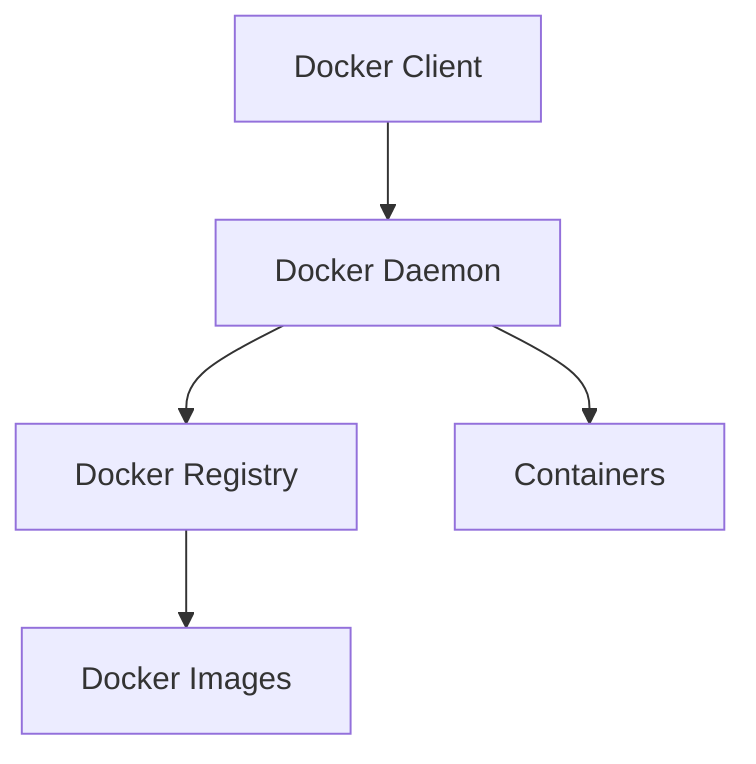

# Comprehensive Docker Learning Path: Beginner to Advanced

This guide provides a structured approach to learning Docker, covering fundamental concepts to advanced topics. Each section includes detailed explanations, commands with options, and practical examples. The guide also explores Docker integration with Docker Compose, Kubernetes, AWS, and covers essential topics like volumes, networking, and caching.

---

## Table of Contents

1. [Introduction to Docker](#1-introduction-to-docker)
2. [Installing Docker](#2-installing-docker)
3. [Basic Docker Concepts](#3-basic-docker-concepts)
4. [Working with Docker Images and Containers](#4-working-with-docker-images-and-containers)
5. [Dockerfile: Building Custom Images](#5-dockerfile-building-custom-images)
6. [Docker Compose: Managing Multi-Container Applications](#6-docker-compose-managing-multi-container-applications)
7. [Docker Networking](#7-docker-networking)
8. [Docker Volumes](#8-docker-volumes)
9. [Docker Caching and Optimization](#9-docker-caching-and-optimization)
10. [Orchestrating Docker with Kubernetes](#10-orchestrating-docker-with-kubernetes)
11. [Docker on AWS](#11-docker-on-aws)
12. [Advanced Docker Commands and Techniques](#12-advanced-docker-commands-and-techniques)
13. [Best Practices and Security](#13-best-practices-and-security)
14. [Common Pitfalls and Troubleshooting](#14-common-pitfalls-and-troubleshooting)
15. [Additional Resources](#15-additional-resources)

---

## 1. Introduction to Docker

### What is Docker?

**Docker** is an open-source platform that automates the deployment, scaling, and management of applications within lightweight, portable containers. Containers encapsulate an application and its dependencies, ensuring consistency across different environments.

### Why Use Docker?

- **Consistency**: Ensures applications run the same in development, testing, and production.
- **Isolation**: Encapsulates applications, preventing conflicts between dependencies.
- **Portability**: Containers can run on any system that supports Docker.
- **Scalability**: Easily scale applications horizontally by deploying multiple container instances.
- **Efficiency**: Containers share the host OS, making them lightweight and faster to start compared to virtual machines.

### Docker vs. Virtual Machines

| Feature         | Docker Containers                           | Virtual Machines                          |
|-----------------|---------------------------------------------|-------------------------------------------|
| **Isolation**   | OS-level isolation using namespaces         | Hardware-level isolation using hypervisors|
| **Performance** | Near-native performance                     | Overhead due to hypervisor                 |
| **Size**        | Lightweight (typically MBs)                 | Heavyweight (typically GBs)               |
| **Startup Time**| Seconds                                     | Minutes                                   |

---

## 2. Installing Docker

### Installing Docker on Windows

Docker provides **Docker Desktop** for Windows, which includes Docker Engine, Docker CLI, Docker Compose, and other essential tools.

#### Steps to Install Docker Desktop on Windows

1. **System Requirements**:
   - Windows 10 64-bit: Pro, Enterprise, or Education (Build 15063 or later).
   - Virtualization enabled in BIOS.

2. **Download Docker Desktop**:
   - Visit the [Docker Desktop for Windows](https://www.docker.com/products/docker-desktop/) page.
   - Click **Download for Windows**.

3. **Run the Installer**:
   - Execute the downloaded installer (`Docker Desktop Installer.exe`).
   - Follow the installation wizard instructions.

4. **Post-Installation Steps**:
   - **Enable WSL 2 Integration** (Recommended):
     - Docker Desktop leverages **Windows Subsystem for Linux 2 (WSL 2)** for better performance and compatibility.
     - Follow Docker's [WSL 2 installation guide](https://docs.microsoft.com/en-us/windows/wsl/install-win10) if not already set up.
   - **Start Docker Desktop**:
     - Launch Docker Desktop from the Start menu.
     - Complete any initial setup prompts.

5. **Verify Installation**:
   - Open **PowerShell** or **Command Prompt**.
   - Run:
     ```bash
     docker --version
     ```
   - Expected Output:
     ```bash
     Docker version 24.0.1, build code
     ```

### File Path: `C:\Program Files\Docker\Docker`

---

## 3. Basic Docker Concepts

### Images and Containers

- **Docker Image**: A read-only template containing application code, libraries, dependencies, and settings. Images are the blueprint for containers.
  
- **Docker Container**: A runnable instance of an image. Containers are isolated from each other and the host system but share the OS kernel.

### Docker Registries

- **Docker Hub**: The default public registry where Docker images are stored and shared.
  
- **Private Registries**: Organizations can host private registries for internal use.

### Docker Architecture

1. **Docker Client**: The interface users interact with (CLI or GUI).
2. **Docker Daemon**: The background service managing Docker objects.
3. **Docker Registries**: Storage and distribution systems for images.



---

## 4. Working with Docker Images and Containers

### Pulling Images from Docker Hub

```bash
docker pull <image_name>:<tag>
```

**Example**:
```bash
docker pull ubuntu:20.04
```

**Explanation**:
- **`ubuntu`**: Name of the image.
- **`20.04`**: Tag specifying the version.

**Common Options**:
- `--all-tags` or `-a`: Download all tagged images in the repository.

### Listing Images

```bash
docker images
```

**Output Columns**:
- **REPOSITORY**: Image name.
- **TAG**: Image tag.
- **IMAGE ID**: Unique identifier.
- **CREATED**: Time since the image was created.
- **SIZE**: Image size.

### Removing Images

```bash
docker rmi <image_name>:<tag>
```

**Example**:
```bash
docker rmi ubuntu:20.04
```

**Options**:
- `-f`, `--force`: Force removal of the image.

### Running Containers

```bash
docker run [OPTIONS] <image_name>:<tag> [COMMAND] [ARG...]
```

**Example**:
```bash
docker run -it ubuntu:20.04 /bin/bash
```

**Explanation**:
- `-i`: Interactive mode.
- `-t`: Allocate a pseudo-TTY.
- `/bin/bash`: Command to execute inside the container.

**Common Options**:
- `-d`, `--detach`: Run container in background.
- `--name`: Assign a name to the container.
- `-p`, `--publish`: Map container ports to host.
- `-v`, `--volume`: Mount a volume.
- `--env`: Set environment variables.

### Listing Containers

```bash
docker ps [OPTIONS]
```

**Options**:
- `-a`, `--all`: Show all containers (default shows just running).
- `--filter`: Filter output based on conditions.
- `--format`: Format output using a Go template.

**Example**:
```bash
docker ps -a
```

### Stopping and Removing Containers

#### Stopping a Container

```bash
docker stop <container_id_or_name>
```

**Example**:
```bash
docker stop my_ubuntu
```

#### Removing a Container

```bash
docker rm <container_id_or_name>
```

**Example**:
```bash
docker rm my_ubuntu
```

**Options**:
- `-f`, `--force`: Force removal (stops the container if running).

### Viewing Logs

```bash
docker logs <container_id_or_name>
```

**Options**:
- `-f`, `--follow`: Follow log output.
- `--tail`: Show the last N lines.

**Example**:
```bash
docker logs -f my_container
```

### Executing Commands in Running Containers

```bash
docker exec [OPTIONS] <container_id_or_name> <command>
```

**Example**:
```bash
docker exec -it my_container /bin/bash
```

**Options**:
- `-i`: Interactive.
- `-t`: Allocate a pseudo-TTY.

---

## 5. Dockerfile: Building Custom Images

### What is a Dockerfile?

A **Dockerfile** is a script containing a series of instructions to build a Docker image. It automates the image creation process, ensuring reproducibility.

### Basic Structure of a Dockerfile

```dockerfile
# Base image
FROM <base_image>:<tag>

# Maintainer information
LABEL maintainer="<name> <email>"

# Working directory
WORKDIR /app

# Copy files
COPY . /app

# Install dependencies
RUN <command>

# Expose ports
EXPOSE <port>

# Define environment variables
ENV <key>=<value>

# Specify the command to run
CMD ["executable", "param1", "param2"]
```

### Example Dockerfile

**File Path**: `./Dockerfile`

```dockerfile
# Dockerfile: Defines the Docker image for a Node.js application

# Use the official Node.js LTS image as the base
FROM node:18-alpine

# Set the working directory
WORKDIR /usr/src/app

# Copy package.json and package-lock.json
COPY package*.json ./

# Install dependencies
RUN npm install

# Copy the rest of the application code
COPY . .

# Expose port 3000
EXPOSE 3000

# Define environment variable
ENV NODE_ENV=production

# Start the application
CMD ["node", "app.js"]
```

### Building an Image from a Dockerfile

```bash
docker build [OPTIONS] -t <image_name>:<tag> <path>
```

**Example**:
```bash
docker build -t my_node_app:1.0 .
```

**Explanation**:
- `-t my_node_app:1.0`: Tags the image with name `my_node_app` and tag `1.0`.
- `.`: Context path (current directory).

**Common Options**:
- `-f`, `--file`: Specify a Dockerfile name/path.
- `--no-cache`: Build without using cache.
- `--build-arg`: Set build-time variables.

### Running the Custom Image

```bash
docker run -d -p 3000:3000 --name my_node_container my_node_app:1.0
```

**Explanation**:
- `-d`: Run in detached mode.
- `-p 3000:3000`: Map host port 3000 to container port 3000.
- `--name my_node_container`: Assign a name to the container.

### Dockerfile Commands Explained

- **FROM**: Specifies the base image.
- **LABEL**: Adds metadata to the image.
- **WORKDIR**: Sets the working directory inside the container.
- **COPY**: Copies files/directories from the host to the container.
- **RUN**: Executes commands during the image build.
- **EXPOSE**: Documents the ports the container listens on.
- **ENV**: Sets environment variables.
- **CMD**: Specifies the default command to run when the container starts.

---

## 6. Docker Compose: Managing Multi-Container Applications

### What is Docker Compose?

**Docker Compose** is a tool for defining and managing multi-container Docker applications. It uses a YAML file (`docker-compose.yml`) to configure the application's services, networks, and volumes.

### Installing Docker Compose

Docker Desktop includes Docker Compose. To verify the installation:

```bash
docker-compose --version
```

**Expected Output**:
```bash
docker-compose version 2.20.2, build <build_id>
```

### Basic Structure of `docker-compose.yml`

```yaml
version: '3.8'

services:
  <service_name>:
    image: <image_name>:<tag>
    build:
      context: <build_context>
      dockerfile: <Dockerfile_path>
    ports:
      - "<host_port>:<container_port>"
    environment:
      - KEY=VALUE
    volumes:
      - <host_path>:<container_path>
    networks:
      - <network_name>

networks:
  <network_name>:
    driver: <driver_type>

volumes:
  <volume_name>:
```

### Example `docker-compose.yml`

**File Path**: `./docker-compose.yml`

```yaml
version: '3.8'

services:
  web:
    build:
      context: .
      dockerfile: Dockerfile
    ports:
      - "3000:3000"
    environment:
      - NODE_ENV=development
    volumes:
      - .:/usr/src/app
      - /usr/src/app/node_modules
    networks:
      - app-network

  redis:
    image: redis:6-alpine
    ports:
      - "6379:6379"
    networks:
      - app-network

networks:
  app-network:
    driver: bridge

volumes:
  node_modules:
```

### Commands

#### Starting Services

```bash
docker-compose up
```

**Options**:
- `-d`, `--detach`: Run containers in the background.
- `--build`: Build images before starting containers.

**Example**:
```bash
docker-compose up -d --build
```

#### Stopping Services

```bash
docker-compose down
```

**Options**:
- `--volumes`: Remove named volumes declared in the `volumes` section.
- `--rmi`: Remove images (`all` or `local`).

**Example**:
```bash
docker-compose down --volumes --rmi all
```

#### Viewing Logs

```bash
docker-compose logs [OPTIONS] [SERVICE...]
```

**Options**:
- `-f`, `--follow`: Follow log output.
- `--tail`: Number of lines to show from the end.

**Example**:
```bash
docker-compose logs -f web
```

#### Executing Commands in Services

```bash
docker-compose exec <service_name> <command>
```

**Example**:
```bash
docker-compose exec web /bin/bash
```

**Explanation**:
- Opens a bash shell in the `web` service container.

### Scaling Services

```bash
docker-compose up --scale <service>=<number>
```

**Example**:
```bash
docker-compose up -d --scale web=3
```

**Explanation**:
- Scales the `web` service to 3 instances.

### Docker Compose Commands Summary

| Command                      | Description                                       |
|------------------------------|---------------------------------------------------|
| `docker-compose up`          | Start services defined in the YAML file.          |
| `docker-compose down`        | Stop and remove containers, networks, images.     |
| `docker-compose build`       | Build or rebuild services.                        |
| `docker-compose ps`          | List containers managed by Compose.               |
| `docker-compose restart`     | Restart services.                                 |
| `docker-compose kill`        | Force stop services.                              |
| `docker-compose rm`          | Remove stopped service containers.               |

---

## 7. Docker Networking

### Docker Network Types

1. **Bridge Network**:
   - Default network type for standalone containers.
   - Suitable for local development.

2. **Host Network**:
   - Removes network isolation; container shares the host's network stack.
   - Only available on Linux.

3. **Overlay Network**:
   - Enables communication between containers across multiple Docker hosts.
   - Requires Docker Swarm or Kubernetes.

4. **Macvlan Network**:
   - Assigns a MAC address to a container, making it appear as a physical device on the network.
   - Useful for legacy applications that expect physical network interfaces.

### Creating Networks

#### Bridge Network

```bash
docker network create <network_name>
```

**Example**:
```bash
docker network create my_bridge_network
```

**Options**:
- `--driver`: Specify the network driver (default is bridge).
- `--subnet`: Specify a custom subnet.

#### Overlay Network

Requires Docker Swarm:

1. **Initialize Swarm**:
   ```bash
   docker swarm init
   ```

2. **Create Overlay Network**:
   ```bash
   docker network create -d overlay my_overlay_network
   ```

### Listing Networks

```bash
docker network ls
```

### Inspecting Networks

```bash
docker network inspect <network_name>
```

**Example**:
```bash
docker network inspect my_bridge_network
```

### Connecting Containers to Networks

```bash
docker network connect <network_name> <container_id_or_name>
```

**Example**:
```bash
docker network connect my_bridge_network my_container
```

### Disconnecting Containers from Networks

```bash
docker network disconnect <network_name> <container_id_or_name>
```

**Example**:
```bash
docker network disconnect my_bridge_network my_container
```

### DNS Resolution in Docker Networks

Docker provides built-in DNS resolution within networks. Containers can communicate using their service names.

**Example**:

- **docker-compose.yml**
  ```yaml
  services:
    web:
      image: my_web_app
      networks:
        - app-network

    db:
      image: postgres
      networks:
        - app-network

  networks:
    app-network:
      driver: bridge
  ```

- **Usage**:
  - The `web` service can connect to the `db` service using the hostname `db`.

---

## 8. Docker Volumes

### What are Docker Volumes?

**Docker Volumes** are the preferred mechanism for persisting data generated by and used by Docker containers. They are managed by Docker and provide better performance and flexibility compared to bind mounts.

### Types of Volumes

1. **Named Volumes**:
   - Managed by Docker with a specific name.
   - Stored in Docker's designated directory (`/var/lib/docker/volumes/` on Linux).

2. **Anonymous Volumes**:
   - No specific name assigned; used for short-term storage.

3. **Bind Mounts**:
   - Mount a filesystem path from the host into the container.
   - Useful for development purposes.

### Creating and Managing Volumes

#### Creating a Volume

```bash
docker volume create <volume_name>
```

**Example**:
```bash
docker volume create my_data_volume
```

#### Listing Volumes

```bash
docker volume ls
```

#### Inspecting a Volume

```bash
docker volume inspect <volume_name>
```

**Example**:
```bash
docker volume inspect my_data_volume
```

#### Removing a Volume

```bash
docker volume rm <volume_name>
```

**Example**:
```bash
docker volume rm my_data_volume
```

**Options**:
- `-f`, `--force`: Force removal even if in use.

### Using Volumes in Docker Run

```bash
docker run -d -v <volume_name>:<container_path> <image_name>
```

**Example**:
```bash
docker run -d -v my_data_volume:/usr/src/app/data my_app:1.0
```

**Explanation**:
- Mounts `my_data_volume` to `/usr/src/app/data` inside the container.

### Using Volumes in Docker Compose

**File Path**: `./docker-compose.yml`

```yaml
version: '3.8'

services:
  web:
    image: my_web_app
    volumes:
      - my_data_volume:/usr/src/app/data

volumes:
  my_data_volume:
```

### Bind Mounts vs. Volumes

| Feature          | Bind Mounts                            | Volumes                                  |
|------------------|----------------------------------------|------------------------------------------|
| **Path Specification** | Host machine path (`/path/on/host`) | Docker managed (`volume_name`)           |
| **Use Case**     | Development, accessing host files      | Data persistence, decoupling data from container|
| **Performance**  | Generally slower due to filesystem differences | Optimized by Docker                        |
| **Management**   | Requires manual handling               | Managed via Docker CLI                    |

### Example: Bind Mount

```bash
docker run -d -v C:\Users\Username\app\data:/usr/src/app/data my_app:1.0
```

**Explanation**:
- Maps `C:\Users\Username\app\data` on Windows to `/usr/src/app/data` in the container.

---

## 9. Docker Caching and Optimization

### Understanding Docker Caching

Docker uses a **layered filesystem** for images, where each instruction in the Dockerfile creates a new layer. Docker caches these layers to speed up the build process. Proper ordering of instructions can optimize cache usage.

### Optimizing Dockerfile for Caching

1. **Order Instructions Appropriately**:
   - Place instructions that change less frequently at the top.
   - Example: Install dependencies before copying application code.

2. **Minimize Number of Layers**:
   - Combine multiple commands using `&&`.
   - Example:
     ```dockerfile
     RUN apt-get update && apt-get install -y \
         package1 \
         package2
     ```

3. **Leverage .dockerignore**:
   - Exclude unnecessary files from the build context to speed up builds.

**File Path**: `./.dockerignore`

```dockerignore
node_modules
*.log
.git
```

### Build Cache Management

#### Clearing the Build Cache

```bash
docker builder prune
```

**Options**:
- `-a`, `--all`: Remove all unused cache.
- `--filter`: Provide conditions to prune.

**Example**:
```bash
docker builder prune -a --filter "until=24h"
```

#### Viewing Build Cache

```bash
docker builder df
```

**Explanation**:
- Shows disk usage by the build cache.

### Multi-Stage Builds

**Purpose**: Reduce image size by separating build-time and runtime dependencies.

**Example Dockerfile**:

**File Path**: `./Dockerfile`

```dockerfile
# Builder Stage
FROM node:18-alpine AS builder
WORKDIR /app
COPY package*.json ./
RUN npm install
COPY . .
RUN npm run build

# Production Stage
FROM nginx:alpine
COPY --from=builder /app/build /usr/share/nginx/html
EXPOSE 80
CMD ["nginx", "-g", "daemon off;"]
```

**Explanation**:
- **Builder Stage**:
  - Builds the application using Node.js.
- **Production Stage**:
  - Copies the built application into an Nginx image.
  - Only the necessary artifacts are included, resulting in a smaller image.

### Example: Optimizing a Node.js Application

**File Path**: `./Dockerfile`

```dockerfile
# Stage 1: Build
FROM node:18-alpine AS builder
WORKDIR /app
COPY package*.json ./
RUN npm install --production
COPY . .
RUN npm run build

# Stage 2: Serve
FROM nginx:alpine
COPY --from=builder /app/build /usr/share/nginx/html
EXPOSE 80
CMD ["nginx", "-g", "daemon off;"]
```

**Benefits**:
- Reduces image size by excluding development dependencies.
- Separates build and runtime environments for better security and efficiency.

---

## 10. Orchestrating Docker with Kubernetes

### What is Kubernetes?

**Kubernetes** is an open-source container orchestration platform for automating deployment, scaling, and management of containerized applications.

### Key Kubernetes Concepts

1. **Cluster**: A set of nodes (machines) running containerized applications managed by Kubernetes.
2. **Node**: A single machine in the cluster (can be virtual or physical).
3. **Pod**: The smallest deployable unit, containing one or more containers.
4. **Deployment**: Manages the desired state for pods, ensuring the correct number are running.
5. **Service**: Abstracts a set of pods, providing stable networking and load balancing.
6. **Namespace**: Logical partitions within a cluster for organizing resources.

### Installing Kubernetes

For development purposes, Docker Desktop includes Kubernetes integration.

#### Enabling Kubernetes in Docker Desktop

1. **Open Docker Desktop**.
2. **Settings**: Click the gear icon.
3. **Kubernetes**: Navigate to the Kubernetes tab.
4. **Enable Kubernetes**: Check the box.
5. **Apply & Restart**: Click to apply changes.

### Basic Kubernetes Commands

#### Viewing Cluster Information

```bash
kubectl cluster-info
```

#### Listing Nodes

```bash
kubectl get nodes
```

#### Listing Pods

```bash
kubectl get pods
```

#### Creating a Deployment

```bash
kubectl create deployment <deployment_name> --image=<image_name>:<tag>
```

**Example**:
```bash
kubectl create deployment my_app --image=my_node_app:1.0
```

#### Exposing a Deployment as a Service

```bash
kubectl expose deployment <deployment_name> --type=LoadBalancer --port=<port>
```

**Example**:
```bash
kubectl expose deployment my_app --type=LoadBalancer --port=3000
```

#### Applying Configuration from YAML

```bash
kubectl apply -f <file_path>
```

**Example**:
```bash
kubectl apply -f deployment.yaml
```

#### Deleting Resources

```bash
kubectl delete -f <file_path>
```

**Example**:
```bash
kubectl delete -f deployment.yaml
```

### Example Kubernetes Deployment

**File Path**: `./k8s/deployment.yaml`

```yaml
apiVersion: apps/v1
kind: Deployment
metadata:
  name: my-node-app
spec:
  replicas: 3
  selector:
    matchLabels:
      app: my-node-app
  template:
    metadata:
      labels:
        app: my-node-app
    spec:
      containers:
        - name: my-node-container
          image: my_node_app:1.0
          ports:
            - containerPort: 3000
          env:
            - name: NODE_ENV
              value: "production"
          volumeMounts:
            - name: app-data
              mountPath: /usr/src/app/data
      volumes:
        - name: app-data
          persistentVolumeClaim:
            claimName: app-pvc
```

**File Path**: `./k8s/service.yaml`

```yaml
apiVersion: v1
kind: Service
metadata:
  name: my-node-service
spec:
  type: LoadBalancer
  ports:
    - port: 80
      targetPort: 3000
  selector:
    app: my-node-app
```

**File Path**: `./k8s/pvc.yaml`

```yaml
apiVersion: v1
kind: PersistentVolumeClaim
metadata:
  name: app-pvc
spec:
  accessModes:
    - ReadWriteOnce
  resources:
    requests:
      storage: 1Gi
```

### Deploying to Kubernetes

1. **Apply PersistentVolumeClaim**:
   ```bash
   kubectl apply -f k8s/pvc.yaml
   ```

2. **Apply Deployment**:
   ```bash
   kubectl apply -f k8s/deployment.yaml
   ```

3. **Apply Service**:
   ```bash
   kubectl apply -f k8s/service.yaml
   ```

4. **Verify Deployment**:
   ```bash
   kubectl get deployments
   kubectl get pods
   kubectl get services
   ```

### Scaling a Deployment

```bash
kubectl scale deployment <deployment_name> --replicas=<number>
```

**Example**:
```bash
kubectl scale deployment my-node-app --replicas=5
```

### Updating a Deployment

```bash
kubectl set image deployment/<deployment_name> <container_name>=<new_image>:<tag>
```

**Example**:
```bash
kubectl set image deployment/my-node-app my-node-container=my_node_app:2.0
```

---

## 11. Docker on AWS

### Overview

Deploying Docker containers on AWS can be accomplished using various services, including:

- **Amazon Elastic Container Service (ECS)**: Managed container orchestration service.
- **Amazon Elastic Kubernetes Service (EKS)**: Managed Kubernetes service.
- **AWS Fargate**: Serverless compute engine for containers.
- **Amazon EC2**: Virtual servers for manual Docker deployments.

### Amazon ECS Basics

**ECS Components**:

1. **Cluster**: Group of container instances.
2. **Task Definition**: Blueprint for your application, defining containers, resources, and configurations.
3. **Service**: Manages task instances, ensuring the desired number are running.
4. **Task**: Running instance of a task definition.

### Getting Started with Amazon ECS

#### Prerequisites

- **AWS Account**: Sign up at [AWS](https://aws.amazon.com/).
- **AWS CLI**: Install and configure with `aws configure`.

#### Steps to Deploy a Docker Container on ECS

1. **Create a Docker Image and Push to Amazon ECR**:

   - **Create ECR Repository**:
     ```bash
     aws ecr create-repository --repository-name my-node-app --region us-east-1
     ```
   
   - **Authenticate Docker to ECR**:
     ```bash
     aws ecr get-login-password --region us-east-1 | docker login --username AWS --password-stdin <aws_account_id>.dkr.ecr.us-east-1.amazonaws.com
     ```
   
   - **Tag the Image**:
     ```bash
     docker tag my_node_app:1.0 <aws_account_id>.dkr.ecr.us-east-1.amazonaws.com/my-node-app:1.0
     ```
   
   - **Push the Image**:
     ```bash
     docker push <aws_account_id>.dkr.ecr.us-east-1.amazonaws.com/my-node-app:1.0
     ```

2. **Create an ECS Cluster**:

   ```bash
   aws ecs create-cluster --cluster-name my-ecs-cluster
   ```

3. **Register a Task Definition**:

   **File Path**: `./ecs-task-def.json`

   ```json
   {
     "family": "my-node-app-task",
     "networkMode": "awsvpc",
     "containerDefinitions": [
       {
         "name": "my-node-container",
         "image": "<aws_account_id>.dkr.ecr.us-east-1.amazonaws.com/my-node-app:1.0",
         "portMappings": [
           {
             "containerPort": 3000,
             "hostPort": 3000,
             "protocol": "tcp"
           }
         ],
         "essential": true
       }
     ],
     "requiresCompatibilities": [
       "FARGATE"
     ],
     "cpu": "256",
     "memory": "512"
   }
   ```

   **Register the Task**:
   ```bash
   aws ecs register-task-definition --cli-input-json file://ecs-task-def.json
   ```

4. **Create an ECS Service**:

   ```bash
   aws ecs create-service \
     --cluster my-ecs-cluster \
     --service-name my-node-service \
     --task-definition my-node-app-task \
     --desired-count 2 \
     --launch-type FARGATE \
     --network-configuration "awsvpcConfiguration={subnets=[subnet-xxxxxxx],securityGroups=[sg-xxxxxxx],assignPublicIp=ENABLED}"
   ```

   **Explanation**:
   - **`--desired-count 2`**: Runs two instances of the task.
   - **`--launch-type FARGATE`**: Uses AWS Fargate for serverless container management.
   - **`--network-configuration`**: Specifies networking details.

5. **Verify the Service**:

   ```bash
   aws ecs describe-services --cluster my-ecs-cluster --services my-node-service
   ```

6. **Access the Application**:

   - Use the assigned **Elastic Load Balancer (ELB)** or **public IP** to access the application.

### Amazon EKS Basics

**EKS** provides a managed Kubernetes service, simplifying Kubernetes cluster setup and management.

#### Steps to Deploy a Docker Container on EKS

1. **Create an EKS Cluster**:

   - Use AWS Management Console or AWS CLI.

2. **Configure kubectl for EKS**:

   ```bash
   aws eks --region us-east-1 update-kubeconfig --name my-eks-cluster
   ```

3. **Deploy Using Kubernetes Manifests**:

   ```bash
   kubectl apply -f k8s/deployment.yaml
   kubectl apply -f k8s/service.yaml
   ```

4. **Scale and Manage Deployment**:

   ```bash
   kubectl scale deployment my-node-app --replicas=3
   ```

### Additional AWS Services for Docker

- **AWS Fargate**: Run containers without managing servers.
- **AWS App Runner**: Deploy containerized web applications and APIs effortlessly.
- **Amazon Lightsail**: Simplified container service for small-scale deployments.

---

## 12. Advanced Docker Commands and Techniques

### Docker Inspect

```bash
docker inspect <object_id_or_name>
```

**Example**:
```bash
docker inspect my_container
```

**Explanation**:
- Retrieves detailed information about Docker objects (containers, images, volumes, networks).

### Docker Events

```bash
docker events
```

**Options**:
- `--filter`: Filter events based on conditions.

**Example**:
```bash
docker events --filter 'event=start'
```

### Docker Stats

```bash
docker stats [OPTIONS] [CONTAINER...]
```

**Example**:
```bash
docker stats my_container
```

**Explanation**:
- Displays real-time resource usage statistics for containers.

### Docker Commit

```bash
docker commit [OPTIONS] <container_id_or_name> <new_image_name>:<tag>
```

**Example**:
```bash
docker commit my_container my_new_image:latest
```

**Explanation**:
- Creates a new image from a container's changes.

**Options**:
- `-a`, `--author`: Specify the author.
- `-m`, `--message`: Commit message.

### Docker Tag

```bash
docker tag <source_image>:<tag> <target_image>:<tag>
```

**Example**:
```bash
docker tag my_new_image:latest myrepo/my_new_image:v1
```

**Explanation**:
- Tags an existing image with a new name and tag.

### Docker Push and Pull Private Images

#### Pushing to a Private Registry

```bash
docker push <registry_url>/<image_name>:<tag>
```

**Example**:
```bash
docker push myregistry.com/myrepo/my_image:1.0
```

#### Pulling from a Private Registry

```bash
docker pull <registry_url>/<image_name>:<tag>
```

**Example**:
```bash
docker pull myregistry.com/myrepo/my_image:1.0
```

### Docker System Prune

```bash
docker system prune [OPTIONS]
```

**Options**:
- `-a`, `--all`: Remove all unused images, not just dangling ones.
- `--volumes`: Also remove unused volumes.

**Example**:
```bash
docker system prune -a --volumes
```

**Explanation**:
- Cleans up unused Docker data, freeing disk space.

### Docker Health Checks

**Purpose**: Ensure containers are running correctly.

**Example in Dockerfile**:

**File Path**: `./Dockerfile`

```dockerfile
# Dockerfile with health check

FROM node:18-alpine
WORKDIR /app
COPY package*.json ./
RUN npm install
COPY . .
EXPOSE 3000
HEALTHCHECK --interval=30s --timeout=10s --start-period=5s --retries=3 \
  CMD curl -f http://localhost:3000/health || exit 1
CMD ["node", "app.js"]
```

**Explanation**:
- **HEALTHCHECK**: Defines a command to test the container's health.
- **Options**:
  - `--interval`: Time between checks.
  - `--timeout`: Maximum time to wait for a check.
  - `--start-period`: Grace period before starting checks.
  - `--retries`: Number of consecutive failures before marking unhealthy.

**Viewing Health Status**:

```bash
docker ps
```

**Output**:
```bash
CONTAINER ID   IMAGE              STATUS                     PORTS                    NAMES
abc123def456   my_node_app:1.0    Up 2 minutes (healthy)     0.0.0.0:3000->3000/tcp   my_node_container
```

### Docker Secrets

**Purpose**: Securely manage sensitive data (e.g., passwords, API keys) used by containers.

**Usage with Swarm**:

1. **Create a Secret**:

   ```bash
   echo "my_secret_password" | docker secret create db_password -
   ```

2. **Use Secret in Service**:

   **docker-compose.yml**

   ```yaml
   version: '3.8'

   services:
     db:
       image: postgres
       secrets:
         - db_password
       environment:
         - POSTGRES_PASSWORD_FILE=/run/secrets/db_password

   secrets:
     db_password:
       external: true
   ```

3. **Deploy Stack**:

   ```bash
   docker stack deploy -c docker-compose.yml my_stack
   ```

**Explanation**:
- **Secrets** are stored encrypted and mounted at `/run/secrets/` inside containers.

**Note**: Docker Secrets are available in Docker Swarm mode.

---

## 13. Best Practices and Security

### Dockerfile Best Practices

1. **Use Official Base Images**:
   - Start with minimal and official images to reduce vulnerabilities.
   - Example: `FROM node:18-alpine`

2. **Minimize Number of Layers**:
   - Combine commands using `&&` and chain them to reduce image size.
   - Example:
     ```dockerfile
     RUN apt-get update && apt-get install -y \
         package1 \
         package2 \
         && rm -rf /var/lib/apt/lists/*
     ```

3. **Leverage .dockerignore**:
   - Exclude unnecessary files to reduce build context size.
   - Example:
     ```dockerignore
     node_modules
     *.log
     .git
     ```

4. **Use Multi-Stage Builds**:
   - Separate build and runtime environments to optimize image size.
   - Example:
     ```dockerfile
     FROM golang:1.18 AS builder
     WORKDIR /app
     COPY . .
     RUN go build -o myapp

     FROM alpine:latest
     COPY --from=builder /app/myapp /usr/local/bin/myapp
     CMD ["myapp"]
     ```

5. **Run as Non-Root User**:
   - Enhance security by running applications as a non-root user.
   - Example:
     ```dockerfile
     RUN addgroup -S appgroup && adduser -S appuser -G appgroup
     USER appuser
     ```

6. **Specify Exact Versions**:
   - Ensure consistency by specifying exact versions of dependencies.
   - Example:
     ```dockerfile
     RUN npm install express@4.17.1
     ```

### Docker Security Best Practices

1. **Regularly Update Images**:
   - Keep base images and dependencies up-to-date to patch vulnerabilities.

2. **Use Minimal Base Images**:
   - Smaller images have fewer components and thus fewer vulnerabilities.

3. **Scan Images for Vulnerabilities**:
   - Use tools like **Clair**, **Anchore**, or **Docker Scan**.
   - Example:
     ```bash
     docker scan my_image:latest
     ```

4. **Limit Container Privileges**:
   - Avoid running containers as root.
   - Use Docker's **`--cap-drop`** and **`--cap-add`** to manage capabilities.

5. **Use Immutable Infrastructure**:
   - Treat containers as immutable; replace rather than modify.

6. **Manage Secrets Securely**:
   - Use Docker Secrets or external secret managers (e.g., HashiCorp Vault).

7. **Implement Network Segmentation**:
   - Use Docker networks to control traffic between containers.

8. **Enable Docker Content Trust**:
   - Ensure image authenticity and integrity.
   - Enable with:
     ```bash
     export DOCKER_CONTENT_TRUST=1
     ```

9. **Monitor and Audit Containers**:
   - Continuously monitor container activities and audit logs for suspicious behavior.

### Resource Management

1. **Limit Resource Usage**:
   - Set CPU and memory limits to prevent containers from exhausting host resources.
   - Example:
     ```bash
     docker run -d --name my_container --memory="512m" --cpus="1.0" my_image:latest
     ```

2. **Use Health Checks**:
   - Define health checks to automatically detect and handle unhealthy containers.

3. **Implement Logging and Monitoring**:
   - Use centralized logging solutions (e.g., ELK Stack) and monitoring tools (e.g., Prometheus).

---

## 14. Common Pitfalls and Troubleshooting

### 1. Port Conflicts

**Issue**: Host port already in use causes container to fail to start.

**Solution**:
- **Verify Port Usage**:
  ```bash
  netstat -an | findstr :<port>
  ```
- **Change Host Port**:
  ```bash
  docker run -p <new_host_port>:<container_port> my_image
  ```

**Example**:
```bash
docker run -d -p 8080:80 my_web_app
```

### 2. Container Exiting Immediately

**Issue**: Container exits right after starting.

**Solution**:
- **Check Command**: Ensure the container has a long-running process.
- **View Logs**:
  ```bash
  docker logs <container_id_or_name>
  ```

**Example**:
- If running a shell without keeping it alive:
  ```bash
  docker run ubuntu /bin/bash
  ```
  - The container exits after the shell exits.

- **Fix**: Use `-it` for interactive sessions or ensure a persistent process.
  ```bash
  docker run -it ubuntu /bin/bash
  ```

### 3. Permissions Issues with Volumes

**Issue**: Container lacks permissions to access mounted volumes.

**Solution**:
- **Set Correct Ownership**: Ensure the host directory has appropriate permissions.
- **Use Dockerfile to Adjust Permissions**:
  ```dockerfile
  RUN chown -R appuser:appgroup /path/to/directory
  ```

### 4. Out of Memory Errors

**Issue**: Containers crash due to exceeding memory limits.

**Solution**:
- **Set Memory Limits**: Define memory constraints in Docker run or Docker Compose.
  ```bash
  docker run -d --memory="256m" my_image
  ```

- **Optimize Application**: Profile and reduce memory usage.

### 5. DNS Resolution Failures

**Issue**: Containers cannot resolve DNS names.

**Solution**:
- **Check DNS Settings**:
  - Specify DNS servers using `--dns` option.
    ```bash
    docker run --dns=8.8.8.8 my_image
    ```

- **Verify Network Configuration**:
  - Ensure containers are connected to the correct network.

### 6. Inaccessible Services

**Issue**: Services within containers are not accessible from the host or other containers.

**Solution**:
- **Expose and Publish Ports Correctly**:
  ```bash
  docker run -d -p 80:80 my_web_app
  ```

- **Check Firewall Settings**: Ensure host firewalls allow traffic on the specified ports.

- **Verify Service Bindings**: Ensure applications bind to `0.0.0.0` instead of `localhost`.

**Example**:
- In a Node.js application:
  ```javascript
  app.listen(3000, '0.0.0.0', () => {
    console.log('Server is running on port 3000');
  });
  ```

### 7. Image Build Failures

**Issue**: Docker build fails due to errors in Dockerfile or context.

**Solution**:
- **Check Dockerfile Syntax**: Ensure all instructions are correct.
- **Use Build Logs**: Review error messages during build.
  ```bash
  docker build -t my_image:latest .
  ```

- **Validate .dockerignore**: Ensure necessary files are included.

### 8. Data Loss in Containers

**Issue**: Data within containers is lost when containers are removed.

**Solution**:
- **Use Volumes**: Persist data outside the container.
  ```bash
  docker run -d -v my_volume:/data my_image
  ```

- **Regular Backups**: Backup volume data regularly.

### 9. Slow Docker Build Times

**Issue**: Docker builds take longer than expected.

**Solution**:
- **Optimize Dockerfile Order**: Place frequently changing instructions later.
- **Leverage Build Cache**: Avoid changing layers unnecessarily.
- **Use Multi-Stage Builds**: Reduce image size and build time.

### 10. Networking Issues in Docker Swarm

**Issue**: Services in Swarm cannot communicate across nodes.

**Solution**:
- **Verify Overlay Network**:
  ```bash
  docker network ls
  docker network inspect <network_name>
  ```

- **Check Firewall Settings**: Ensure required ports for Swarm are open.

- **Ensure Proper Service Discovery**: Use service names correctly.

---

## 15. Additional Resources

- **Official Docker Documentation**: [https://docs.docker.com/](https://docs.docker.com/)
- **Docker Cheat Sheet**: [https://github.com/wsargent/docker-cheat-sheet](https://github.com/wsargent/docker-cheat-sheet)
- **Docker Hub**: [https://hub.docker.com/](https://hub.docker.com/)
- **Docker Compose Documentation**: [https://docs.docker.com/compose/](https://docs.docker.com/compose/)
- **Kubernetes Documentation**: [https://kubernetes.io/docs/home/](https://kubernetes.io/docs/home/)
- **AWS ECS Documentation**: [https://docs.aws.amazon.com/ecs/](https://docs.aws.amazon.com/ecs/)
- **Play with Docker**: [https://labs.play-with-docker.com/](https://labs.play-with-docker.com/)
- **Docker Forums**: [https://forums.docker.com/](https://forums.docker.com/)
- **Udemy Docker Courses**: [https://www.udemy.com/topic/docker/](https://www.udemy.com/topic/docker/)

---

# Conclusion

This comprehensive Docker learning path covers essential concepts from beginner to advanced levels, ensuring a solid foundation in containerization. By following this guide, students will gain hands-on experience with Docker commands, Dockerfiles, Docker Compose, networking, volumes, caching, and orchestrating containers with Kubernetes and AWS. Emphasizing best practices and addressing common pitfalls will prepare learners to efficiently deploy and manage containerized applications in real-world scenarios.

Feel free to adapt and expand upon this guide to suit the specific needs and pace of your students. Providing continuous support and encouraging exploration will foster a deeper understanding and proficiency in Docker and containerization technologies.

---

# Sample Projects

### 1. Building a Simple Web Application with Docker

**Objective**: Containerize a basic Node.js web application.

**Steps**:

1. **Create a Node.js Application**:
   ```bash
   mkdir my_node_app
   cd my_node_app
   npm init -y
   npm install express
   ```

2. **Create `app.js`**:
   **File Path**: `./my_node_app/app.js`

   ```javascript
   const express = require('express');
   const app = express();
   const port = 3000;

   app.get('/', (req, res) => {
     res.send('Hello, Docker!');
   });

   app.listen(port, '0.0.0.0', () => {
     console.log(`App running on port ${port}`);
   });
   ```

3. **Create Dockerfile**:
   **File Path**: `./my_node_app/Dockerfile`

   ```dockerfile
   FROM node:18-alpine
   WORKDIR /usr/src/app
   COPY package*.json ./
   RUN npm install
   COPY . .
   EXPOSE 3000
   CMD ["node", "app.js"]
   ```

4. **Build the Docker Image**:
   ```bash
   docker build -t my_node_app:1.0 ./my_node_app
   ```

5. **Run the Container**:
   ```bash
   docker run -d -p 3000:3000 --name my_node_container my_node_app:1.0
   ```

6. **Access the Application**:
   - Open `http://localhost:3000` in a browser.
   - Should display **"Hello, Docker!"**.

### 2. Multi-Container Application with Docker Compose

**Objective**: Set up a web application with a Redis cache using Docker Compose.

**Steps**:

1. **Create `docker-compose.yml`**:
   **File Path**: `./my_node_app/docker-compose.yml`

   ```yaml
   version: '3.8'

   services:
     web:
       build:
         context: .
         dockerfile: Dockerfile
       ports:
         - "3000:3000"
       environment:
         - NODE_ENV=development
       volumes:
         - .:/usr/src/app
         - /usr/src/app/node_modules
       networks:
         - app-network
       depends_on:
         - redis

     redis:
       image: redis:6-alpine
       ports:
         - "6379:6379"
       networks:
         - app-network

   networks:
     app-network:
       driver: bridge

   volumes:
     node_modules:
   ```

2. **Update `app.js` to Use Redis**:
   **File Path**: `./my_node_app/app.js`

   ```javascript
   const express = require('express');
   const redis = require('redis');
   const app = express();
   const port = 3000;

   // Create Redis client
   const client = redis.createClient({
     host: 'redis',
     port: 6379
   });

   client.on('error', (err) => {
     console.log('Redis error: ', err);
   });

   app.get('/', (req, res) => {
     client.get('visits', (err, visits) => {
       if (err) return res.send('Error retrieving visits');

       visits = parseInt(visits) || 0;
       visits++;
       client.set('visits', visits);

       res.send(`Number of visits: ${visits}`);
     });
   });

   app.listen(port, '0.0.0.0', () => {
     console.log(`App running on port ${port}`);
   });
   ```

3. **Install Redis Package**:
   ```bash
   npm install redis
   ```

4. **Start Services with Docker Compose**:
   ```bash
   docker-compose up -d --build
   ```

5. **Access the Application**:
   - Open `http://localhost:3000` in a browser.
   - Refresh to see the visit count increment.

6. **Stop and Remove Services**:
   ```bash
   docker-compose down
   ```

### 3. Deploying to Kubernetes

**Objective**: Deploy the multi-container application to Kubernetes.

**Steps**:

1. **Ensure Kubernetes is Enabled in Docker Desktop**.

2. **Create Kubernetes Manifests**:
   - **Deployment**:
     **File Path**: `./k8s/deployment.yaml`

     ```yaml
     apiVersion: apps/v1
     kind: Deployment
     metadata:
       name: my-node-app
     spec:
       replicas: 3
       selector:
         matchLabels:
           app: my-node-app
       template:
         metadata:
           labels:
             app: my-node-app
         spec:
           containers:
             - name: web
               image: my_node_app:1.0
               ports:
                 - containerPort: 3000
               env:
                 - name: NODE_ENV
                   value: "production"
               volumeMounts:
                 - name: app-data
                   mountPath: /usr/src/app/data
               resources:
                 limits:
                   memory: "512Mi"
                   cpu: "500m"
           volumes:
             - name: app-data
               emptyDir: {}
     ```

   - **Service**:
     **File Path**: `./k8s/service.yaml`

     ```yaml
     apiVersion: v1
     kind: Service
     metadata:
       name: my-node-service
     spec:
       type: NodePort
       ports:
         - port: 80
           targetPort: 3000
           nodePort: 30080
       selector:
         app: my-node-app
     ```

3. **Apply Manifests**:

   ```bash
   kubectl apply -f k8s/deployment.yaml
   kubectl apply -f k8s/service.yaml
   ```

4. **Verify Deployment**:

   ```bash
   kubectl get deployments
   kubectl get pods
   kubectl get services
   ```

5. **Access the Application**:
   - Open `http://localhost:30080` in a browser.
   - Should display visit counts.

6. **Cleanup**:

   ```bash
   kubectl delete -f k8s/service.yaml
   kubectl delete -f k8s/deployment.yaml
   ```

### 4. Integrating Docker with AWS ECS

**Objective**: Deploy the Dockerized application to AWS ECS.

**Steps**:

1. **Push Image to Amazon ECR**:
   - Follow steps in [Amazon ECS Basics](#11-docker-on-aws).

2. **Create ECS Cluster and Service**:
   - Use AWS Management Console or CLI as described earlier.

3. **Verify Deployment**:
   - Use AWS Console to monitor ECS services and tasks.
   - Access the application via the provided service URL.

---

# Final Notes

Docker is a powerful tool for containerization, enabling consistent and efficient application deployments. Mastery of Docker facilitates smoother transitions to orchestration platforms like Kubernetes and cloud services like AWS. This comprehensive guide aims to equip learners with the knowledge and skills required to effectively utilize Docker in various development and production environments.

---

# Additional Resources

- **Docker Documentation**: [https://docs.docker.com/](https://docs.docker.com/)
- **Kubernetes Documentation**: [https://kubernetes.io/docs/home/](https://kubernetes.io/docs/home/)
- **AWS ECS Documentation**: [https://docs.aws.amazon.com/ecs/](https://docs.aws.amazon.com/ecs/)
- **Docker Compose Documentation**: [https://docs.docker.com/compose/](https://docs.docker.com/compose/)
- **Dockerfile Best Practices**: [https://docs.docker.com/develop/develop-images/dockerfile_best-practices/](https://docs.docker.com/develop/develop-images/dockerfile_best-practices/)
- **Play with Docker**: [https://labs.play-with-docker.com/](https://labs.play-with-docker.com/)
- **Docker Forums**: [https://forums.docker.com/](https://forums.docker.com/)
- **Udemy Docker Courses**: [https://www.udemy.com/topic/docker/](https://www.udemy.com/topic/docker/)

---