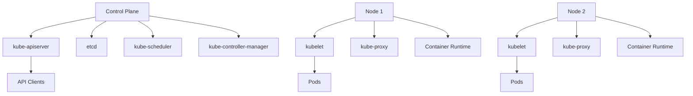

# Comprehensive Kubernetes Learning Path: Beginner to Advanced

This guide offers a structured approach to mastering **Kubernetes**, covering fundamental concepts to advanced topics. It includes detailed explanations, commands with options, practical examples, visualizations of architectures, and step-by-step instructions to set up, manage, and monitor Kubernetes clusters effectively using tools like **kubectl**. The guide also explores real-world usage scenarios, handling various challenges, and best practices to ensure robust and scalable deployments.

---

## Table of Contents

1. [Introduction to Kubernetes](#1-introduction-to-kubernetes)
2. [Kubernetes Architecture](#2-kubernetes-architecture)
3. [Setting Up Kubernetes on Windows](#3-setting-up-kubernetes-on-windows)
    - [3.1. Prerequisites](#31-prerequisites)
    - [3.2. Installing Kubernetes with Minikube](#32-installing-kubernetes-with-minikube)
    - [3.3. Verifying the Installation](#33-verifying-the-installation)
4. [Kubernetes Core Components](#4-kubernetes-core-components)
    - [4.1. Nodes and Clusters](#41-nodes-and-clusters)
    - [4.2. Pods](#42-pods)
    - [4.3. Services](#43-services)
    - [4.4. Deployments](#44-deployments)
    - [4.5. ConfigMaps and Secrets](#45-configmaps-and-secrets)
    - [4.6. Volumes](#46-volumes)
    - [4.7. Ingress](#47-ingress)
5. [Basic Kubernetes Commands](#5-basic-kubernetes-commands)
    - [5.1. kubectl Overview](#51-kubectl-overview)
    - [5.2. Common kubectl Commands](#52-common-kubectl-commands)
6. [Deploying Applications with Kubernetes](#6-deploying-applications-with-kubernetes)
    - [6.1. Example: Deploying a Dockerized Application](#61-example-deploying-a-dockerized-application)
    - [6.2. Understanding YAML Manifests](#62-understanding-yaml-manifests)
7. [Managing Kubernetes Clusters](#7-managing-kubernetes-clusters)
    - [7.1. Scaling Applications](#71-scaling-applications)
    - [7.2. Updating Deployments](#72-updating-deployments)
    - [7.3. Rolling Updates and Rollbacks](#73-rolling-updates-and-rollbacks)
8. [Monitoring Kubernetes](#8-monitoring-kubernetes)
    - [8.1. Built-in Monitoring with kubectl](#81-built-in-monitoring-with-kubectl)
    - [8.2. Kubernetes Dashboards](#82-kubernetes-dashboards)
    - [8.3. Prometheus and Grafana Integration](#83-prometheus-and-grafana-integration)
9. [Kubernetes in the Market](#9-kubernetes-in-the-market)
    - [9.1. Real-World Usage Scenarios](#91-real-world-usage-scenarios)
    - [9.2. Advantages of Using Kubernetes](#92-advantages-of-using-kubernetes)
    - [9.3. Popular Kubernetes Platforms](#93-popular-kubernetes-platforms)
10. [Advanced Kubernetes Topics](#10-advanced-kubernetes-topics)
    - [10.1. StatefulSets](#101-statefulsets)
    - [10.2. DaemonSets](#102-daemonsets)
    - [10.3. Custom Resources and Operators](#103-custom-resources-and-operators)
    - [10.4. Helm Charts](#104-helm-charts)
    - [10.5. Network Policies](#105-network-policies)
11. [Handling Various Scenarios](#11-handling-various-scenarios)
    - [11.1. High Availability](#111-high-availability)
    - [11.2. Self-Healing](#112-self-healing)
    - [11.3. Resource Management](#113-resource-management)
12. [Best Practices](#12-best-practices)
13. [Common Pitfalls and Troubleshooting](#13-common-pitfalls-and-troubleshooting)
14. [Additional Resources](#14-additional-resources)
15. [Conclusion](#15-conclusion)
16. [Sample Projects](#16-sample-projects)

---

## 1. Introduction to Kubernetes

### What is Kubernetes?

**Kubernetes** (often abbreviated as **K8s**) is an open-source container orchestration platform designed to automate deploying, scaling, and managing containerized applications. Originally developed by Google, Kubernetes is now maintained by the Cloud Native Computing Foundation (CNCF).

### Benefits of Kubernetes

- **Scalability**: Automatically scale applications up or down based on demand.
- **High Availability**: Ensures applications are always running, even in case of failures.
- **Efficient Resource Utilization**: Optimizes the use of computing resources.
- **Portability**: Run applications consistently across various environments (on-premises, cloud).
- **Self-Healing**: Automatically restarts containers that fail, replaces containers, kills containers that don't respond to user-defined health checks, and doesn't advertise them to clients until they are ready to serve.

---

## 2. Kubernetes Architecture

Understanding Kubernetes architecture is crucial to effectively utilize its features and capabilities. The architecture consists of a **Control Plane** and **Node Components**.

### Control Plane Components

1. **kube-apiserver**: Serves the Kubernetes API.
2. **etcd**: A consistent and highly-available key-value store used as Kubernetes' backing store for all cluster data.
3. **kube-scheduler**: Assigns work to nodes based on resource availability.
4. **kube-controller-manager**: Runs controller processes that regulate the state of the cluster.

### Node Components

1. **kubelet**: An agent that runs on each node, ensuring containers are running in a Pod.
2. **kube-proxy**: Manages network communication inside the cluster.
3. **Container Runtime**: Software that runs containers (e.g., Docker, containerd).

### Kubernetes Architecture Diagram



**Explanation**:

- **Control Plane**: Manages the overall state of the cluster.
- **Nodes**: Physical or virtual machines that run containerized applications.

---

## 3. Setting Up Kubernetes on Windows

Setting up Kubernetes on a Windows machine involves installing tools like **Minikube** or **Docker Desktop**, which provide a local Kubernetes environment for development and testing.

### 3.1. Prerequisites

- **Windows 10** or higher (Professional or Enterprise editions recommended).
- **Virtualization Enabled** in BIOS.
- **Hardware**: Minimum 2 CPU cores, 4GB RAM.

### 3.2. Installing Kubernetes with Minikube

**Minikube** is a tool that enables running a single-node Kubernetes cluster locally for development purposes.

#### Steps to Install Minikube on Windows

1. **Install a Hypervisor**:

    Minikube supports Hyper-V and VirtualBox. For this guide, we'll use **Hyper-V**.

    - **Enable Hyper-V**:
        ```powershell
        # Open PowerShell as Administrator
        Enable-WindowsOptionalFeature -Online -FeatureName Microsoft-Hyper-V -All
        ```
        - **Restart** your computer when prompted.

2. **Install Chocolatey** (a Windows package manager):

    ```powershell
    Set-ExecutionPolicy Bypass -Scope Process -Force; `
    [System.Net.ServicePointManager]::SecurityProtocol = `
    [System.Net.ServicePointManager]::SecurityProtocol -bor 3072; `
    iex ((New-Object System.Net.WebClient).DownloadString('https://chocolatey.org/install.ps1'))
    ```

3. **Install Minikube and kubectl**:

    ```powershell
    choco install minikube kubernetes-cli -y
    ```

4. **Start Minikube**:

    ```powershell
    minikube start --driver=hyperv --hyperv-virtual-switch="MinikubeSwitch"
    ```

    **Note**: You may need to create a Hyper-V virtual switch named "MinikubeSwitch" via **Hyper-V Manager**.

5. **Verify Installation**:

    ```powershell
    kubectl version --client
    kubectl get nodes
    ```

    **Expected Output**:
    ```plaintext
    NAME       STATUS   ROLES    AGE   VERSION
    minikube   Ready    master   5m    v1.24.0
    ```

### 3.3. Verifying the Installation

Ensure that Kubernetes is running correctly by checking the cluster status.

```powershell
kubectl cluster-info
```

**Expected Output**:
```plaintext
Kubernetes control plane is running at https://127.0.0.1:8443
KubeDNS is running at https://127.0.0.1:8443/api/v1/namespaces/kube-system/services/kube-dns:dns/proxy
```

---

## 4. Kubernetes Core Components

Understanding core Kubernetes components is essential for effectively managing and deploying applications.

### 4.1. Nodes and Clusters

- **Cluster**: A set of machines (nodes) running Kubernetes, divided into Control Plane and Nodes.
- **Node**: A single machine (virtual or physical) in the cluster, running containerized applications.

### 4.2. Pods

**Pods** are the smallest deployable units in Kubernetes, representing a single instance of a running process in the cluster.

#### Example: Pod YAML Manifest

```yaml:manifests/pod-example.yaml
apiVersion: v1
kind: Pod
metadata:
  name: nginx-pod
  labels:
    app: nginx
spec:
  containers:
    - name: nginx-container
      image: nginx:latest
      ports:
        - containerPort: 80
```

**Explanation**:

- **apiVersion**: Specifies the version of the Kubernetes API.
- **kind**: Defines the type of Kubernetes object (Pod in this case).
- **metadata**: Contains data that uniquely identifies the Pod, including `name` and `labels`.
- **spec**: Defines the desired behavior of the Pod, including the containers to run.

### 4.3. Services

**Services** expose Pods to network traffic, enabling communication between different parts of the application or external access.

#### Example: Service YAML Manifest

```yaml:manifests/service-example.yaml
apiVersion: v1
kind: Service
metadata:
  name: nginx-service
spec:
  selector:
    app: nginx
  ports:
    - protocol: TCP
      port: 80
      targetPort: 80
  type: NodePort
```

**Explanation**:

- **selector**: Defines how the Service finds which Pods to target (matching labels).
- **ports**: Specifies the port configurations.
- **type**: Determines how the Service is exposed (`NodePort`, `ClusterIP`, `LoadBalancer`).

### 4.4. Deployments

**Deployments** manage the desired state of applications, ensuring the specified number of Pod replicas are running and handling updates.

#### Example: Deployment YAML Manifest

```yaml:manifests/deployment-example.yaml
apiVersion: apps/v1
kind: Deployment
metadata:
  name: nginx-deployment
spec:
  replicas: 3
  selector:
    matchLabels:
      app: nginx
  template:
    metadata:
      labels:
        app: nginx
    spec:
      containers:
        - name: nginx-container
          image: nginx:1.19.0
          ports:
            - containerPort: 80
```

**Explanation**:

- **replicas**: Number of Pod copies to run.
- **selector**: Identifies which Pods the Deployment manages.
- **template**: Defines the Pods' specifications.

### 4.5. ConfigMaps and Secrets

**ConfigMaps** and **Secrets** store configuration data and sensitive information, respectively.

#### Example: ConfigMap YAML Manifest

```yaml:manifests/configmap-example.yaml
apiVersion: v1
kind: ConfigMap
metadata:
  name: app-config
data:
  APP_ENV: production
  APP_DEBUG: "false"
```

#### Example: Secret YAML Manifest

```yaml:manifests/secret-example.yaml
apiVersion: v1
kind: Secret
metadata:
  name: db-secret
type: Opaque
data:
  username: YWRtaW4=  # base64 encoded
  password: MWYyZDFlMmU2N2Rm
```

**Explanation**:

- **ConfigMap**: Non-confidential data in key-value pairs.
- **Secret**: Confidential data, stored as base64-encoded strings.

### 4.6. Volumes

**Volumes** provide persistent storage for Pods, ensuring data is retained across Pod restarts.

#### Example: Volume YAML Manifest

```yaml:manifests/volume-example.yaml
apiVersion: v1
kind: Pod
metadata:
  name: redis-pod
spec:
  containers:
    - name: redis-container
      image: redis:6.0
      ports:
        - containerPort: 6379
      volumeMounts:
        - name: redis-storage
          mountPath: /data
  volumes:
    - name: redis-storage
      persistentVolumeClaim:
        claimName: redis-pvc
```

#### PersistentVolumeClaim YAML Manifest

```yaml:manifests/pvc-example.yaml
apiVersion: v1
kind: PersistentVolumeClaim
metadata:
  name: redis-pvc
spec:
  accessModes:
    - ReadWriteOnce
  resources:
    requests:
      storage: 1Gi
```

**Explanation**:

- **volumeMounts**: Specifies where the volume is mounted inside the container.
- **PersistentVolumeClaim (PVC)**: Requests storage resources from the cluster.

### 4.7. Ingress

**Ingress** manages external access to services, typically HTTP and HTTPS, providing load balancing, SSL termination, and name-based virtual hosting.

#### Example: Ingress YAML Manifest

```yaml:manifests/ingress-example.yaml
apiVersion: networking.k8s.io/v1
kind: Ingress
metadata:
  name: nginx-ingress
  annotations:
    kubernetes.io/ingress.class: "nginx"
spec:
  rules:
    - host: nginx.example.com
      http:
        paths:
          - path: /
            pathType: Prefix
            backend:
              service:
                name: nginx-service
                port:
                  number: 80
```

**Explanation**:

- **annotations**: Provide metadata for Ingress controllers.
- **rules**: Define how traffic is routed based on host and path.

---

## 5. Basic Kubernetes Commands

### 5.1. kubectl Overview

**kubectl** is the command-line tool for interacting with Kubernetes clusters. It allows you to deploy applications, inspect and manage cluster resources, and view logs.

### 5.2. Common kubectl Commands

#### 5.2.1. Cluster Information

```powershell
kubectl cluster-info
```

**Explanation**: Displays information about the Kubernetes cluster, including the Control Plane and services.

#### 5.2.2. Viewing Nodes

```powershell
kubectl get nodes
```

**Explanation**: Lists all nodes in the cluster with their status, roles, age, and Kubernetes version.

#### 5.2.3. Deploying an Application

```powershell
kubectl apply -f manifests/deployment-example.yaml
```

**Explanation**: Creates or updates resources defined in the specified YAML file.

#### 5.2.4. Viewing Deployments

```powershell
kubectl get deployments
```

**Explanation**: Lists all deployments in the current namespace.

#### 5.2.5. Scaling a Deployment

```powershell
kubectl scale deployment nginx-deployment --replicas=5
```

**Explanation**: Scales the specified deployment to the desired number of replicas.

#### 5.2.6. Updating a Deployment

```powershell
kubectl set image deployment/nginx-deployment nginx-container=nginx:1.20.0
```

**Explanation**: Updates the image of the specified container in the deployment.

#### 5.2.7. Viewing Pods

```powershell
kubectl get pods
```

**Explanation**: Lists all Pods in the current namespace with their status, restarts, and age.

#### 5.2.8. Describing a Pod

```powershell
kubectl describe pod nginx-pod
```

**Explanation**: Provides detailed information about a specific Pod, including events, container statuses, and resource usage.

#### 5.2.9. Deleting a Resource

```powershell
kubectl delete -f manifests/pod-example.yaml
```

**Explanation**: Deletes the resources defined in the specified YAML file.

#### 5.2.10. Viewing Logs

```powershell
kubectl logs nginx-pod
```

**Explanation**: Retrieves logs from the specified Pod. Useful for debugging.

#### 5.2.11. Executing a Command Inside a Pod

```powershell
kubectl exec -it nginx-pod -- /bin/bash
```

**Explanation**: Opens an interactive terminal session inside the specified Pod.

---

## 6. Deploying Applications with Kubernetes

Deploying applications involves defining Kubernetes resources using YAML manifests and applying them to the cluster.

### 6.1. Example: Deploying a Dockerized Application

We'll deploy a simple **Nginx** web server as an example.

#### Project Structure

```
./kubernetes-demo/
├── manifests/
│   ├── pod-example.yaml
│   ├── service-example.yaml
│   └── deployment-example.yaml
└── README.md
```

#### File Path: `./kubernetes-demo/manifests/deployment-example.yaml`

```yaml:manifests/deployment-example.yaml
apiVersion: apps/v1
kind: Deployment
metadata:
  name: nginx-deployment
  labels:
    app: nginx
spec:
  replicas: 3
  selector:
    matchLabels:
      app: nginx
  template:
    metadata:
      labels:
        app: nginx
    spec:
      containers:
        - name: nginx-container
          image: nginx:1.19.0
          ports:
            - containerPort: 80
```

**Detailed Comments**:

```yaml
apiVersion: apps/v1  # Specifies the API version for the Deployment resource
kind: Deployment     # Defines the type of Kubernetes object
metadata:
  name: nginx-deployment  # Name of the Deployment
  labels:
    app: nginx            # Labels to categorize the Deployment
spec:
  replicas: 3             # Number of Pod replicas to maintain
  selector:
    matchLabels:
      app: nginx          # Selector to identify Pods managed by this Deployment
  template:
    metadata:
      labels:
        app: nginx        # Labels applied to the Pods
    spec:
      containers:
        - name: nginx-container   # Name of the container
          image: nginx:1.19.0      # Docker image to use
          ports:
            - containerPort: 80    # Port exposed by the container
```

### 6.2. Understanding YAML Manifests

YAML manifests define the desired state of Kubernetes resources. They consist of several key sections:

- **apiVersion**: Defines the version of the Kubernetes API to use.
- **kind**: Specifies the type of resource (e.g., Pod, Service, Deployment).
- **metadata**: Contains data that uniquely identifies the object, including `name` and `labels`.
- **spec**: Describes the desired behavior and characteristics of the resource.

---

## 7. Managing Kubernetes Clusters

Effective management involves scaling applications, updating deployments, and ensuring smooth rollbacks.

### 7.1. Scaling Applications

Scaling adjusts the number of Pod replicas to handle varying workloads.

#### Example: Scaling the Nginx Deployment to 5 Replicas

```powershell
kubectl scale deployment nginx-deployment --replicas=5
```

**Explanation**: Increases the number of Pods in the `nginx-deployment` to 5, ensuring higher availability and handling increased traffic.

### 7.2. Updating Deployments

Kubernetes allows seamless updates to applications without downtime using rolling updates.

#### Example: Updating the Nginx Image Version

```powershell
kubectl set image deployment/nginx-deployment nginx-container=nginx:1.20.0
```

**Explanation**: Updates the `nginx-container` in the `nginx-deployment` to use the `nginx:1.20.0` image. Kubernetes performs a rolling update, replacing old Pods with new ones gradually.

### 7.3. Rolling Updates and Rollbacks

**Rolling Updates**: Gradually replace old Pods with new ones to ensure zero downtime.

**Rollbacks**: Revert to a previous Deployment version in case of issues.

#### Example: Rolling Back to the Previous Deployment

```powershell
kubectl rollout undo deployment/nginx-deployment
```

**Explanation**: Reverts the `nginx-deployment` to its previous state, undoing the last update.

#### Viewing Rollout Status

```powershell
kubectl rollout status deployment/nginx-deployment
```

**Explanation**: Monitors the status of the ongoing rollout, ensuring it completes successfully.

---

## 8. Monitoring Kubernetes

Monitoring provides insights into the health and performance of your Kubernetes cluster and applications.

### 8.1. Built-in Monitoring with kubectl

#### Viewing Cluster Health

```powershell
kubectl get componentstatuses
```

**Explanation**: Lists the status of cluster components like the scheduler, controller-manager, and etcd.

#### Checking Pod Status

```powershell
kubectl get pods --all-namespaces
```

**Explanation**: Displays all Pods across namespaces with their current status.

### 8.2. Kubernetes Dashboards

**Kubernetes Dashboard** is a web-based UI for managing and monitoring Kubernetes clusters.

#### Installing Kubernetes Dashboard

```powershell
kubectl apply -f https://raw.githubusercontent.com/kubernetes/dashboard/v2.7.0/aio/deploy/recommended.yaml
```

#### Accessing the Dashboard

1. **Start the Proxy**:

    ```powershell
    kubectl proxy
    ```

2. **Open the Dashboard**:

    Navigate to [http://localhost:8001/api/v1/namespaces/kubernetes-dashboard/services/https:kubernetes-dashboard:/proxy/](http://localhost:8001/api/v1/namespaces/kubernetes-dashboard/services/https:kubernetes-dashboard:/proxy/) in your browser.

#### Creating a Service Account for Dashboard Access

```yaml:manifests/dashboard-admin.yaml
apiVersion: v1
kind: ServiceAccount
metadata:
  name: admin-user
  namespace: kubernetes-dashboard
---
apiVersion: rbac.authorization.k8s.io/v1
kind: ClusterRoleBinding
metadata:
  name: admin-user
roleRef:
  apiGroup: rbac.authorization.k8s.io
  kind: ClusterRole
  name: cluster-admin
subjects:
  - kind: ServiceAccount
    name: admin-user
    namespace: kubernetes-dashboard
```

**Applying the Manifest**:

```powershell
kubectl apply -f manifests/dashboard-admin.yaml
```

#### Retrieving the Access Token

```powershell
kubectl -n kubernetes-dashboard create token admin-user
```

**Use this token to log in to the Kubernetes Dashboard.**

### 8.3. Prometheus and Grafana Integration

**Prometheus** collects metrics from Kubernetes clusters, while **Grafana** visualizes these metrics.

#### Installing Prometheus

1. **Add Helm Repository**:

    ```powershell
    helm repo add prometheus-community https://prometheus-community.github.io/helm-charts
    helm repo update
    ```

2. **Install Prometheus**:

    ```powershell
    helm install prometheus prometheus-community/kube-prometheus-stack
    ```

#### Installing Grafana

1. **Grafana is Included in the Kube-Prometheus-Stack**.

2. **Access Grafana Dashboard**:

    ```powershell
    kubectl port-forward svc/prometheus-grafana 3000:80
    ```

    - **Open** [http://localhost:3000](http://localhost:3000) in your browser.
    - **Default Credentials**:
        - **Username**: admin
        - **Password**: Prometheus Helm chart installs a random password, retrieve it using:

            ```powershell
            kubectl get secret prometheus-grafana -o jsonpath="{.data.admin-password}" | base64 --decode ; echo
            ```

---

## 9. Kubernetes in the Market

### 9.1. Real-World Usage Scenarios

- **Microservices Architecture**: Deploying and managing microservices with independent scaling and deployment cycles.
- **Big Data Processing**: Running scalable data processing jobs using Kubernetes-native tools.
- **CI/CD Pipelines**: Integrating Kubernetes with CI/CD tools for automated deployments.
- **Machine Learning**: Managing ML model training and serving pipelines.
- **Hybrid Cloud Deployments**: Running applications consistently across on-premises and cloud environments.

### 9.2. Advantages of Using Kubernetes

- **Scalability**: Easily scale applications to meet demand.
- **Portability**: Run Kubernetes clusters on various environments without modifying applications.
- **Self-Healing**: Automatically restarts failed containers, replaces containers, and reschedules Pods when nodes die.
- **Flexible Storage Management**: Automatically mount storage systems of your choice.
- **Automated Rollouts and Rollbacks**: Gradually roll out changes while monitoring application health.

### 9.3. Popular Kubernetes Platforms

- **Google Kubernetes Engine (GKE)**: Managed Kubernetes service by Google Cloud.
- **Amazon Elastic Kubernetes Service (EKS)**: Managed Kubernetes service by AWS.
- **Azure Kubernetes Service (AKS)**: Managed Kubernetes service by Microsoft Azure.
- **IBM Cloud Kubernetes Service**: Managed Kubernetes offering by IBM.
- **Red Hat OpenShift**: Kubernetes platform with additional enterprise features.

---

## 10. Advanced Kubernetes Topics

### 10.1. StatefulSets

**StatefulSets** manage the deployment and scaling of stateful applications, providing guarantees about the ordering and uniqueness of Pods.

#### Example: StatefulSet YAML Manifest

```yaml:manifests/statefulset-example.yaml
apiVersion: apps/v1
kind: StatefulSet
metadata:
  name: web
spec:
  serviceName: "nginx"
  replicas: 3
  selector:
    matchLabels:
      app: nginx
  template:
    metadata:
      labels:
        app: nginx
    spec:
      containers:
        - name: nginx-container
          image: nginx:1.19.0
          ports:
            - containerPort: 80
          volumeMounts:
            - name: www
              mountPath: /usr/share/nginx/html
  volumeClaimTemplates:
    - metadata:
        name: www
      spec:
        accessModes: [ "ReadWriteOnce" ]
        resources:
          requests:
            storage: 1Gi
```

**Explanation**:

- **serviceName**: Associates the StatefulSet with a Headless Service.
- **volumeClaimTemplates**: Defines a PersistentVolumeClaim template for each Pod.

### 10.2. DaemonSets

**DaemonSets** ensure that a copy of a Pod runs on all (or some) Nodes in the cluster.

#### Example: DaemonSet YAML Manifest

```yaml:manifests/daemonset-example.yaml
apiVersion: apps/v1
kind: DaemonSet
metadata:
  name: fluentd
  labels:
    app: fluentd
spec:
  selector:
    matchLabels:
      app: fluentd
  template:
    metadata:
      labels:
        app: fluentd
    spec:
      containers:
        - name: fluentd
          image: fluent/fluentd:v1.11.2
          ports:
            - containerPort: 24224
```

**Explanation**:

- **DaemonSet**: Deploys the Fluentd logging agent on every node.

### 10.3. Custom Resources and Operators

**Custom Resources (CRs)** allow you to extend Kubernetes with your own API objects. **Operators** automate the management of complex applications using CRs.

#### Example: Custom Resource Definition (CRD)

```yaml:manifests/crd-example.yaml
apiVersion: apiextensions.k8s.io/v1
kind: CustomResourceDefinition
metadata:
  name: memcacheds.cache.example.com
spec:
  group: cache.example.com
  versions:
    - name: v1alpha1
      served: true
      storage: true
      schema:
        openAPIV3Schema:
          type: object
          properties:
            spec:
              type: object
              properties:
                size:
                  type: integer
                  minimum: 1
  scope: Namespaced
  names:
    plural: memcacheds
    singular: memcached
    kind: Memcached
    shortNames:
      - mc
```

**Explanation**:

- **CustomResourceDefinition**: Defines a new resource type `Memcached`.
- **group**: API group the CR belongs to.
- **versions**: Supported versions with schema validation.
- **scope**: `Namespaced` means the resource exists within a namespace.
- **names**: Plural, singular, kind, and short names for the resource.

### 10.4. Helm Charts

**Helm** is a package manager for Kubernetes, allowing you to define, install, and upgrade complex Kubernetes applications.

#### Installing Helm on Windows

```powershell
choco install kubernetes-helm -y
```

#### Example: Creating a Helm Chart

1. **Create a New Chart**:

    ```powershell
    helm create mynginx
    ```

2. **Chart Structure**:

    ```
    mynginx/
    ├── Chart.yaml
    ├── values.yaml
    ├── charts/
    ├── templates/
    │   ├── deployment.yaml
    │   ├── service.yaml
    │   └── ...
    ```

3. **Deploying the Chart**:

    ```powershell
    helm install mynginx-release mynginx/
    ```

**Explanation**:

- **Chart.yaml**: Contains chart metadata.
- **values.yaml**: Default configuration values.
- **templates/**: Kubernetes resource templates.

### 10.5. Network Policies

**Network Policies** define how Pods communicate with each other and with external services, enhancing security within the cluster.

#### Example: NetworkPolicy YAML Manifest

```yaml:manifests/networkpolicy-example.yaml
apiVersion: networking.k8s.io/v1
kind: NetworkPolicy
metadata:
  name: allow-nginx
spec:
  podSelector:
    matchLabels:
      app: nginx
  policyTypes:
    - Ingress
  ingress:
    - from:
        - podSelector:
            matchLabels:
              role: frontend
      ports:
        - protocol: TCP
          port: 80
```

**Explanation**:

- **podSelector**: Targets Pods with label `app: nginx`.
- **policyTypes**: Specifies the type of policy (`Ingress`).
- **ingress**: Allows traffic from Pods with label `role: frontend` on port 80.

---

## 11. Handling Various Scenarios

Kubernetes efficiently handles a variety of deployment and operational scenarios, ensuring applications remain reliable and scalable.

### 11.1. High Availability

**Objective**: Ensure that applications remain available despite failures.

#### Strategies

- **ReplicaSets**: Maintain multiple replicas of Pods.
    ```powershell
    kubectl scale deployment nginx-deployment --replicas=5
    ```
- **Multiple Master Nodes**: Distribute the Control Plane across multiple nodes.
- **Health Checks**: Implement readiness and liveness probes.
    ```yaml:manifests/deployment-example.yaml
    ...
    spec:
      containers:
        - name: nginx-container
          image: nginx:1.19.0
          ports:
            - containerPort: 80
          livenessProbe:
            httpGet:
              path: /
              port: 80
            initialDelaySeconds: 15
            periodSeconds: 20
          readinessProbe:
            httpGet:
              path: /
              port: 80
            initialDelaySeconds: 5
            periodSeconds: 10
    ```

**Explanation**:

- **livenessProbe**: Checks if the container is running. If it fails, Kubernetes restarts the container.
- **readinessProbe**: Checks if the container is ready to serve traffic. If it fails, Kubernetes stops sending traffic to the Pod until it passes.

### 11.2. Self-Healing

**Objective**: Automatically recover from failures without manual intervention.

#### Mechanisms

- **Automatic Restarts**: Kubernetes restarts containers that crash.
- **Replacement of Failed Pods**:
    ```powershell
    kubectl delete pod nginx-pod
    ```
    **Explanation**: Deletes a Pod. Kubernetes automatically creates a new Pod to replace it based on the Deployment's replica count.
- **Rescheduling Pods on Healthy Nodes**: If a node fails, Pods are rescheduled on other healthy nodes.

### 11.3. Resource Management

**Objective**: Optimize the use of computing resources and ensure fair distribution.

#### Strategies

- **Resource Requests and Limits**:
    ```yaml:manifests/deployment-example.yaml
    ...
    spec:
      containers:
        - name: nginx-container
          image: nginx:1.19.0
          resources:
            requests:
              memory: "64Mi"
              cpu: "250m"
            limits:
              memory: "128Mi"
              cpu: "500m"
    ```
    
    **Explanation**:
    - **requests**: Guaranteed amount of resources for the container.
    - **limits**: Maximum amount of resources the container can use.

- **Namespaces**: Isolate resources within namespaces.
    ```powershell
    kubectl create namespace development
    kubectl create namespace production
    ```

- **Resource Quotas**:
    ```yaml:manifests/resourcequota-example.yaml
    apiVersion: v1
    kind: ResourceQuota
    metadata:
      name: dev-quota
      namespace: development
    spec:
      hard:
        pods: "10"
        requests.cpu: "4"
        requests.memory: "8Gi"
        limits.cpu: "8"
        limits.memory: "16Gi"
    ```

    **Applying the ResourceQuota**:
    ```powershell
    kubectl apply -f manifests/resourcequota-example.yaml
    ```

---

## 12. Best Practices

Adhering to best practices ensures efficient, secure, and maintainable Kubernetes deployments.

### 12.1. Use Declarative Configurations

- **YAML Manifests**: Define resources using YAML files and apply them using `kubectl apply -f`.
- **Version Control**: Store all YAML configurations in a Git repository for tracking changes.

### 12.2. Implement Robust Security Measures

- **Role-Based Access Control (RBAC)**:
    ```yaml:manifests/rbac-example.yaml
    apiVersion: rbac.authorization.k8s.io/v1
    kind: Role
    metadata:
      namespace: default
      name: pod-reader
    rules:
      - apiGroups: [""]
        resources: ["pods"]
        verbs: ["get", "watch", "list"]
    ---
    apiVersion: rbac.authorization.k8s.io/v1
    kind: RoleBinding
    metadata:
      name: read-pods
      namespace: default
    subjects:
      - kind: User
        name: jane
        apiGroup: rbac.authorization.k8s.io
    roleRef:
      kind: Role
      name: pod-reader
      apiGroup: rbac.authorization.k8s.io
    ```
    **Applying the RBAC**:
    ```powershell
    kubectl apply -f manifests/rbac-example.yaml
    ```
    **Explanation**: Grants user `jane` permission to read Pods in the `default` namespace.

- **Network Policies**: Secure inter-Pod communication.
- **Secrets Management**: Store sensitive information securely using Kubernetes Secrets.

### 12.3. Optimize Resource Utilization

- **Set Resource Requests and Limits**: Prevent resource contention and ensure QoS.
- **Horizontal Pod Autoscaling (HPA)**:
    ```powershell
    kubectl autoscale deployment nginx-deployment --cpu-percent=50 --min=1 --max=10
    ```
    **Explanation**: Automatically scales the number of Pods based on CPU utilization.

### 12.4. Maintain Environment Parity

- **Consistent Environments**: Use the same configurations for development, staging, and production.
- **Infrastructure as Code (IaC)**: Define infrastructure using code for reproducibility and version control.

### 12.5. Implement Monitoring and Logging

- **Prometheus and Grafana**: Monitor metrics and visualize data.
- **Centralized Logging**: Collect logs using tools like Fluentd or Elastic Stack.

### 12.6. Automate Deployments

- **CI/CD Integration**: Incorporate Kubernetes deployments into CI/CD pipelines for automated deployments.
- **Helm Charts**: Use Helm to manage complex applications and dependencies.

---

## 13. Common Pitfalls and Troubleshooting

### 13.1. Pod Not Starting or Failing

**Issue**: Pods stuck in `Pending` or `CrashLoopBackOff` states.

**Solutions**:

- **Check Pod Events**:
    ```powershell
    kubectl describe pod <pod-name>
    ```
    **Explanation**: Reveals reasons for pod failures, such as insufficient resources or image pull errors.

- **Verify Container Images**:
    ```powershell
    kubectl get pods
    ```
    - Ensure the specified image exists and is accessible.

- **Inspect Logs**:
    ```powershell
    kubectl logs <pod-name>
    ```

### 13.2. Service Not Accessible

**Issue**: Unable to access the application via the Service.

**Solutions**:

- **Check Service Type and Ports**:
    ```powershell
    kubectl get services
    ```

- **Ensure Pods are Running**:
    ```powershell
    kubectl get pods
    ```

- **Verify Ingress Configuration**:
    ```powershell
    kubectl describe ingress <ingress-name>
    ```

### 13.3. Cluster Resource Exhaustion

**Issue**: Nodes run out of CPU or memory, causing Pods to be evicted or fail to schedule.

**Solutions**:

- **Monitor Resource Usage**:
    ```powershell
    kubectl top nodes
    kubectl top pods
    ```

- **Adjust Resource Requests and Limits**: Ensure appropriate allocations.

- **Scale the Cluster**: Add more nodes to the cluster.

### 13.4. Network Issues

**Issue**: Inter-Pod communication failures or DNS resolution problems.

**Solutions**:

- **Verify Network Policies**:
    ```powershell
    kubectl get networkpolicies
    ```

- **Check DNS Configurations**:
    ```powershell
    kubectl get svc kube-dns -n kube-system
    ```

- **Inspect Network Components**: Ensure `kube-proxy` is functioning correctly.

---

## 14. Additional Resources

- **Official Kubernetes Documentation**: [https://kubernetes.io/docs/](https://kubernetes.io/docs/)
- **Kubernetes GitHub Repository**: [https://github.com/kubernetes/kubernetes](https://github.com/kubernetes/kubernetes)
- **Helm Documentation**: [https://helm.sh/docs/](https://helm.sh/docs/)
- **Prometheus Documentation**: [https://prometheus.io/docs/introduction/overview/](https://prometheus.io/docs/introduction/overview/)
- **Grafana Documentation**: [https://grafana.com/docs/grafana/latest/](https://grafana.com/docs/grafana/latest/)
- **Books**:
    - *Kubernetes Up & Running* by Kelsey Hightower, Brendan Burns, and Joe Beda
    - *The Kubernetes Book* by Nigel Poulton
- **Online Courses**:
    - [Udemy: Kubernetes for Beginners](https://www.udemy.com/course/learn-kubernetes/)
    - [Coursera: Architecting with Kubernetes](https://www.coursera.org/specializations/google-cloud-architecture)
- **YouTube Tutorials**:
    - [Kubernetes Tutorial for Beginners](https://www.youtube.com/watch?v=X48VuDVv0do)
    - [Learn Kubernetes in 30 Minutes](https://www.youtube.com/watch?v=PH-2FfFD2PU)
- **Community Forums**:
    - [Kubernetes Slack](http://slack.k8s.io/)
    - [Stack Overflow Kubernetes Questions](https://stackoverflow.com/questions/tagged/kubernetes)

---

## 15. Conclusion

Mastering **Kubernetes** is pivotal for modern software development and deployment, enabling teams to efficiently manage containerized applications at scale. This comprehensive guide has provided foundational knowledge, practical implementations, best practices, and troubleshooting techniques essential for leveraging Kubernetes' full potential. By understanding its architecture, core components, and advanced features, you'll be well-equipped to deploy, manage, and optimize applications in any Kubernetes environment.

Continuous learning and hands-on experimentation are key to becoming proficient in Kubernetes. Embrace the Kubernetes ecosystem, participate in community forums, and stay updated with the latest developments to maintain and enhance your Kubernetes expertise.

---

## 16. Sample Projects

### 16.1. Implementing a CI/CD Pipeline for a Python Web Application with Kubernetes

**Objective**: Set up a CI/CD pipeline that builds, tests, and deploys a Django-based web application to a Kubernetes cluster.

#### Project Structure

```
./django-k8s-cicd/
├── manifests/
│   ├── deployment.yaml
│   ├── service.yaml
│   ├── ingress.yaml
│   ├── configmap.yaml
│   └── secret.yaml
├── Dockerfile
├── deploy.sh
├── .gitlab-ci.yml
├── requirements.txt
└── README.md
```

#### File Path: `./django-k8s-cicd/manifests/deployment.yaml`

```yaml:manifests/deployment.yaml
apiVersion: apps/v1
kind: Deployment
metadata:
  name: django-deployment
  labels:
    app: django
spec:
  replicas: 3
  selector:
    matchLabels:
      app: django
  template:
    metadata:
      labels:
        app: django
    spec:
      containers:
        - name: django-container
          image: yourdockerhubusername/django-app:latest
          ports:
            - containerPort: 8000
          envFrom:
            - configMapRef:
                name: django-config
            - secretRef:
                name: django-secret
          volumeMounts:
            - name: media-volume
              mountPath: /app/media
      volumes:
        - name: media-volume
          persistentVolumeClaim:
            claimName: media-pvc
```

**Detailed Comments**:

```yaml
apiVersion: apps/v1  # API version for Deployment
kind: Deployment     # Specifies the resource type
metadata:
  name: django-deployment  # Name of the Deployment
  labels:
    app: django            # Labels for identifying the Deployment
spec:
  replicas: 3             # Number of Pod replicas
  selector:
    matchLabels:
      app: django          # Selector to match Pods managed by this Deployment
  template:
    metadata:
      labels:
        app: django        # Labels applied to the Pods
    spec:
      containers:
        - name: django-container   # Container name within the Pod
          image: yourdockerhubusername/django-app:latest  # Docker image
          ports:
            - containerPort: 8000    # Port exposed by the container
          envFrom:
            - configMapRef:
                name: django-config  # References ConfigMap for environment variables
            - secretRef:
                name: django-secret  # References Secret for sensitive data
          volumeMounts:
            - name: media-volume
              mountPath: /app/media   # Mounts PersistentVolume at /app/media
      volumes:
        - name: media-volume
          persistentVolumeClaim:
            claimName: media-pvc    # References the PersistentVolumeClaim
```

#### File Path: `./django-k8s-cicd/manifests/service.yaml`

```yaml:manifests/service.yaml
apiVersion: v1
kind: Service
metadata:
  name: django-service
spec:
  selector:
    app: django
  ports:
    - protocol: TCP
      port: 80
      targetPort: 8000
  type: ClusterIP
```

**Explanation**:

- **ClusterIP**: Exposes the Service on an internal IP within the cluster.

#### File Path: `./django-k8s-cicd/manifests/ingress.yaml`

```yaml:manifests/ingress.yaml
apiVersion: networking.k8s.io/v1
kind: Ingress
metadata:
  name: django-ingress
  annotations:
    kubernetes.io/ingress.class: "nginx"
spec:
  rules:
    - host: django.example.com
      http:
        paths:
          - path: /
            pathType: Prefix
            backend:
              service:
                name: django-service
                port:
                  number: 80
```

#### File Path: `./django-k8s-cicd/manifests/configmap.yaml`

```yaml:manifests/configmap.yaml
apiVersion: v1
kind: ConfigMap
metadata:
  name: django-config
data:
  DEBUG: "False"
  ALLOWED_HOSTS: "django.example.com"
```

#### File Path: `./django-k8s-cicd/manifests/secret.yaml`

```yaml:manifests/secret.yaml
apiVersion: v1
kind: Secret
metadata:
  name: django-secret
type: Opaque
data:
  SECRET_KEY: <base64-encoded-secret-key>
  DB_PASSWORD: <base64-encoded-db-password>
```

**Explanation**:

- **SECRET_KEY** and **DB_PASSWORD**: Sensitive information stored securely as Secrets.

#### File Path: `./django-k8s-cicd/Dockerfile`

```dockerfile:Dockerfile
# Dockerfile: Builds the Django application image

# Use official Python image as the base
FROM python:3.8-slim

# Set environment variables
ENV PYTHONDONTWRITEBYTECODE 1
ENV PYTHONUNBUFFERED 1

# Set work directory
WORKDIR /app

# Install dependencies
COPY requirements.txt .
RUN pip install --upgrade pip && pip install -r requirements.txt

# Copy project
COPY . .

# Collect static files
RUN python manage.py collectstatic --noinput

# Run the application
CMD ["gunicorn", "myapp.wsgi:application", "--bind", "0.0.0.0:8000"]
```

**Detailed Comments**:

```dockerfile
# Use official Python image as the base
FROM python:3.8-slim

# Prevent Python from writing .pyc files and buffering stdout/stderr
ENV PYTHONDONTWRITEBYTECODE 1
ENV PYTHONUNBUFFERED 1

# Set the working directory inside the container
WORKDIR /app

# Copy the requirements file into the container
COPY requirements.txt .

# Install Python dependencies
RUN pip install --upgrade pip && pip install -r requirements.txt

# Copy the entire project into the container
COPY . .

# Collect static files for Django
RUN python manage.py collectstatic --noinput

# Command to run the application using Gunicorn
CMD ["gunicorn", "myapp.wsgi:application", "--bind", "0.0.0.0:8000"]
```

#### File Path: `./django-k8s-cicd/deploy.sh`

```bash:deploy.sh
#!/bin/bash
# deploy.sh: Deploys the Django application to the Kubernetes cluster

echo "Starting deployment..."

# Apply Kubernetes manifests
kubectl apply -f manifests/configmap.yaml
kubectl apply -f manifests/secret.yaml
kubectl apply -f manifests/deployment.yaml
kubectl apply -f manifests/service.yaml
kubectl apply -f manifests/ingress.yaml

echo "Deployment completed successfully."
```

**Detailed Comments**:

```bash
#!/bin/bash
# deploy.sh: Automates the deployment of the Django application to Kubernetes

echo "Starting deployment..."

# Apply ConfigMap for environment variables
kubectl apply -f manifests/configmap.yaml

# Apply Secret for sensitive data
kubectl apply -f manifests/secret.yaml

# Deploy the application
kubectl apply -f manifests/deployment.yaml

# Expose the application as a Service
kubectl apply -f manifests/service.yaml

# Configure Ingress for external access
kubectl apply -f manifests/ingress.yaml

echo "Deployment completed successfully."
```

#### File Path: `./django-k8s-cicd/.gitlab-ci.yml`

```yaml:.gitlab-ci.yml
# .gitlab-ci.yml: Defines the GitLab CI/CD pipeline for the Django application

stages:
  - build
  - test
  - deploy

variables:
  DOCKER_IMAGE: yourdockerhubusername/django-app

cache:
  paths:
    - .venv/

build_job:
  stage: build
  image: docker:latest
  services:
    - docker:dind
  script:
    - echo "Building Docker image..."
    - docker build -t $DOCKER_IMAGE:latest .
    - docker push $DOCKER_IMAGE:latest
  only:
    - main

test_job:
  stage: test
  image: $DOCKER_IMAGE:latest
  script:
    - echo "Running tests..."
    - python manage.py test
  only:
    - main

deploy_job:
  stage: deploy
  image: bitnami/kubectl:latest
  script:
    - echo "Deploying to Kubernetes..."
    - ./deploy.sh
  only:
    - main
  environment:
    name: production
    url: https://django.example.com
```

**Detailed Comments**:

```yaml
stages:
  - build       # Stage for building the Docker image
  - test        # Stage for running tests
  - deploy      # Stage for deploying to Kubernetes

variables:
  DOCKER_IMAGE: yourdockerhubusername/django-app  # Docker image name

cache:
  paths:
    - .venv/    # Caches the virtual environment directory

build_job:
  stage: build
  image: docker:latest
  services:
    - docker:dind        # Docker-in-Docker service for building images
  script:
    - echo "Building Docker image..."
    - docker build -t $DOCKER_IMAGE:latest .  # Builds the Docker image
    - docker push $DOCKER_IMAGE:latest      # Pushes the image to Docker Hub
  only:
    - main               # Triggers only on pushes to the main branch

test_job:
  stage: test
  image: $DOCKER_IMAGE:latest
  script:
    - echo "Running tests..."
    - python manage.py test   # Runs Django tests
  only:
    - main

deploy_job:
  stage: deploy
  image: bitnami/kubectl:latest    # Uses kubectl image for deployment
  script:
    - echo "Deploying to Kubernetes..."
    - ./deploy.sh                    # Executes the deployment script
  only:
    - main
  environment:
    name: production
    url: https://django.example.com
```

---

## 17. Setting Up a Kubernetes Cluster on Windows with Minikube

To ensure you have a working Kubernetes environment, follow these steps to set up Minikube on Windows.

### 17.1. Install Minikube and kubectl

```powershell
choco install minikube kubernetes-cli -y
```

**Explanation**: Uses **Chocolatey** to install **Minikube** and **kubectl** on Windows.

### 17.2. Create a Hyper-V Virtual Switch

1. **Open Hyper-V Manager**.
2. **Create Virtual Switch**:
    - Go to **Action > Virtual Switch Manager**.
    - Select **External** and click **Create Virtual Switch**.
    - Name it **MinikubeSwitch** and select your physical network adapter.
    - Click **OK**.

### 17.3. Start Minikube

```powershell
minikube start --driver=hyperv --hyperv-virtual-switch="MinikubeSwitch"
```

**Explanation**: Initializes a local Kubernetes cluster using Hyper-V with the specified virtual switch.

### 17.4. Verify the Cluster Status

```powershell
kubectl cluster-info
kubectl get nodes
```

**Expected Output**:
```plaintext
Kubernetes control plane is running at https://127.0.0.1:8443
KubeDNS is running at https://127.0.0.1:8443/api/v1/namespaces/kube-system/services/kube-dns:dns/proxy

NAME       STATUS   ROLES    AGE   VERSION
minikube   Ready    master   10m   v1.24.0
```

---

## 18. Sample Projects

### 18.1. Implementing a CI/CD Pipeline for a Python Web Application with Kubernetes

**Objective**: Automate the build, test, and deployment process of a Django application to a Kubernetes cluster using GitLab CI/CD.

#### Project Structure

```
./django-k8s-cicd/
├── manifests/
│   ├── deployment.yaml
│   ├── service.yaml
│   ├── ingress.yaml
│   ├── configmap.yaml
│   └── secret.yaml
├── Dockerfile
├── deploy.sh
├── .gitlab-ci.yml
├── requirements.txt
└── README.md
```

#### File Path: `./django-k8s-cicd/Dockerfile`

```dockerfile:Dockerfile
# Dockerfile: Builds the Django application image

# Use official Python image as the base
FROM python:3.8-slim

# Set environment variables to prevent Python from writing .pyc files and buffering stdout/stderr
ENV PYTHONDONTWRITEBYTECODE 1
ENV PYTHONUNBUFFERED 1

# Set the working directory inside the container
WORKDIR /app

# Install dependencies
COPY requirements.txt .
RUN pip install --upgrade pip && pip install -r requirements.txt

# Copy the entire project into the container
COPY . .

# Collect static files for Django
RUN python manage.py collectstatic --noinput

# Command to run the application using Gunicorn
CMD ["gunicorn", "myapp.wsgi:application", "--bind", "0.0.0.0:8000"]
```

**Detailed Comments**:

- **FROM python:3.8-slim**: Uses a lightweight Python 3.8 image.
- **ENV PYTHONDONTWRITEBYTECODE 1**: Prevents Python from generating `.pyc` files.
- **ENV PYTHONUNBUFFERED 1**: Ensures stdout and stderr are unbuffered.
- **WORKDIR /app**: Sets the working directory in the container.
- **COPY requirements.txt .**: Copies the `requirements.txt` file into the container.
- **RUN pip install --upgrade pip && pip install -r requirements.txt**: Installs Python dependencies.
- **COPY . .**: Copies the entire project into the container.
- **RUN python manage.py collectstatic --noinput**: Collects static files for Django.
- **CMD ["gunicorn", "myapp.wsgi:application", "--bind", "0.0.0.0:8000"]**: Runs the Django application using Gunicorn.

#### File Path: `./django-k8s-cicd/manifests/deployment.yaml`

```yaml:manifests/deployment.yaml
apiVersion: apps/v1
kind: Deployment
metadata:
  name: django-deployment
  labels:
    app: django
spec:
  replicas: 3
  selector:
    matchLabels:
      app: django
  template:
    metadata:
      labels:
        app: django
    spec:
      containers:
        - name: django-container
          image: yourdockerhubusername/django-app:latest
          ports:
            - containerPort: 8000
          envFrom:
            - configMapRef:
                name: django-config
            - secretRef:
                name: django-secret
          volumeMounts:
            - name: media-volume
              mountPath: /app/media
      volumes:
        - name: media-volume
          persistentVolumeClaim:
            claimName: media-pvc
```

**Detailed Comments**:

- **replicas: 3**: Deploys three instances of the Django application for high availability.
- **envFrom**: Injects environment variables from ConfigMap and Secret.
- **volumeMounts**: Mounts a PersistentVolume at `/app/media` for storing media files.
- **volumes**: References a PersistentVolumeClaim named `media-pvc`.

#### File Path: `./django-k8s-cicd/manifests/service.yaml`

```yaml:manifests/service.yaml
apiVersion: v1
kind: Service
metadata:
  name: django-service
spec:
  selector:
    app: django
  ports:
    - protocol: TCP
      port: 80
      targetPort: 8000
  type: ClusterIP
```

**Detailed Comments**:

- **type: ClusterIP**: Exposes the Service on an internal IP in the cluster.
- **ports**: Maps port 80 on the Service to port 8000 on the Pods.

#### File Path: `./django-k8s-cicd/manifests/ingress.yaml`

```yaml:manifests/ingress.yaml
apiVersion: networking.k8s.io/v1
kind: Ingress
metadata:
  name: django-ingress
  annotations:
    kubernetes.io/ingress.class: "nginx"
spec:
  rules:
    - host: django.example.com
      http:
        paths:
          - path: /
            pathType: Prefix
            backend:
              service:
                name: django-service
                port:
                  number: 80
```

**Detailed Comments**:

- **ingress.class: "nginx"**: Specifies the Ingress controller to use.
- **rules**: Routes traffic from `django.example.com` to the `django-service` on port 80.

#### File Path: `./django-k8s-cicd/manifests/configmap.yaml`

```yaml:manifests/configmap.yaml
apiVersion: v1
kind: ConfigMap
metadata:
  name: django-config
data:
  DEBUG: "False"
  ALLOWED_HOSTS: "django.example.com"
```

**Detailed Comments**:

- **DEBUG**: Disables debug mode in production.
- **ALLOWED_HOSTS**: Specifies allowed hosts for the Django application.

#### File Path: `./django-k8s-cicd/manifests/secret.yaml`

```yaml:manifests/secret.yaml
apiVersion: v1
kind: Secret
metadata:
  name: django-secret
type: Opaque
data:
  SECRET_KEY: <base64-encoded-secret-key>
  DB_PASSWORD: <base64-encoded-db-password>
```

**Detailed Comments**:

- **SECRET_KEY**: Django's secret key, encoded in base64.
- **DB_PASSWORD**: Database password, encoded in base64.

#### File Path: `./django-k8s-cicd/deploy.sh`

```bash:deploy.sh
#!/bin/bash
# deploy.sh: Deploys the Django application to the Kubernetes cluster

echo "Starting deployment..."

# Apply ConfigMap for environment variables
kubectl apply -f manifests/configmap.yaml

# Apply Secret for sensitive data
kubectl apply -f manifests/secret.yaml

# Deploy the application
kubectl apply -f manifests/deployment.yaml

# Expose the application as a Service
kubectl apply -f manifests/service.yaml

# Configure Ingress for external access
kubectl apply -f manifests/ingress.yaml

echo "Deployment completed successfully."
```

**Detailed Comments**:

- **kubectl apply -f**: Applies the specified YAML manifest to the cluster.
- **Order of Deployment**: ConfigMap and Secret are applied first, followed by Deployment, Service, and Ingress.

#### File Path: `./django-k8s-cicd/.gitlab-ci.yml`

```yaml:.gitlab-ci.yml
# .gitlab-ci.yml: Defines the GitLab CI/CD pipeline for the Django application

stages:
  - build
  - test
  - deploy

variables:
  DOCKER_IMAGE: yourdockerhubusername/django-app

cache:
  paths:
    - .venv/

build_job:
  stage: build
  image: docker:latest
  services:
    - docker:dind
  script:
    - echo "Building Docker image..."
    - docker build -t $DOCKER_IMAGE:latest .
    - docker push $DOCKER_IMAGE:latest
  only:
    - main

test_job:
  stage: test
  image: $DOCKER_IMAGE:latest
  script:
    - echo "Running tests..."
    - python manage.py test
  only:
    - main

deploy_job:
  stage: deploy
  image: bitnami/kubectl:latest
  script:
    - echo "Deploying to Kubernetes..."
    - ./deploy.sh
  only:
    - main
  environment:
    name: production
    url: https://django.example.com
```

**Detailed Comments**:

- **stages**: Defines the pipeline stages: build, test, deploy.
- **variables**: Sets the Docker image name.
- **cache**: Caches the virtual environment directory to speed up builds.
- **build_job**:
    - **image: docker:latest**: Uses the latest Docker image.
    - **services: docker:dind**: Enables Docker-in-Docker for building images.
    - **script**: Builds and pushes the Docker image to Docker Hub.
- **test_job**:
    - **image: $DOCKER_IMAGE:latest**: Uses the built Docker image.
    - **script**: Runs Django tests.
- **deploy_job**:
    - **image: bitnami/kubectl:latest**: Uses the kubectl tool.
    - **script**: Executes the deployment script to apply Kubernetes manifests.
    - **environment**: Defines the deployment environment.

### Steps to Execute the Pipeline

1. **Commit and Push Changes**:

    ```powershell
    git add .
    git commit -m "feat(ci): add GitLab CI/CD pipeline for Django app"
    git push origin main
    ```

2. **Pipeline Execution**:

    - **Build Stage**:
        - Builds the Docker image.
        - Pushes the image to Docker Hub.
    - **Test Stage**:
        - Runs automated tests inside the Docker container.
    - **Deploy Stage**:
        - Applies Kubernetes manifests to deploy the application to the cluster.

3. **Monitoring Pipeline**:

    - Access the **GitLab CI/CD Pipelines** dashboard.
    - Monitor each job's status and view logs for detailed information.

4. **Accessing the Application**:

    - Ensure DNS is configured for `django.example.com` pointing to your Ingress controller.
    - Visit [https://django.example.com](https://django.example.com) to access the deployed Django application.

---

# Final Notes

Implementing **Kubernetes** effectively requires a deep understanding of its architecture, components, and best practices. This comprehensive guide provides a solid foundation, enabling you to deploy, manage, and scale applications within Kubernetes clusters confidently. By leveraging Kubernetes' robust features and integrating it with CI/CD pipelines, you can achieve seamless and efficient software delivery, ensuring high availability and performance for your applications.

Continuous exploration and hands-on practice are essential to mastering Kubernetes. Engage with the Kubernetes community, stay updated with evolving features, and experiment with advanced topics to enhance your proficiency and adaptability in managing containerized applications.

Feel free to adapt and expand upon this guide to suit your specific project requirements and organizational needs. Embracing Kubernetes will undoubtedly contribute to more resilient and scalable software infrastructures.

---
