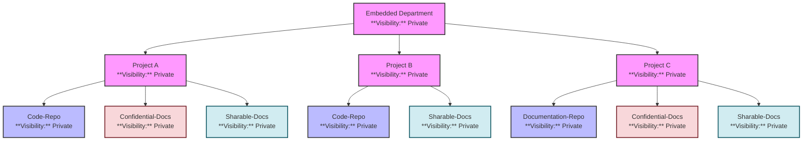
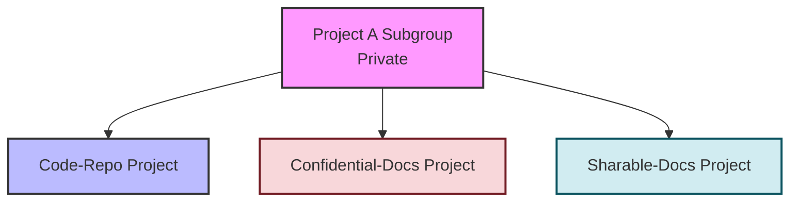

# Managing GitLab Group Structure and Access for the Embedded Department

To effectively manage the **Embedded Department** in GitLab, it's crucial to establish a clear and secure group hierarchy. This ensures that each team member has appropriate access based on their role and the projects they are involved in. Below is a comprehensive guide to setting up the GitLab group structure, visualizing it with a **Mermaid** diagram, and managing access for 20 team members across three projects (**A**, **B**, and **C**).

## Correct GitLab Group Structure

In GitLab, **Groups** are used to organize projects and manage permissions collectively. Each **Group** can contain **Subgroups** and **Projects**. Here's how to structure the Embedded Department:

```
/Embedded-Department
├── Project-A
│   ├── Code-Repo
│   ├── Confidential-Docs
│   └── Sharable-Docs
├── Project-B
│   ├── Code-Repo
│   └── Sharable-Docs
└── Project-C
    ├── Documentation-Repo
    ├── Confidential-Docs
    └── Sharable-Docs
```

- **Embedded-Department**: Parent group.
- **Project-A, Project-B, Project-C**: Subgroups representing individual projects.
- **Code-Repo / Documentation-Repo**: GitLab projects (repositories) containing code or documentation.
- **Confidential-Docs / Sharable-Docs**: GitLab projects (repositories) containing sensitive or sharable documents.

## Mermaid Diagram Visualization

Below is a **Mermaid** diagram that accurately represents the GitLab group and project structure for the **Embedded Department**.



### Diagram Explanation

- **Embedded Department**: The top-level private group containing all projects.

- **Projects A, B, and C**: Subgroups under Embedded Department, each representing a distinct project.

- **Code Repositories and Documentation**:
  
  - **Project A**: Contains `Code-Repo`, `Confidential-Docs`, and `Sharable-Docs`.
  - **Project B**: Contains `Code-Repo` and `Sharable-Docs`.
  - **Project C**: Contains `Documentation-Repo`, `Confidential-Docs`, and `Sharable-Docs`.

- **Visibility**: All groups and projects are set to **Private**, ensuring controlled access.

## Team Composition and Role Assignments

Below is a table listing the 20 team members along with their roles and project assignments:

| Name            | Role      | Project Assignments             |
| --------------- | --------- | ------------------------------- |
| Alice Johnson   | Manager   | All Projects                    |
| Bob Smith       | Team Lead | Project A, Project B, Project C |
| Carol Davis     | Developer | Project A, Project B            |
| David Wilson    | Developer | Project A, Project B            |
| Eva Brown       | Tester    | Project A, Project B            |
| Frank Miller    | Tester    | Project A, Project B            |
| Grace Lee       | Reviewer  | Project A, Project B, Project C |
| Henry Taylor    | Reviewer  | Project A, Project B, Project C |
| Irene Anderson  | Intern    | Project B, Project C            |
| Jack Thomas     | Intern    | Project B, Project C            |
| Karen White     | Developer | Project A, Project B            |
| Leo Harris      | Developer | Project A, Project B            |
| Mia Martin      | Tester    | Project C                       |
| Noah Thompson   | Tester    | Project C                       |
| Olivia Garcia   | Reviewer  | Project C                       |
| Paul Martinez   | Reviewer  | Project C                       |
| Quinn Robinson  | Developer | Project A                       |
| Rachel Clark    | Developer | Project A                       |
| Steve Rodriguez | Team Lead | Project A, Project B            |
| Tina Lewis      | Manager   | All Projects                    |

### Role Definitions

- **Manager**: Full access to all groups and projects. Can manage settings and permissions.
- **Team Lead**: Elevated permissions within assigned projects. Can oversee development and testing activities.
- **Developer**: Access to code repositories and sharable documents within assigned projects.
- **Tester**: Access to testing-related documents and repositories.
- **Reviewer**: Can review code, documentation, and access sharable documents.
- **Intern**: Limited access to specific documents and repositories as assigned.

## Assigning Roles and Managing Custom Access

### GitLab Role Permissions

GitLab provides predefined roles with specific permissions. Here's how to map the team roles to GitLab roles:

| GitLab Role    | Permissions                                                                                    |
| -------------- | ---------------------------------------------------------------------------------------------- |
| **Owner**      | Full access to manage group and project settings. Typically assigned to Managers.              |
| **Maintainer** | Can manage project settings, merge requests, and protect branches. Usually Team Leads.         |
| **Developer**  | Can push code, create branches, manage issues, and access sharable documents.                  |
| **Reporter**   | Can view and create issues, view code and documentation. Suitable for Reviewers and Testers.   |
| **Guest**      | Limited access, typically for viewing purposes only. Suitable for Interns with minimal access. |

### Role Assignment Strategy

1. **Managers (Alice Johnson & Tina Lewis)**:
   
   - **Role Assignment**: **Owner** in the `Embedded-Department` group.
   - **Access**: Full control over all projects and subgroups.

2. **Team Leads (Bob Smith & Steve Rodriguez)**:
   
   - **Role Assignment**: **Maintainer** in their respective project subgroups.
   - **Access**: Elevated permissions to manage project workflows and settings.

3. **Developers (Carol Davis, David Wilson, Karen White, Leo Harris, Quinn Robinson, Rachel Clark)**:
   
   - **Role Assignment**: **Developer** in assigned project subgroups.
   - **Access**: Can push to `Code-Repo`, access `Sharable-Docs`.

4. **Testers (Eva Brown, Frank Miller, Mia Martin, Noah Thompson)**:
   
   - **Role Assignment**: **Reporter** in assigned project subgroups.
   - **Access**: Can view code repositories and access testing-related documents.

5. **Reviewers (Grace Lee, Henry Taylor, Olivia Garcia, Paul Martinez)**:
   
   - **Role Assignment**: **Reporter** with additional permissions for code and documentation review.
   - **Access**: Can view and comment on code and documentation, access `Sharable-Docs`.

6. **Interns (Irene Anderson, Jack Thomas)**:
   
   - **Role Assignment**: **Guest** in assigned project subgroups.
   - **Access**: Limited to viewing specific `Sharable-Docs` as necessary.

### Custom Access Management

To ensure that access is appropriately restricted:

1. **Private Visibility**:
   
   - All projects and subgroups are set to **Private** to restrict access to authorized members only.

2. **Confidential-Docs Access**:
   
   - **Confidential-Docs** repositories are accessible **only** to **Managers** and **Team Leads**.
   - **Developers**, **Testers**, and other roles do **not** have access to these repositories.

3. **Sharable-Docs Access**:
   
   - **Sharable-Docs** repositories are accessible **only** to members of the respective project.
   - Members of one project **cannot** access sharable documents of another project within the Embedded Department.

4. **Project Isolation**:
   
   - Each project (`Project A`, `Project B`, `Project C`) operates within its own subgroup, ensuring that permissions are scoped correctly.
   - This prevents cross-project access unless explicitly granted.

### Access Assignment Steps

1. **Create the Parent Group** `/Embedded-Department`:
   
   - Set **Visibility** to **Private**.
   - Assign **Owners** (Managers) with the **Owner** role.

2. **Create Subgroups for Each Project**:
   
   - **Project-A**, **Project-B**, **Project-C** as subgroups under `/Embedded-Department`.
   - Set **Visibility** to **Private** for each subgroup.

3. **Create Projects within Subgroups**:
   
   - For each project subgroup, create:
     - `Code-Repo` or `Documentation-Repo` as GitLab projects with **Private** visibility.
     - `Confidential-Docs` and `Sharable-Docs` as separate GitLab projects with **Private** visibility.

4. **Assign Roles to Members**:
   
   - Navigate to each project and subgroup.
   - Assign team members to the appropriate roles based on their responsibilities.

5. **Manage Access Controls**:
   
   - Ensure that **Confidential-Docs** are accessible only to **Managers** and **Team Leads**.
   - Configure **Sharable-Docs** to be accessible only within the respective project members.

## Example of Access Configuration

### Project A Access Control

- **Code-Repo**:
  
  - **Owners**: Alice Johnson, Tina Lewis
  - **Maintainers**: Bob Smith, Steve Rodriguez
  - **Developers**: Carol Davis, David Wilson, Karen White, Leo Harris, Quinn Robinson, Rachel Clark
  - **Reporters**: Grace Lee, Henry Taylor
  - **Guests**: *None*

- **Confidential-Docs**:
  
  - **Owners**: Alice Johnson, Tina Lewis
  - **Maintainers**: Bob Smith, Steve Rodriguez
  - **Access**: Restricted to Owners and Maintainers only.

- **Sharable-Docs**:
  
  - **Owners**: Alice Johnson, Tina Lewis
  - **Maintainers**: Bob Smith, Steve Rodriguez
  - **Developers**: Carol Davis, David Wilson, Karen White, Leo Harris, Quinn Robinson, Rachel Clark
  - **Reporters**: Grace Lee, Henry Taylor
  - **Guests**: *None*

### Project B Access Control

- **Code-Repo**:
  
  - **Owners**: Alice Johnson, Tina Lewis
  - **Maintainers**: Bob Smith, Steve Rodriguez
  - **Developers**: Carol Davis, David Wilson, Karen White, Leo Harris
  - **Reporters**: Grace Lee, Henry Taylor
  - **Guests**: *None*

- **Sharable-Docs**:
  
  - **Owners**: Alice Johnson, Tina Lewis
  - **Maintainers**: Bob Smith, Steve Rodriguez
  - **Developers**: Carol Davis, David Wilson, Karen White, Leo Harris
  - **Reporters**: Grace Lee, Henry Taylor
  - **Guests**: *None*

### Project C Access Control

- **Documentation-Repo**:
  
  - **Owners**: Alice Johnson, Tina Lewis
  - **Maintainers**: Bob Smith, Steve Rodriguez
  - **Developers**: *None*
  - **Reporters**: Grace Lee, Henry Taylor, Olivia Garcia, Paul Martinez
  - **Guests**: *None*

- **Confidential-Docs**:
  
  - **Owners**: Alice Johnson, Tina Lewis
  - **Maintainers**: Bob Smith, Steve Rodriguez
  - **Access**: Restricted to Owners and Maintainers only.

- **Sharable-Docs**:
  
  - **Owners**: Alice Johnson, Tina Lewis
  - **Maintainers**: Bob Smith, Steve Rodriguez
  - **Reporters**: Grace Lee, Henry Taylor, Olivia Garcia, Paul Martinez
  - **Guests**: Irene Anderson, Jack Thomas *(Interns with limited access)*

## Managing Custom Access

### Steps to Restrict Access to Confidential Documents

1. **Navigate to the Confidential-Docs Project**:
   
   - Go to `/Embedded-Department/Project-A/Confidential-Docs` in GitLab.

2. **Adjust Project Members**:
   
   - Remove all members except **Managers** and **Team Leads**.
   - Assign **Owners** and **Maintainers** accordingly.

3. **Set Membership Permissions**:
   
   - Ensure only desired roles have access by verifying their role assignments.

### Steps to Restrict Sharable Documents to Project Members

1. **Navigate to the Sharable-Docs Project**:
   
   - Go to `/Embedded-Department/Project-A/Sharable-Docs` in GitLab.

2. **Ensure Project Visibility**:
   
   - Set **Visibility** to **Private** to restrict access.

3. **Assign Project Members**:
   
   - Add only members of **Project A** with appropriate roles (Owners, Maintainers, Developers, Reporters).

4. **Verify Access Permissions**:
   
   - Confirm that members do not have access to Sharable-Docs of other projects.

### Ensuring Project Isolation

- **Private Subgroups**: Each project subgroup is set to **Private**, preventing unauthorized access.
- **Role-Based Access**: Assign roles strictly based on project assignments to enforce the principle of least privilege.
- **Regular Audits**: Periodically review project memberships and roles to maintain security integrity.

## Best Practices for Access Management

1. **Principle of Least Privilege**: Grant only the minimum necessary permissions required for a member to perform their role.
2. **Consistent Role Definitions**: Ensure that roles are consistently defined and assigned across all projects and subgroups.
3. **Regular Reviews**: Conduct regular audits of group memberships and access permissions to prevent privilege creep.
4. **Clear Documentation**: Maintain comprehensive documentation of group structures, roles, and access policies for transparency and ease of onboarding.
5. **Utilize GitLab Features**: Leverage GitLab’s built-in features like Protected Branches, Merge Request Approvals, and Access Tokens to enhance security and workflow efficiency.

## Updated File Structure Representation

For clarity, here's the updated file structure representation reflecting the correct hierarchy:

```plaintext:path/to/Embedded-Department
/Embedded-Department
├── Project-A
│   ├── Code-Repo
│   ├── Confidential-Docs
│   └── Sharable-Docs
├── Project-B
│   ├── Code-Repo
│   └── Sharable-Docs
└── Project-C
    ├── Documentation-Repo
    ├── Confidential-Docs
    └── Sharable-Docs
```

This structure ensures that:

- **Projects** are organized as **Subgroups** within the parent group.
- Each **Project** contains its respective **Repositories** (Code-Repo, Documentation-Repo) and **Document Repositories** (Confidential-Docs, Sharable-Docs).
- Access is meticulously controlled at both the subgroup and project levels.

## ---

---

# GitLab Access Control for Project A Subgroup

Let me clarify how GitLab's inheritance and access control works at different levels:

## Group Inheritance and Access Control

1. **Subgroup Level (Project A)**:
   
   - Members added at the subgroup level will automatically inherit access to all projects within that subgroup
   - The access level (Owner, Maintainer, Developer, etc.) set at the subgroup level is the **maximum** permission that member can have for any project within the subgroup

2. **Project Level**:
   
   - You can restrict access further at the project level
   - You cannot grant higher access at the project level than what is set at the subgroup level

## Correct Setup for Project A

### 1. First, set up Project A Subgroup members:



**Project A Subgroup Members**:

```plaintext
/Embedded-Department/Project-A/
├── Alice Johnson (Owner)
├── Tina Lewis (Owner)
├── Bob Smith (Maintainer)
├── Steve Rodriguez (Maintainer)
├── Carol Davis (Developer)
├── David Wilson (Developer)
├── Karen White (Developer)
├── Leo Harris (Developer)
├── Quinn Robinson (Developer)
├── Rachel Clark (Developer)
├── Grace Lee (Reporter)
└── Henry Taylor (Reporter)
```

### 2. Then, restrict access at the project level:

#### For Confidential-Docs Project:

```plaintext
/Embedded-Department/Project-A/Confidential-Docs/
├── Alice Johnson (Owner)      # Inherited and maintained
├── Tina Lewis (Owner)        # Inherited and maintained
├── Bob Smith (Maintainer)    # Inherited and maintained
└── Steve Rodriguez (Maintainer) # Inherited and maintained
# All other members are removed at project level
```

To achieve this:

1. Navigate to the Confidential-Docs project settings
2. Remove all members except Owners and Maintainers
3. Set project visibility to Private

This way:

- Members still exist in the Project A subgroup
- They can access Code-Repo and Sharable-Docs
- But they cannot access Confidential-Docs, even though they're members of the parent subgroup

Example GitLab UI steps:

```plaintext
1. Go to Project A/Confidential-Docs
2. Settings > Members
3. Remove members you want to restrict
4. These members will still have access to other projects in Project A
```

## Best Practice Implementation

### 1. Project A Subgroup Setup:

```bash
# First, add all members to Project A subgroup
gitlab-rails console

group = Group.find_by_full_path('Embedded-Department/Project-A')

# Add members with appropriate roles
group.add_owner('alice.johnson@example.com')
group.add_owner('tina.lewis@example.com')
group.add_maintainer('bob.smith@example.com')
# ... and so on
```

### 2. Confidential-Docs Project Restriction:

```bash
# Then, restrict Confidential-Docs project
project = Project.find_by_full_path('Embedded-Department/Project-A/Confidential-Docs')

# Remove all members except Owners and Maintainers
project.members.each do |member|
  unless ['Owner', 'Maintainer'].include?(member.access_level)
    member.destroy
  end
end
```

## Access Matrix

| Member          | Project A Subgroup | Code-Repo  | Confidential-Docs | Sharable-Docs |
| --------------- | ------------------ | ---------- | ----------------- | ------------- |
| Alice Johnson   | Owner              | Owner      | Owner             | Owner         |
| Tina Lewis      | Owner              | Owner      | Owner             | Owner         |
| Bob Smith       | Maintainer         | Maintainer | Maintainer        | Maintainer    |
| Steve Rodriguez | Maintainer         | Maintainer | Maintainer        | Maintainer    |
| Carol Davis     | Developer          | Developer  | No Access         | Developer     |
| David Wilson    | Developer          | Developer  | No Access         | Developer     |
| Karen White     | Developer          | Developer  | No Access         | Developer     |
| Leo Harris      | Developer          | Developer  | No Access         | Developer     |
| Quinn Robinson  | Developer          | Developer  | No Access         | Developer     |
| Rachel Clark    | Developer          | Developer  | No Access         | Developer     |
| Grace Lee       | Reporter           | Reporter   | No Access         | Reporter      |
| Henry Taylor    | Reporter           | Reporter   | No Access         | Reporter      |

This setup ensures:

1. All members have appropriate access to the Project A subgroup
2. Access to Confidential-Docs is restricted to only Owners and Maintainers
3. Other projects (Code-Repo and Sharable-Docs) remain accessible according to subgroup permissions
4. The principle of least privilege is maintained

Remember:

- Always set the broadest access at the subgroup level
- Restrict access further at the project level where needed
- Regularly audit access permissions
- Document any changes to access control
