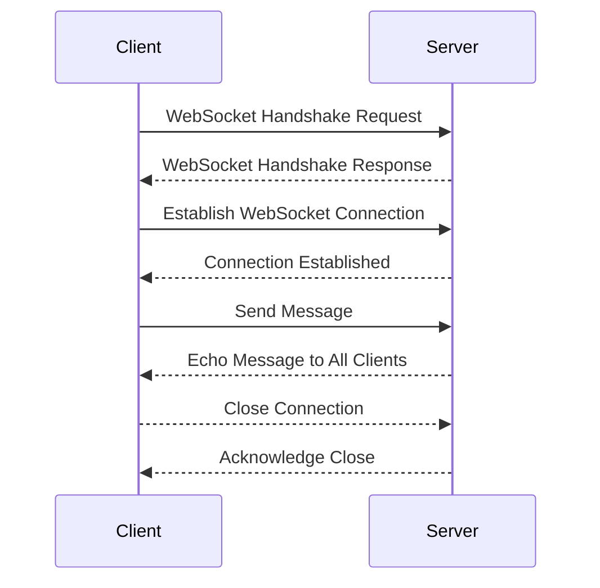

### Advanced WebSocket Communication in Python

### WebSocket Connection Process




#### Enhanced WebSocket Server

```python:server.py
import asyncio
import websockets
import json
import logging
from collections import defaultdict
import ssl

# Configure logging
logging.basicConfig(level=logging.INFO)
logger = logging.getLogger(__name__)

# Dictionary to store connected clients, grouped by topics
connected_clients = defaultdict(set)

# Maximum message size (in bytes)
MAX_MESSAGE_SIZE = 1024 * 1024

class AuthenticationError(Exception):
    pass

async def authenticate(websocket):
    """
    Authenticate the client connection.
    In a real-world scenario, this would involve token verification.
    """
    try:
        auth_message = await asyncio.wait_for(websocket.recv(), timeout=5.0)
        auth_data = json.loads(auth_message)
        if auth_data.get('token') != 'secret_token':
            raise AuthenticationError("Invalid token")
        return auth_data.get('user_id')
    except (asyncio.TimeoutError, json.JSONDecodeError, KeyError):
        raise AuthenticationError("Authentication failed")

async def handle_subscription(websocket, user_id):
    """
    Handle client subscription to topics.
    """
    try:
        message = await websocket.recv()
        data = json.loads(message)
        topics = data.get('subscribe', [])
        for topic in topics:
            connected_clients[topic].add((websocket, user_id))
        logger.info(f"User {user_id} subscribed to topics: {topics}")
    except (json.JSONDecodeError, KeyError):
        logger.error("Invalid subscription message")

async def broadcast(topic, message, exclude=None):
    """
    Broadcast a message to all clients subscribed to a topic.
    """
    if topic in connected_clients:
        await asyncio.gather(
            *[client[0].send(message) for client in connected_clients[topic] if client[0] != exclude]
        )

async def handler(websocket, path):
    """
    Main handler for WebSocket connections.
    """
    try:
        user_id = await authenticate(websocket)
        await handle_subscription(websocket, user_id)
        
        async for message in websocket:
            if len(message) > MAX_MESSAGE_SIZE:
                await websocket.send(json.dumps({"error": "Message too large"}))
                continue
            
            try:
                data = json.loads(message)
                topic = data.get('topic')
                content = data.get('content')
                if topic and content:
                    await broadcast(topic, json.dumps({
                        "topic": topic,
                        "content": content,
                        "user_id": user_id
                    }), exclude=websocket)
            except json.JSONDecodeError:
                logger.error("Invalid JSON message")
    except AuthenticationError as e:
        await websocket.send(json.dumps({"error": str(e)}))
    except websockets.exceptions.ConnectionClosed:
        logger.info(f"Connection closed for user {user_id}")
    finally:
        # Remove the client from all subscribed topics
        for topic in connected_clients:
            connected_clients[topic] = {client for client in connected_clients[topic] if client[0] != websocket}

async def main():
    """
    Start the WebSocket server with SSL/TLS support.
    """
    ssl_context = ssl.SSLContext(ssl.PROTOCOL_TLS_SERVER)
    ssl_context.load_cert_chain('path/to/cert.pem', 'path/to/key.pem')
    
    server = await websockets.serve(
        handler, 
        "localhost", 
        8765, 
        ssl=ssl_context,
        max_size=MAX_MESSAGE_SIZE,
        max_queue=1000  # Limit the number of queued connections
    )
    logger.info("WebSocket server started")
    await server.wait_closed()

if __name__ == "__main__":
    asyncio.run(main())
```

#### Enhanced WebSocket Client

```python:client.py
import asyncio
import websockets
import json
import ssl

async def connect_and_listen():
    """
    Connect to the WebSocket server, authenticate, subscribe to topics, and listen for messages.
    """
    uri = "wss://localhost:8765"
    ssl_context = ssl.create_default_context(ssl.Purpose.SERVER_AUTH)
    ssl_context.check_hostname = False
    ssl_context.verify_mode = ssl.CERT_NONE  # In production, always verify the certificate

    async with websockets.connect(uri, ssl=ssl_context) as websocket:
        # Authenticate
        await websocket.send(json.dumps({"token": "secret_token", "user_id": "user123"}))

        # Subscribe to topics
        await websocket.send(json.dumps({"subscribe": ["topic1", "topic2"]}))

        # Listen for messages
        while True:
            try:
                message = await websocket.recv()
                data = json.loads(message)
                print(f"Received message: {data}")

                # Example: send a message to a topic
                if data.get('content') == 'ping':
                    await websocket.send(json.dumps({
                        "topic": "topic1",
                        "content": "pong"
                    }))
            except websockets.exceptions.ConnectionClosed:
                print("Connection closed")
                break

if __name__ == "__main__":
    asyncio.run(connect_and_listen())
```

### Detailed Code Explanation

#### Server Code

1. **Imports and Setup**
   - We use `asyncio` for asynchronous programming, `websockets` for WebSocket functionality, `json` for message parsing, `logging` for error tracking, `defaultdict` for efficient client management, and `ssl` for secure connections.

2. **Global Variables**
   - `connected_clients`: A `defaultdict` of sets to manage clients subscribed to different topics.
   - `MAX_MESSAGE_SIZE`: Limits the size of incoming messages to prevent DoS attacks.

3. **Authentication**
   - `authenticate` function simulates token-based authentication. In a real-world scenario, this would involve verifying JWTs or other secure tokens.

4. **Subscription Handling**
   - `handle_subscription` allows clients to subscribe to multiple topics.

5. **Broadcasting**
   - `broadcast` function efficiently sends messages to all subscribed clients using `asyncio.gather`.

6. **Main Handler**
   - `handler` function:
     - Authenticates the client
     - Handles subscriptions
     - Processes incoming messages
     - Broadcasts messages to appropriate topics
     - Implements error handling and connection management

7. **Server Startup**
   - `main` function sets up SSL/TLS and starts the WebSocket server with specific configurations like maximum message size and connection queue limit.

#### Client Code

1. **Connection and Authentication**
   - Establishes a secure WebSocket connection using SSL/TLS.
   - Sends authentication credentials.

2. **Topic Subscription**
   - Subscribes to specific topics of interest.

3. **Message Handling**
   - Continuously listens for incoming messages.
   - Processes received messages and can send responses based on content.

### Advanced Concepts and Best Practices

1. **Scalability**
   - The server uses a topic-based publish-subscribe model, allowing for efficient message distribution.
   - To scale horizontally, implement a message queue (e.g., Redis Pub/Sub) for inter-server communication.

2. **Security**
   - SSL/TLS encryption for all connections.
   - Token-based authentication with timeout.
   - Message size limiting to prevent DoS attacks.

3. **Performance Optimization**
   - Asynchronous handling of connections and message broadcasting.
   - Use of `defaultdict` for efficient topic-based client management.
   - `asyncio.gather` for concurrent message sending.

4. **Error Handling and Logging**
   - Comprehensive try-except blocks to handle various error scenarios.
   - Detailed logging for debugging and monitoring.

5. **Connection Management**
   - Proper cleanup of disconnected clients from all subscribed topics.

6. **Flexibility**
   - Topic-based messaging allows for versatile application architectures.

---

#### 1. **Connection Management**
   - **Keep track of connected clients**: Use a set to manage active connections.
   - **Handle disconnections gracefully**: Ensure clients are removed from the set when they disconnect.

#### 2. **Error Handling**
   - **Catch exceptions**: Use try-except blocks to handle potential errors.
   - **Log errors**: Maintain logs for debugging and monitoring purposes.

#### 3. **Security**
   - **Use SSL/TLS**: Encrypt WebSocket connections to protect data in transit.
   - **Authenticate clients**: Implement authentication mechanisms to ensure only authorized clients can connect.
   - **Validate input**: Sanitize and validate incoming messages to prevent injection attacks.

#### 4. **Performance Optimization**
   - **Broadcast efficiently**: Use `asyncio.wait` to send messages to multiple clients concurrently.
   - **Limit message size**: Set a maximum message size to prevent resource exhaustion.

#### 5. **Scaling**
   - **Horizontal scaling**: Distribute the load across multiple servers using a load balancer.
   - **State management**: Use a distributed state management system (e.g., Redis) to share state across servers.

---

### Scaling Considerations

To scale this system:

1. **Load Balancing**: Use a WebSocket-aware load balancer (e.g., HAProxy) to distribute connections across multiple server instances.

2. **Shared State**: Implement a distributed cache (e.g., Redis) to share client subscription information across servers.

3. **Message Queue**: Use a message broker (e.g., RabbitMQ, Kafka) for reliable message distribution in a multi-server setup.

4. **Database Sharding**: If persistent storage is needed, implement database sharding for horizontal scaling of data storage.

5. **Microservices Architecture**: Break down functionality into microservices for independent scaling of different components.

### Performance Metrics and Monitoring

1. **Key Metrics to Monitor**:
   - Connection count
   - Message throughput (messages/second)
   - Latency (message round-trip time)
   - Error rates
   - CPU, memory, and network usage

2. **Monitoring Tools**:
   - Implement application-level metrics using libraries like `prometheus_client`.
   - Use system monitoring tools like Grafana for visualization.
   - Set up alerting for critical thresholds.

### Security Enhancements

1. **Rate Limiting**: Implement per-client rate limiting to prevent abuse.
2. **Input Validation**: Thoroughly validate all incoming messages to prevent injection attacks.
3. **Regular Security Audits**: Conduct periodic security reviews and penetration testing.

### Example: Handling Load and Scaling

#### Load Estimation
Assume a server with the following specifications:
- CPU: 4 cores
- RAM: 8 GB
- Network: 1 Gbps

**Metrics:**
- Average message size: 1 KB
- Messages per second per client: 10
- Number of clients: 1000

**Calculations:**
- Total data per second: 1 KB * 10 * 1000 = 10 MB/s
- Network utilization: 10 MB/s / 1 Gbps ≈ 0.01 (1% of network capacity)
- Memory usage: 1000 clients * 1 KB = 1 MB (negligible compared to 8 GB RAM)

#### Scaling Strategy
1. **Load Balancing**: Use a load balancer (e.g., Nginx) to distribute connections across multiple WebSocket servers.
2. **Distributed State Management**: Use Redis to manage connected clients and message broadcasting across servers.
3. **Auto-scaling**: Implement auto-scaling policies to add/remove servers based on load.

### Security and Robustness

#### Methods to Enhance Security
- **SSL/TLS**: Encrypt communication using SSL/TLS.
- **Authentication**: Use token-based authentication (e.g., JWT) to verify clients.
- **Rate Limiting**: Implement rate limiting to prevent abuse.

#### Methods to Enhance Performance
- **Compression**: Use WebSocket compression to reduce message size.
- **Efficient Data Structures**: Use efficient data structures (e.g., sets) for managing connections.
- **Asynchronous I/O**: Leverage asynchronous I/O to handle multiple connections concurrently.