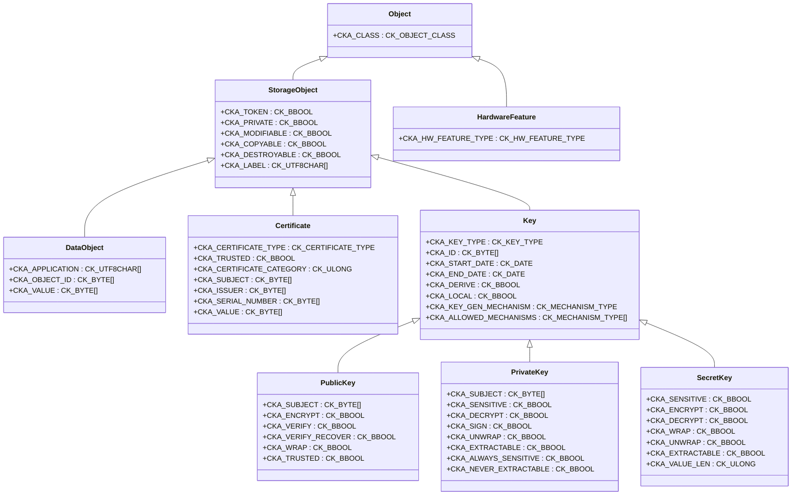
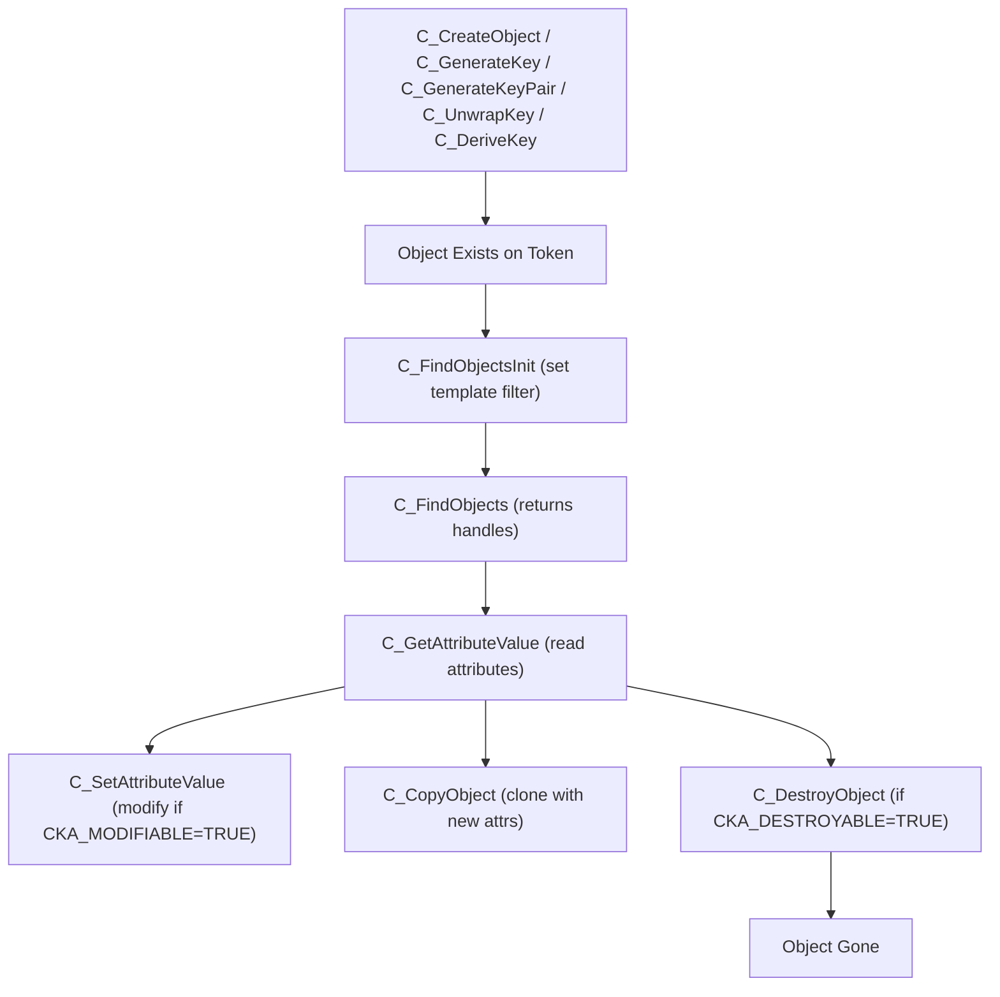
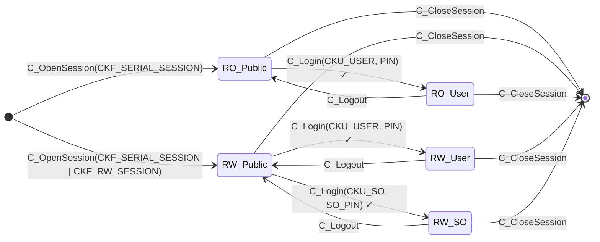
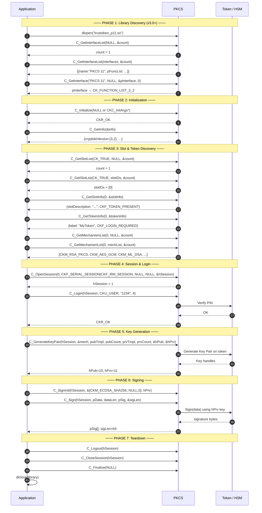
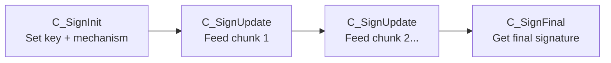
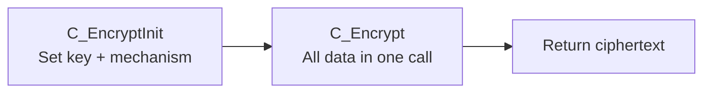
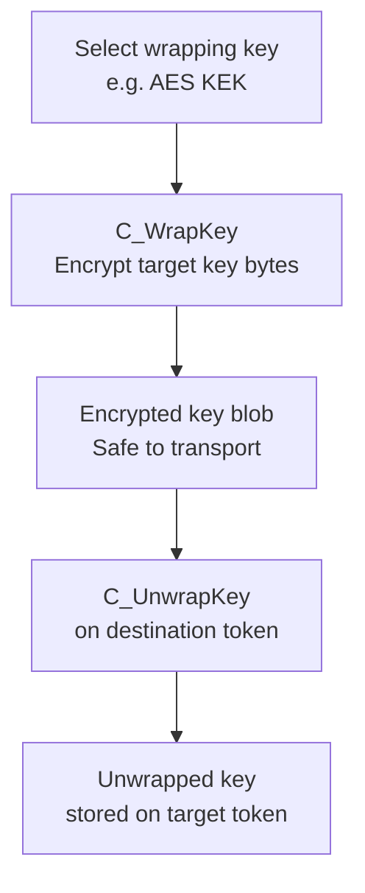
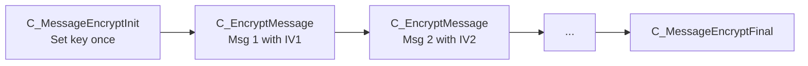
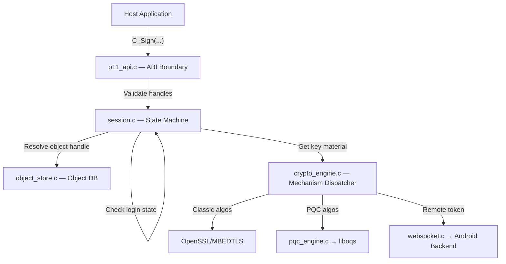
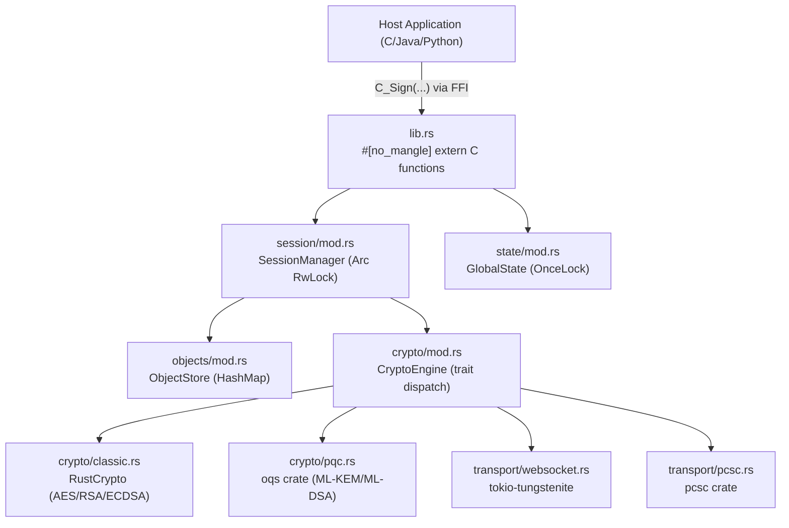

> **Reference**: [OASIS PKCS#11 v3.2 Specification](https://docs.oasis-open.org/pkcs11/pkcs11-spec/v3.2/pkcs11-spec-v3.2.html)

---

## Table of Contents

1. [What is PKCS#11?](#1-what-is-pkcs11)
2. [Key Concepts & Terminology](#2-key-concepts--terminology)
3. [Core Data Types & Structures](#3-core-data-types--structures)
4. [Object Hierarchy](#4-object-hierarchy)
5. [Session State Machine](#5-session-state-machine)
6. [Complete Application Workflow](#6-complete-application-workflow)
7. [Cryptographic Operation Flows](#7-cryptographic-operation-flows)
8. [All PKCS#11 Functions by Category](#8-all-pkcs11-functions-by-category)
9. [Mechanism Types (Classic + Post-Quantum)](#9-mechanism-types-classic--post-quantum)
10. [Option A — C/C++ Implementation Roadmap](#10-option-a--cc-implementation-roadmap)
11. [Option B — Rust Implementation Roadmap (TDD)](#11-option-b--rust-implementation-roadmap-tdd)
12. [Cross-Platform Strategy](#12-cross-platform-strategy)

---

## 1. What is PKCS#11?

PKCS#11 (Public Key Cryptography Standard #11), also known as **Cryptoki**, is a platform-independent C API that defines a standard interface between applications and cryptographic hardware/software tokens like:

- Hardware Security Modules (HSMs)
- Smart Cards (via PC/SC)
- USB tokens
- Software tokens (like SoftHSM)

The standard is maintained by OASIS. **v3.2** is the latest version and adds:

- `C_GetInterfaceList` / `C_GetInterface` for dynamic interface discovery
- Message-based cryptographic API (`C_MessageEncryptInit`, `C_EncryptMessage`, etc.)
- Post-Quantum Cryptography (PQC) mechanism standardization

### Why PKCS#11 Matters

- A single application (e.g., OpenVPN, Firefox, Java KeyStore) can work with ANY hardware token from ANY vendor without rewriting code.
- The token vendor writes the PKCS#11 library (`.dll` / `.so`). The application simply loads it dynamically.

---

## 2. Key Concepts & Terminology

|Term|Meaning|
|---|---|
|**Cryptoki**|The PKCS#11 API name. Short for "Cryptographic Token Interface".|
|**Slot**|A physical or logical reader/channel that can hold a Token (e.g., a USB port).|
|**Token**|The cryptographic device itself (e.g., a SmartCard inserted into a Slot).|
|**Session**|An active connection to a Token through a Slot. Multiple sessions can be open simultaneously.|
|**Object**|A PKCS#11 entity stored on a Token (e.g., a Key, Certificate, or raw Data blob).|
|**Mechanism**|Specifies the cryptographic algorithm and its parameters (e.g., `CKM_AES_GCM`, `CKM_RSA_PKCS`).|
|**Attribute**|A typed key-value pair (`CK_ATTRIBUTE`) used to describe or query objects.|
|**Handle**|An opaque integer reference to a Session or Object. Never a raw pointer.|
|**SO**|Security Officer — an administrative user role that can set/reset the user PIN.|
|**CKR_**|Prefix for all PKCS#11 return codes (e.g., `CKR_OK`, `CKR_PIN_INCORRECT`).|
|**CKM_**|Prefix for Mechanism identifiers (e.g., `CKM_RSA_PKCS`, `CKM_ML_KEM`).|
|**CKA_**|Prefix for Attribute types (e.g., `CKA_CLASS`, `CKA_VALUE`).|
|**CKO_**|Prefix for Object classes (e.g., `CKO_PUBLIC_KEY`, `CKO_CERTIFICATE`).|

---

## 3. Core Data Types & Structures

### Primitive Types (from `pkcs11t.h`)

```c
typedef unsigned char      CK_BYTE;
typedef unsigned long      CK_ULONG;
typedef long               CK_LONG;
typedef CK_BYTE *          CK_BYTE_PTR;
typedef CK_ULONG           CK_FLAGS;
typedef CK_ULONG           CK_SLOT_ID;
typedef CK_ULONG           CK_SESSION_HANDLE;
typedef CK_ULONG           CK_OBJECT_HANDLE;
typedef CK_ULONG           CK_MECHANISM_TYPE;
typedef CK_ULONG           CK_ATTRIBUTE_TYPE;
typedef CK_ULONG           CK_RV;          /* Return Value */
typedef CK_ULONG           CK_USER_TYPE;   /* CKU_USER, CKU_SO */
typedef CK_ULONG           CK_STATE;       /* Session State */
typedef CK_ULONG           CK_OBJECT_CLASS;
typedef CK_ULONG           CK_KEY_TYPE;
typedef CK_ULONG           CK_CERTIFICATE_TYPE;
```

### Key Structures

#### CK_VERSION — Library/Firmware Version

```c
typedef struct CK_VERSION {
    CK_BYTE major;  /* e.g. 3 */
    CK_BYTE minor;  /* e.g. 2 */
} CK_VERSION;
```

#### CK_INFO — Library Identity

```c
typedef struct CK_INFO {
    CK_VERSION cryptokiVersion;       /* Must be { 3, 2 } for v3.2 */
    CK_UTF8CHAR manufacturerID[32];   /* Padded with spaces */
    CK_FLAGS flags;                   /* Reserved, must be 0 */
    CK_UTF8CHAR libraryDescription[32];
    CK_VERSION libraryVersion;
} CK_INFO;
```

#### CK_SLOT_INFO — Describes a physical slot/reader

```c
typedef struct CK_SLOT_INFO {
    CK_UTF8CHAR slotDescription[64];
    CK_UTF8CHAR manufacturerID[32];
    CK_FLAGS flags;         /* CKF_TOKEN_PRESENT, CKF_REMOVABLE_DEVICE, CKF_HW_SLOT */
    CK_VERSION hardwareVersion;
    CK_VERSION firmwareVersion;
} CK_SLOT_INFO;
```

#### CK_TOKEN_INFO — Describes a token (the card/device itself)

```c
typedef struct CK_TOKEN_INFO {
    CK_UTF8CHAR label[32];
    CK_UTF8CHAR manufacturerID[32];
    CK_UTF8CHAR model[16];
    CK_CHAR serialNumber[16];
    CK_FLAGS flags;
    /* Flags include: CKF_RNG, CKF_WRITE_PROTECTED, CKF_LOGIN_REQUIRED,
       CKF_USER_PIN_INITIALIZED, CKF_TOKEN_INITIALIZED, CKF_SO_PIN_LOCKED, etc. */
    CK_ULONG ulMaxSessionCount;
    CK_ULONG ulSessionCount;
    CK_ULONG ulMaxRwSessionCount;
    CK_ULONG ulRwSessionCount;
    CK_ULONG ulMaxPinLen;
    CK_ULONG ulMinPinLen;
    CK_ULONG ulTotalPublicMemory;
    CK_ULONG ulFreePublicMemory;
    CK_ULONG ulTotalPrivateMemory;
    CK_ULONG ulFreePrivateMemory;
    CK_VERSION hardwareVersion;
    CK_VERSION firmwareVersion;
    CK_CHAR utcTime[16];
} CK_TOKEN_INFO;
```

#### CK_SESSION_INFO — Session state snapshot

```c
typedef struct CK_SESSION_INFO {
    CK_SLOT_ID slotID;
    CK_STATE state;  /* CKS_RO_PUBLIC_SESSION, CKS_RW_USER_SESSION, etc. */
    CK_FLAGS flags;  /* CKF_RW_SESSION, CKF_SERIAL_SESSION */
    CK_ULONG ulDeviceError;
} CK_SESSION_INFO;
```

#### CK_ATTRIBUTE — The Universal Key-Value Descriptor

```c
typedef struct CK_ATTRIBUTE {
    CK_ATTRIBUTE_TYPE type;    /* e.g. CKA_CLASS, CKA_VALUE */
    CK_VOID_PTR pValue;        /* Pointer to the value buffer */
    CK_ULONG ulValueLen;       /* Length of pValue in bytes */
} CK_ATTRIBUTE;
```

> **Note**: When `pValue = NULL`, the library fills `ulValueLen` with the required size. This two-step call pattern is how you allocate correctly-sized buffers.

#### CK_MECHANISM — Algorithm Selector

```c
typedef struct CK_MECHANISM {
    CK_MECHANISM_TYPE mechanism;  /* e.g. CKM_RSA_PKCS, CKM_AES_GCM */
    CK_VOID_PTR pParameter;       /* Mechanism-specific params (e.g. IV for AES) */
    CK_ULONG ulParameterLen;
} CK_MECHANISM;
```

#### CK_INTERFACE — v3.0+ Interface Discovery

```c
typedef struct CK_INTERFACE {
    CK_UTF8CHAR_PTR pInterfaceName;    /* e.g. "PKCS 11" */
    CK_VOID_PTR pFunctionList;         /* Points to CK_FUNCTION_LIST_3_2 */
    CK_FLAGS flags;
} CK_INTERFACE;
```

---

## 4. Object Hierarchy

Every entity stored on a PKCS#11 token is an **Object**. Objects have a strict inheritance structure defined via `CKA_CLASS`.



### Object Lifecycle



---

## 5. Session State Machine

The session state is the single most important concept to understand for implementation.



### Permitted Operations per State

|Operation|RO Public|RW Public|RO User|RW User|RW SO|
|---|---|---|---|---|---|
|Access Public Token Objects|✅|✅|✅|✅|❌|
|Access Private Token Objects|❌|❌|✅|✅|❌|
|Create Public Token Object|❌|✅|❌|✅|❌|
|Create Private Token Object|❌|❌|❌|✅|❌|
|Initialize User PIN|❌|❌|❌|❌|✅|
|Sign / Decrypt|❌|❌|✅|✅|❌|
|Create Session Objects|✅|✅|✅|✅|✅|

---

## 6. Complete Application Workflow



---

## 7. Cryptographic Operation Flows

### 7.1 Multi-Part Signature Flow (Streaming)

Used for large data where you cannot load the entire buffer at once.



### 7.2 Single-Shot Encryption Flow



### 7.3 Key Wrapping Flow (Key Export Protection)



### 7.4 Message-Based Encryption (v3.0+ Only)

The new message-based API is more efficient for AEAD operations like AES-GCM where each message may have a different IV.



---

## 8. All PKCS#11 Functions by Category

### General Purpose Functions

|Function|Purpose|
|---|---|
|`C_GetInterfaceList` _(v3.0+)_|Get list of supported interfaces|
|`C_GetInterface` _(v3.0+)_|Get a specific named interface|
|`C_GetFunctionList` _(legacy)_|Get the function pointer table|
|`C_Initialize`|Init the library, set up threading|
|`C_Finalize`|Tear down the library, free memory|
|`C_GetInfo`|Get library version, manufacturer|

### Slot & Token Management

|Function|Purpose|
|---|---|
|`C_GetSlotList`|List all available slot IDs|
|`C_GetSlotInfo`|Get info about a specific slot|
|`C_GetTokenInfo`|Get info about the token in a slot|
|`C_GetMechanismList`|List mechanisms the token supports|
|`C_GetMechanismInfo`|Get min/max key size, flags for a mechanism|
|`C_InitToken`|Initialize a token (set label, set SO PIN)|
|`C_InitPIN`|Set the User PIN (in SO session)|
|`C_SetPIN`|Change the current user's PIN|
|`C_WaitForSlotEvent`|Block until a token is inserted/removed|

### Session Management

|Function|Purpose|
|---|---|
|`C_OpenSession`|Open a session (R/O or R/W) on a slot|
|`C_CloseSession`|Close one session|
|`C_CloseAllSessions`|Close all sessions on a slot|
|`C_GetSessionInfo`|Query state of a session|
|`C_GetOperationState`|Serialize current op state (for cloning)|
|`C_SetOperationState`|Restore serialized op state|
|`C_Login`|Authenticate as USER or SO|
|`C_Logout`|Deauthenticate|
|`C_LoginUser` _(v3.0+)_|Extended login with context data|

### Object Management

|Function|Purpose|
|---|---|
|`C_CreateObject`|Manually create an object from attributes|
|`C_CopyObject`|Clone an object, optionally changing attrs|
|`C_DestroyObject`|Delete an object from the token|
|`C_GetObjectSize`|Get storage size of an object|
|`C_GetAttributeValue`|Read attributes from an object|
|`C_SetAttributeValue`|Modify attributes (if mutable)|
|`C_FindObjectsInit`|Start a search with a template filter|
|`C_FindObjects`|Retrieve matching object handles|
|`C_FindObjectsFinal`|Clean up the search context|

### Key Management

|Function|Purpose|
|---|---|
|`C_GenerateKey`|Generate a symmetric key|
|`C_GenerateKeyPair`|Generate an asymmetric key pair|
|`C_WrapKey`|Encrypt a key for export|
|`C_UnwrapKey`|Decrypt a wrapped key and store it|
|`C_DeriveKey`|Derive a new key from an existing one|

### Cryptographic Functions

|Function|Purpose|
|---|---|
|`C_EncryptInit` / `C_Encrypt` / `C_EncryptUpdate` / `C_EncryptFinal`|Encrypt data|
|`C_DecryptInit` / `C_Decrypt` / `C_DecryptUpdate` / `C_DecryptFinal`|Decrypt data|
|`C_DigestInit` / `C_Digest` / `C_DigestUpdate` / `C_DigestKey` / `C_DigestFinal`|Hash data|
|`C_SignInit` / `C_Sign` / `C_SignUpdate` / `C_SignFinal`|Sign data|
|`C_SignRecoverInit` / `C_SignRecover`|Sign with message recovery|
|`C_VerifyInit` / `C_Verify` / `C_VerifyUpdate` / `C_VerifyFinal`|Verify a signature|
|`C_VerifyRecoverInit` / `C_VerifyRecover`|Verify and recover message|
|`C_DigestEncryptUpdate` / `C_DecryptDigestUpdate`|Dual-function operations|
|`C_SignEncryptUpdate` / `C_DecryptVerifyUpdate`|Dual-function operations|
|`C_GenerateRandom`|Get random bytes from the token's RNG|
|`C_SeedRandom`|Seed the token's RNG|

### Message Functions (v3.0+)

|Function|Purpose|
|---|---|
|`C_MessageEncryptInit`|Init for multi-message encryption|
|`C_EncryptMessage`|Encrypt one message|
|`C_EncryptMessageBegin` / `C_EncryptMessageNext` / `C_MessageEncryptFinal`|Streaming multi-message|
|`C_MessageDecryptInit` / `C_DecryptMessage` / etc.|Multi-message decryption|
|`C_MessageSignInit` / `C_SignMessage` / etc.|Multi-message signing|
|`C_MessageVerifyInit` / `C_VerifyMessage` / etc.|Multi-message verification|

---

## 9. Mechanism Types (Classic + Post-Quantum)

### Classic Mechanisms

|CKM Constant|Purpose|Key Type|
|---|---|---|
|`CKM_RSA_PKCS`|RSA Sign/Encrypt|RSA|
|`CKM_RSA_PKCS_OAEP`|RSA Encrypt (OAEP padding)|RSA|
|`CKM_RSA_PKCS_PSS`|RSA Sign (PSS padding)|RSA|
|`CKM_SHA256_RSA_PKCS`|SHA-256 + RSA Sign|RSA|
|`CKM_EC_KEY_PAIR_GEN`|ECC Key Pair generation|EC|
|`CKM_ECDSA`|ECDSA Sign|EC|
|`CKM_ECDSA_SHA256`|SHA-256 + ECDSA|EC|
|`CKM_ECDH1_DERIVE`|ECDH Key Agreement|EC|
|`CKM_AES_KEY_GEN`|AES Key generation|AES|
|`CKM_AES_CBC`|AES-CBC Encrypt/Decrypt|AES|
|`CKM_AES_GCM`|AES-GCM (AEAD)|AES|
|`CKM_AES_CTR`|AES-CTR|AES|
|`CKM_AES_KW`|AES Key Wrap|AES|
|`CKM_SHA_1`|SHA-1 Hash|—|
|`CKM_SHA256`|SHA-256 Hash|—|
|`CKM_SHA512`|SHA-512 Hash|—|
|`CKM_SHA3_256`|SHA3-256 Hash|—|

### Post-Quantum Mechanisms (PKCS#11 v3.2 Draft)

|CKM Constant|Algorithm|Purpose|
|---|---|---|
|`CKM_ML_KEM`|CRYSTALS-Kyber (ML-KEM)|Key Encapsulation|
|`CKM_ML_DSA`|CRYSTALS-Dilithium (ML-DSA)|Digital Signature|
|`CKM_SLH_DSA`|SPHINCS+ (SLH-DSA)|Digital Signature (hash-based)|
|`CKM_XMSS`|XMSS|Stateful Hash Signature|

---

## 10. Option A — C/C++ Implementation Roadmap

### Purpose

Use C/C++ when you need zero-overhead native integration with existing C-based HSM SDKs, or when your team has deep embedded/systems programming experience.

### Folder Structure

```
trustoken_p11/
├── include/
│   ├── pkcs11t.h         # OASIS standard types (do not modify)
│   ├── pkcs11f.h         # OASIS function prototypes (do not modify)
│   ├── cryptoki.h        # Pulls in pkcs11t.h and pkcs11f.h
│   └── token_internal.h  # Internal structs (not exposed)
├── src/
│   ├── p11_api.c         # Only file that exports extern C symbols
│   ├── context.c         # Global state, slot/token list management
│   ├── session.c         # Session state machine & handle map
│   ├── object_store.c    # In-memory/database-backed object store
│   ├── crypto_engine.c   # Mechanism dispatcher → OpenSSL/MBEDTLS
│   ├── pqc_engine.c      # liboqs dispatcher for PQC mechanisms
│   ├── websocket.c       # libwebsockets-based remote token client
│   └── utils.c           # Attribute template helpers, padding
├── tests/
│   ├── test_session.c    # CMocka unit tests
│   └── test_crypto.c
├── CMakeLists.txt
└── Makefile
```

### Layered Architecture



### Phase-by-Phase C/C++ Implementation

#### Phase 1: Headers & ABI Skeleton (Days 1–2)

- Include the official unmodified OASIS `pkcs11t.h` and `pkcs11f.h`.
- Create `p11_api.c` exporting `C_GetFunctionList` with a static `CK_FUNCTION_LIST` table.
- Return `CKR_FUNCTION_NOT_SUPPORTED` for all stubs.
- Verify the `.dll`/`.so` loads with `pkcs11-tool --module ./lib.so --show-info`.

#### Phase 2: Global Context & Slot Management (Days 3–5)

- Create a global `p11Context_t` struct protected by a mutex.
- Implement `C_Initialize` to set up threading locks.
- Implement `C_GetSlotList`, `C_GetSlotInfo`, `C_GetTokenInfo`.
- Hardcode a single virtual slot for `SoftToken` mode.

#### Phase 3: Session State Machine (Days 6–8)

- Create a `HashMap<CK_SESSION_HANDLE, Session>` equivalent.
- Implement `C_OpenSession`, `C_CloseSession`, `C_Login`, `C_Logout`.
- Implement the full transition table from §5.

#### Phase 4: Object Store & Find (Days 9–13)

- Design the internal object structure with an attribute array.
- Implement `C_CreateObject`, `C_DestroyObject`, `C_GetAttributeValue`.
- Build `C_FindObjectsInit` / `C_FindObjects` with template matching logic.

#### Phase 5: Cryptographic Dispatcher (Days 14–20)

- Implement `C_SignInit` → check mechanism against token's supported list.
- Implement `C_Sign` → dispatch to correct backend (OpenSSL/liboqs/WebSocket).
- Repeat for Encrypt, Decrypt, Digest, Verify, GenerateKey, GenerateKeyPair.

#### Phase 6: Post-Quantum Integration (Days 21–23)

- Link against `liboqs.lib` / `liboqs.so`.
- Map `CKM_ML_DSA` → `OQS_SIG_dilithium_3_sign()`.
- Map `CKM_ML_KEM` → `OQS_KEM_kyber_768_encaps()`.

#### Phase 7: Testing & Compliance (Days 24–25)

- Write `CMocka` tests for each session state transition.
- Run `pkcs11-tool --test --login` to validate end-to-end compliance.

---

## 11. Option B — Rust Implementation Roadmap (TDD)

### Purpose

Use Rust when you need memory safety guarantees, fearless concurrency, cross-platform cross-compilation, and a modern TDD workflow.

### Why Rust for PKCS#11?

|Risk in C|How Rust Eliminates It|
|---|---|
|Buffer overflow in `CK_ATTRIBUTE` parsing|Borrow checker prevents out-of-bounds access at compile time|
|Use-after-free on Session handles|Ownership system guarantees freed memory is never referenced|
|Data race in multi-threaded session access|`Send`/`Sync` traits + `Arc<RwLock<T>>` compile-time enforcement|
|Forgotten `NULL` check on `pValue`|`Option<&[u8]>` cannot be dereferenced without explicit unwrap|

### Cargo.toml Dependencies

```toml
[lib]
crate-type = ["cdylib"]

[dependencies]
pkcs11-sys = "0.3"           # Auto-generated bindings from pkcs11t.h
lazy_static = "1.5"          # Global state initialization
parking_lot = "0.12"         # Fast RwLock / Mutex
serde = { version = "1", features = ["derive"] }
serde_json = "1"             # Replace cJSON
tokio = { version = "1", features = ["full"] }
tokio-tungstenite = "0.24"   # WebSocket client
pcsc = "2"                   # PC/SC hardware token access
oqs = "0.9"                  # liboqs Post-Quantum bindings
log = "0.4"
env_logger = "0.11"

[dev-dependencies]
rstest = "0.22"              # Parameterized test cases
tokio-test = "0.4"           # Async test utilities
```

### Module Architecture



### Phase 1: Scaffold & FFI Boundary (Days 1–3)

**Goal**: Export a valid C ABI and pass `pkcs11-tool --show-info`.

**Implementation**:

```rust
// src/lib.rs
#[no_mangle]
pub unsafe extern "C" fn C_Initialize(pInitArgs: CK_VOID_PTR) -> CK_RV {
    if !pInitArgs.is_null() {
        // Validate CK_C_INITIALIZE_ARGS safely
    }
    state::init();
    CKR_OK
}

#[no_mangle]
pub unsafe extern "C" fn C_GetFunctionList(
    ppFunctionList: CK_FUNCTION_LIST_PTR_PTR
) -> CK_RV {
    if ppFunctionList.is_null() { return CKR_ARGUMENTS_BAD; }
    *ppFunctionList = &FUNCTION_LIST as *const _ as *mut _;
    CKR_OK
}
```

**TDD Tests**:

```rust
#[cfg(test)]
mod tests {
    #[test]
    fn test_initialize_null_args_succeeds() {
        let rv = unsafe { C_Initialize(std::ptr::null_mut()) };
        assert_eq!(rv, CKR_OK);
    }

    #[test]
    fn test_get_function_list_null_ptr_returns_bad_args() {
        let rv = unsafe { C_GetFunctionList(std::ptr::null_mut()) };
        assert_eq!(rv, CKR_ARGUMENTS_BAD);
    }

    #[test]
    fn test_get_info_returns_v3_2() {
        let mut info = CK_INFO::default();
        let rv = unsafe { C_GetInfo(&mut info) };
        assert_eq!(rv, CKR_OK);
        assert_eq!(info.cryptokiVersion.major, 3);
        assert_eq!(info.cryptokiVersion.minor, 2);
    }
}
```

### Phase 2: Session State Machine (Days 4–7)

**Goal**: Enforce all login state transitions at compile time using Rust enums.

**Implementation**:

```rust
// src/session/mod.rs
#[derive(Debug, Clone, PartialEq)]
pub enum SessionState {
    RoPublic,
    RwPublic,
    RoUser,
    RwUser,
    RwSO,
}

pub struct Session {
    pub slot_id: CK_SLOT_ID,
    pub state: SessionState,
    pub is_rw: bool,
    pub active_sign_op: Option<Box<dyn SignOperation>>,
    pub active_encrypt_op: Option<Box<dyn EncryptOperation>>,
    pub find_context: Option<FindContext>,
}

impl Session {
    pub fn can_access_private_objects(&self) -> bool {
        matches!(self.state, SessionState::RoUser | SessionState::RwUser)
    }

    pub fn can_create_private_objects(&self) -> bool {
        matches!(self.state, SessionState::RwUser)
    }
}
```

**TDD Tests**:

```rust
#[test]
fn test_private_object_access_denied_in_public_session() {
    let session = Session::new_public(0, false);
    assert!(!session.can_access_private_objects());
}

#[test]
fn test_login_transitions_to_user_state() {
    let mut mgr = SessionManager::new();
    let handle = mgr.open_session(0, false);
    let rv = mgr.login(handle, CKU_USER, b"1234");
    assert_eq!(rv, CKR_OK);
    let state = mgr.get_session(handle).unwrap().state.clone();
    assert_eq!(state, SessionState::RwUser);
}

#[test]
fn test_concurrent_sessions_on_different_slots_are_independent() {
    let mgr = Arc::new(RwLock::new(SessionManager::new()));
    let m1 = mgr.clone();
    let m2 = mgr.clone();
    let t1 = std::thread::spawn(move || m1.write().open_session(0, true));
    let t2 = std::thread::spawn(move || m2.write().open_session(1, false));
    let h1 = t1.join().unwrap();
    let h2 = t2.join().unwrap();
    assert_ne!(h1, h2);
}
```

### Phase 3: Object Store & Find Engine (Days 8–12)

**Goal**: Build a queryable in-memory object database.

```rust
// src/objects/mod.rs
pub struct P11Object {
    pub handle: CK_OBJECT_HANDLE,
    pub class: CK_OBJECT_CLASS,
    pub is_token: bool,
    pub is_private: bool,
    pub attributes: HashMap<CK_ATTRIBUTE_TYPE, Vec<u8>>,
}

pub struct ObjectStore {
    objects: HashMap<CK_OBJECT_HANDLE, P11Object>,
    next_handle: CK_OBJECT_HANDLE,
}

impl ObjectStore {
    pub fn find_matching(&self, template: &[CK_ATTRIBUTE]) -> Vec<CK_OBJECT_HANDLE> {
        self.objects.values()
            .filter(|obj| template.iter().all(|attr| {
                obj.attributes.get(&attr.type)
                    .map_or(false, |v| v.as_slice() == attr.value_bytes())
            }))
            .map(|obj| obj.handle)
            .collect()
    }
}
```

**TDD Tests**:

```rust
#[rstest]
#[case(CKO_PUBLIC_KEY, true)]
#[case(CKO_PRIVATE_KEY, false)]
fn test_find_by_class(#[case] class: CK_OBJECT_CLASS, #[case] found: bool) {
    let store = build_test_store_with_public_key();
    let template = vec![attr!(CKA_CLASS, class)];
    let results = store.find_matching(&template);
    assert_eq!(!results.is_empty(), found);
}
```

### Phase 4: Cryptographic Engine (Days 13–20)

**Goal**: Implement sign/encrypt with pluggable backends.

```rust
// src/crypto/mod.rs
pub trait SignOperation: Send + Sync {
    fn update(&mut self, data: &[u8]) -> CK_RV;
    fn finalize(&mut self) -> Result<Vec<u8>, CK_RV>;
}

pub struct EcdsaSigner {
    signing_key: p256::ecdsa::SigningKey,
    hasher: sha2::Sha256,
}

impl SignOperation for EcdsaSigner {
    fn update(&mut self, data: &[u8]) -> CK_RV {
        use sha2::Digest;
        self.hasher.update(data);
        CKR_OK
    }
    fn finalize(&mut self) -> Result<Vec<u8>, CK_RV> {
        use sha2::Digest;
        use p256::ecdsa::signature::Signer;
        let hash = self.hasher.clone().finalize();
        let sig: p256::ecdsa::Signature = self.signing_key.sign(&hash);
        Ok(sig.to_der().as_bytes().to_vec())
    }
}
```

**TDD Tests**:

```rust
#[test]
fn test_sign_without_init_returns_not_initialized() {
    let mut session = Session::new_user(0, true);
    let data = b"hello world";
    let mut sig_buf = vec![0u8; 256];
    let mut sig_len = sig_buf.len() as CK_ULONG;
    // active_sign_op is None here
    let rv = session.sign(data, &mut sig_buf, &mut sig_len);
    assert_eq!(rv, CKR_OPERATION_NOT_INITIALIZED);
}

#[test]
fn test_ecdsa_sign_produces_valid_der_signature() {
    let key = generate_test_ec_key();
    let mut signer = EcdsaSigner::new(key);
    signer.update(b"test message").unwrap();
    let sig = signer.finalize().unwrap();
    assert!(!sig.is_empty());
    assert!(sig[0] == 0x30); // DER SEQUENCE tag
}
```

### Phase 5: Post-Quantum Integration (Days 21–23)

```rust
// src/crypto/pqc.rs
use oqs::sig::{Algorithm, Sig};

pub struct MlDsaSigner {
    sig_alg: Sig,
    secret_key: oqs::sig::SecretKey,
    message_buf: Vec<u8>,
}

impl SignOperation for MlDsaSigner {
    fn update(&mut self, data: &[u8]) -> CK_RV {
        self.message_buf.extend_from_slice(data);
        CKR_OK
    }
    fn finalize(&mut self) -> Result<Vec<u8>, CK_RV> {
        let sig = self.sig_alg
            .sign(&self.message_buf, &self.secret_key)
            .map_err(|_| CKR_FUNCTION_FAILED)?;
        Ok(sig.into_vec())
    }
}
```

**TDD Tests**:

```rust
#[test]
fn test_ml_dsa_sign_verify_roundtrip() {
    let sig_alg = Sig::new(Algorithm::Dilithium3).unwrap();
    let (pk, sk) = sig_alg.keypair().unwrap();
    let mut signer = MlDsaSigner::new(sig_alg.clone(), sk);
    signer.update(b"quantum safe message").unwrap();
    let signature = signer.finalize().unwrap();
    let result = sig_alg.verify(b"quantum safe message", &sig, &pk);
    assert!(result.is_ok());
}
```

### Phase 6: End-to-End & Fuzzing (Days 24–25)

```bash
# Compliance check with external tool
pkcs11-tool --module ./target/release/trustoken_p11.so --show-info
pkcs11-tool --module ./target/release/trustoken_p11.so --test --login --pin 1234

# Fuzzing
cargo install cargo-fuzz
cargo fuzz add fuzz_attribute_parser
cargo fuzz run fuzz_attribute_parser
```

---

## 12. Cross-Platform Strategy

|Platform|Output|Build Command|
|---|---|---|
|Windows x64|`.dll`|`cargo build --release --target x86_64-pc-windows-msvc`|
|Linux x64|`.so`|`cargo build --release --target x86_64-unknown-linux-gnu`|
|macOS|`.dylib`|`cargo build --release --target x86_64-apple-darwin`|
|Android (ARM64)|`.so`|`cargo build --release --target aarch64-linux-android`|

### CI/CD Pipeline (GitHub Actions)

```yaml
jobs:
  build-and-test:
    strategy:
      matrix:
        os: [ubuntu-latest, windows-latest, macos-latest]
    runs-on: ${{ matrix.os }}
    steps:
      - uses: actions/checkout@v4
      - uses: dtolnay/rust-toolchain@stable
      - run: cargo test
      - run: cargo build --release
      - run: pkcs11-tool --module target/release/trustoken_p11.so --show-info
```

---

_End of Document — Reference: OASIS PKCS#11 v3.2 Specification_