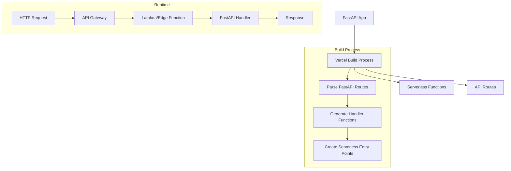

I'll help you create a complete example of converting FastAPI routes to serverless functions.

### 1. First, let's create a basic FastAPI application

````python:app/main.py
from fastapi import FastAPI
from typing import Dict

app = FastAPI()

# Sample database (in memory for demonstration)
users_db = {
    1: {"name": "John", "age": 30},
    2: {"name": "Jane", "age": 25}
}

@app.get("/users/{user_id}")
async def get_user(user_id: int) -> Dict:
    if user_id in users_db:
        return users_db[user_id]
    return {"error": "User not found"}

@app.post("/users/create")
async def create_user(name: str, age: int) -> Dict:
    new_id = max(users_db.keys()) + 1
    users_db[new_id] = {"name": name, "age": age}
    return {"id": new_id, "name": name, "age": age}
````

### 2. Create the Serverless Handler

````python:api/handler.py
from mangum import Mangum
from app.main import app

# Create handler instance
handler = Mangum(app)
````

### 3. Create Individual Function Handlers

````python:api/users/[user_id].py
from api.handler import handler

def handle(request, context):
    return handler(request, context)
````

````python:api/users/create.py
from api.handler import handler

def handle(request, context):
    return handler(request, context)
````

### 4. Create Serverless Configuration

````yaml:vercel.json
{
  "version": 2,
  "builds": [
    { "src": "api/**/*.py", "use": "@vercel/python" }
  ],
  "routes": [
    { "src": "/users/create", "dest": "api/users/create.py" },
    { "src": "/users/(.*)", "dest": "api/users/[user_id].py" }
  ]
}
````

### 5. Create Requirements File

````text:requirements.txt
fastapi==0.104.1
mangum==0.17.0
pydantic==2.5.2
````

### 6. Create a Custom Serverless Implementation

Let's create our own serverless implementation to understand how it works:

````python:serverless/bridge.py
import json
import asyncio
from typing import Dict, Any

class ServerlessBridge:
    def __init__(self, app):
        self.app = app
    
    async def handle_request(self, event: Dict[str, Any]) -> Dict[str, Any]:
        """
        Convert HTTP event to ASGI format and process it
        """
        # Parse request
        path = event.get('path', '/')
        method = event.get('httpMethod', 'GET')
        headers = event.get('headers', {})
        body = event.get('body', '')
        
        # Create ASGI scope
        scope = {
            'type': 'http',
            'method': method,
            'path': path,
            'headers': [[k.lower().encode(), v.encode()] for k, v in headers.items()],
            'query_string': event.get('queryStringParameters', '').encode(),
        }
        
        # Create response holder
        response = {
            'status': None,
            'headers': [],
            'body': b''
        }
        
        # ASGI send callback
        async def send(message):
            if message['type'] == 'http.response.start':
                response['status'] = message['status']
                response['headers'] = message['headers']
            elif message['type'] == 'http.response.body':
                response['body'] += message['body']
        
        # ASGI receive callback
        async def receive():
            return {
                'type': 'http.request',
                'body': body.encode() if body else b'',
                'more_body': False,
            }
        
        # Call ASGI application
        await self.app(scope, receive, send)
        
        # Format response for serverless
        return {
            'statusCode': response['status'],
            'headers': dict(response['headers']),
            'body': response['body'].decode(),
            'isBase64Encoded': False
        }
````

### 7. Create a Serverless Handler Factory

````python:serverless/factory.py
import json
from typing import Callable, Dict, Any
from .bridge import ServerlessBridge

class ServerlessHandler:
    def __init__(self, app):
        self.bridge = ServerlessBridge(app)
    
    def create_handler(self) -> Callable:
        """
        Creates a handler function for serverless platforms
        """
        async def handler(event: Dict[str, Any], context: Any) -> Dict[str, Any]:
            try:
                response = await self.bridge.handle_request(event)
                return response
            except Exception as e:
                return {
                    'statusCode': 500,
                    'body': json.dumps({'error': str(e)}),
                    'headers': {
                        'Content-Type': 'application/json'
                    }
                }
        
        return handler
````

### 8. Implementation Example

````python:api/serverless.py
import asyncio
from app.main import app
from serverless.factory import ServerlessHandler

# Create handler
handler_factory = ServerlessHandler(app)
handle = handler_factory.create_handler()

# Wrapper for synchronous platforms
def lambda_handler(event, context):
    return asyncio.run(handle(event, context))
````

### How to Use

1. **Local Testing**
Create a test script:

````python:test_serverless.py
import asyncio
from api.serverless import handle

async def test():
    # Test GET /users/1
    get_event = {
        'path': '/users/1',
        'httpMethod': 'GET',
        'headers': {'Content-Type': 'application/json'},
        'queryStringParameters': ''
    }
    
    response = await handle(get_event, {})
    print("GET Response:", response)
    
    # Test POST /users/create
    post_event = {
        'path': '/users/create',
        'httpMethod': 'POST',
        'headers': {'Content-Type': 'application/json'},
        'body': '{"name": "Alice", "age": 28}',
        'queryStringParameters': ''
    }
    
    response = await handle(post_event, {})
    print("POST Response:", response)

if __name__ == "__main__":
    asyncio.run(test())
````

### Deployment Steps

1. **For Vercel:**
```bash
vercel deploy
```

2. **For AWS Lambda:**
```bash
# Package your application
zip -r function.zip . -x "*.git*" -x "*.env*" -x "__pycache__/*"

# Upload to AWS Lambda
aws lambda create-function \
    --function-name my-fastapi-function \
    --runtime python3.9 \
    --handler api.serverless.lambda_handler \
    --zip-file fileb://function.zip \
    --role arn:aws:iam::YOUR_ACCOUNT_ID:role/lambda-role
```

### How It Works

1. **Request Flow:**
````mermaid
sequenceDiagram
    Client->>API Gateway: HTTP Request
    API Gateway->>Lambda Function: Convert to Event
    Lambda Function->>ServerlessBridge: Process Event
    ServerlessBridge->>FastAPI App: ASGI Request
    FastAPI App->>ServerlessBridge: ASGI Response
    ServerlessBridge->>Lambda Function: Format Response
    Lambda Function->>API Gateway: Return Response
    API Gateway->>Client: HTTP Response
````

### Key Benefits

1. **Resource Efficiency:**
- Functions only run when called
- No idle server costs
- Automatic scaling

2. **Cost Effectiveness:**
- Pay per execution
- No costs when idle
- Efficient resource utilization

3. **Maintenance:**
- No server management
- Automatic updates
- Built-in monitoring

### Usage Example

```bash
# Call the GET endpoint
curl https://your-domain.com/users/1

# Call the POST endpoint
curl -X POST \
     -H "Content-Type: application/json" \
     -d '{"name": "Alice", "age": 28}' \
     https://your-domain.com/users/create
```

### Important Notes

1. **Cold Starts:**
- First request might be slower
- Use provisioned concurrency for consistent performance
- Optimize dependencies

2. **State Management:**
- Don't rely on in-memory state
- Use external databases/caches
- Consider connection pooling

3. **Environment Variables:**
```bash
# Set these in your serverless platform
STAGE=production
DATABASE_URL=your-database-url
```

---

---
---
---
---


### High-Level Overview



### How It Works

1. **Original FastAPI Code**
```python
from fastapi import FastAPI

app = FastAPI()

@app.get("/hello")
async def hello():
    return {"message": "Hello World"}
```

2. **Vercel's Transformation Process**
Vercel creates a wrapper that converts each FastAPI route into a serverless function. Here's a simplified version of what happens behind the scenes:

```python
from mangum import Mangum
from app.main import app  # Your FastAPI app

# Mangum adapts ASGI apps to AWS Lambda
handler = Mangum(app)

# Vercel creates this wrapper for each route
async def vercel_handler(request):
    # Convert Vercel request format to ASGI
    asgi_request = convert_to_asgi(request)
    
    # Process through Mangum handler
    response = await handler(asgi_request)
    
    # Convert ASGI response to Vercel format
    return convert_to_vercel_response(response)
```

3. **Generated Serverless Structure**
```plaintext
/api
  ├── hello.js        # Generated serverless function for /hello
  └── [other_routes]  # Other route handlers
```

### Key Components for Building Your Own Serverless Mechanism

1. **ASGI Bridge**
```python
class ASGIBridge:
    def __init__(self, app):
        self.app = app
    
    async def __call__(self, event, context):
        # Convert HTTP event to ASGI format
        asgi_event = {
            'type': 'http',
            'method': event['httpMethod'],
            'path': event['path'],
            'headers': event['headers'],
            # ... other conversions
        }
        
        # Create response collector
        response = {'status': None, 'headers': [], 'body': b''}
        
        async def send(message):
            if message['type'] == 'http.response.start':
                response['status'] = message['status']
                response['headers'] = message['headers']
            elif message['type'] == 'http.response.body':
                response['body'] += message['body']

        await self.app(asgi_event, lambda: None, send)
        return response
```

2. **Route Parser**
```python
class RouteParser:
    def __init__(self, app):
        self.app = app
        self.routes = {}
    
    def parse_routes(self):
        # Extract FastAPI routes
        for route in self.app.routes:
            path = route.path
            self.routes[path] = {
                'endpoint': route.endpoint,
                'methods': route.methods,
                'name': route.name
            }
        return self.routes
```

3. **Function Generator**
```python
class FunctionGenerator:
    def __init__(self, routes):
        self.routes = routes
    
    def generate_handler(self, route):
        template = f"""
        from your_serverless.bridge import ASGIBridge
        from your_app.main import app

        bridge = ASGIBridge(app)

        async def handler(event, context):
            return await bridge(event, context)
        """
        return template
```

### Implementation Steps for Your Own Serverless Mechanism

1. **Build Process**
```python
import os
from .parser import RouteParser
from .generator import FunctionGenerator

def build_serverless_functions(app, output_dir):
    # 1. Parse FastAPI routes
    parser = RouteParser(app)
    routes = parser.parse_routes()
    
    # 2. Generate handler functions
    generator = FunctionGenerator(routes)
    
    # 3. Create function files
    for path, route_info in routes.items():
        handler_code = generator.generate_handler(route_info)
        
        # Create function file
        function_path = os.path.join(
            output_dir, 
            f"{path.strip('/')}.py"
        )
        with open(function_path, 'w') as f:
            f.write(handler_code)
```

4. **Runtime Handler**
```python
class RuntimeHandler:
    def __init__(self, event):
        self.event = event
    
    async def process(self):
        # 1. Parse request path
        path = self.event['path']
        
        # 2. Load corresponding handler
        handler = self.load_handler(path)
        
        # 3. Execute handler
        response = await handler(self.event)
        
        return response
    
    def load_handler(self, path):
        # Dynamic import of generated handler
        module_path = f"functions.{path.strip('/')}"
        module = __import__(module_path, fromlist=['handler'])
        return module.handler
```

### Key Differences from Traditional FastAPI

1. **No ASGI Server**
- Traditional: Uses Uvicorn/Hypercorn
- Serverless: Uses ASGI bridge to handle requests

2. **Request Lifecycle**
- Traditional: Continuous server process
- Serverless: New function instance per request

3. **State Management**
- Traditional: Can maintain state in memory
- Serverless: Must use external state storage

### Important Considerations

1. **Cold Starts**
```python
# Optimize cold starts by minimizing imports
from fastapi import FastAPI
app = FastAPI()

# Lazy load heavy dependencies
async def heavy_operation():
    # Import only when needed
    import heavy_module
    return heavy_module.process()
```

2. **Connection Management**
```python
# Use connection pooling for databases
from contextlib import asynccontextmanager

@asynccontextmanager
async def get_db_connection():
    pool = await create_pool()
    try:
        yield pool
    finally:
        await pool.close()
```

This explanation provides a foundation for understanding how FastAPI applications can be transformed into serverless functions. The actual implementation would need additional error handling, logging, and optimization for production use.