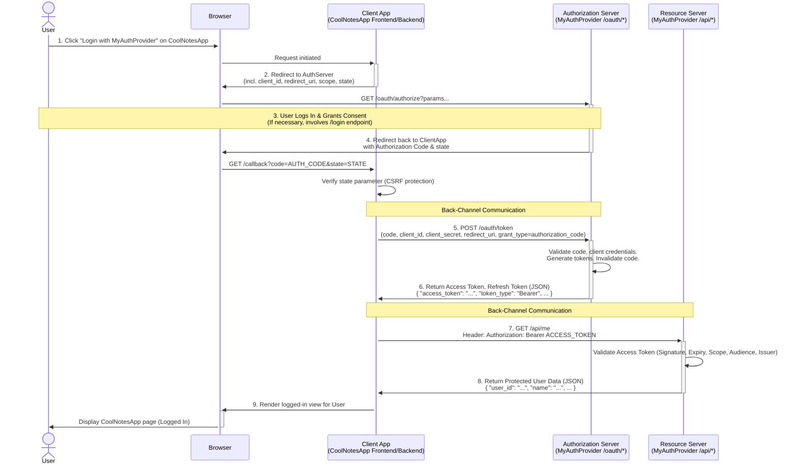

**1. Purpose: Why Does OAuth Exist? The Problem It Solves**

Imagine you have an online photo printing service ("AwesomePrints") and you want it to print photos directly from your Google Photos account.

* **The Old, Bad Way:** AwesomePrints might ask you for your Google username and password. You'd have to give them your *main* Google credentials. This is terrible because:
    * AwesomePrints now has your password and could potentially access your Gmail, Google Drive, etc., not just photos.
    * If AwesomePrints gets hacked, your Google password is stolen.
    * You can't easily revoke AwesomePrints' access without changing your main Google password, which affects all other services.
    * AwesomePrints has to securely store your password, which is difficult and risky.

* **The OAuth Way (The Solution):** Instead of giving AwesomePrints your password, OAuth provides a way for you (the user) to grant AwesomePrints *limited*, *specific* permissions to access *only* your Google Photos, without ever sharing your password. You remain in control.

**In essence, OAuth is a standard for *delegated authorization*.** It allows a third-party application (like AwesomePrints) to obtain limited access to an HTTP service (like Google Photos API), either on behalf of a resource owner (you) or by allowing the third-party application to obtain access on its own behalf.

**2. Simple Analogy: The Hotel Key Card**

Think of it like checking into a hotel:

1.  **You (Resource Owner):** You own the resource (your "stuff" in the hotel room / your data on Google Photos).
2.  **Hotel Front Desk (Authorization Server):** This is like Google's login and permission system. It verifies who you are and what you're allowing access to.
3.  **Your Hotel Room (Resource Server):** This is where your protected data lives (your actual photos on Google's servers / the physical hotel room).
4.  **Someone Needing Temporary Access (Client Application):** This could be a valet needing to park your car (if the key gives garage access) or AwesomePrints needing access to your photos.
5.  **The Request:** The valet asks the front desk for permission to access the garage using your room number. AwesomePrints asks Google for permission to access your photos.
6.  **Your Approval:** You go to the front desk (you log in to Google and see a consent screen: "AwesomePrints wants to access your Google Photos. Allow?"). You approve the specific request.
7.  **The Key Card (Access Token):** The front desk gives the valet a temporary key card that *only* opens the garage door (or maybe just your room door for a limited time). Google gives AwesomePrints a special digital key (an Access Token) that *only* works for accessing your photos and usually expires after a while.
8.  **Using the Key:** The valet uses the key card on the garage door reader (Resource Server). AwesomePrints uses the Access Token when calling the Google Photos API (Resource Server).
9.  **Access Granted:** The door opens / Google Photos API returns the photos.

**Key points from the analogy:**
* You never give your master house keys (your password) to the valet/AwesomePrints.
* The key card (Access Token) has limited scope (only opens specific doors/accesses specific data).
* The key card (Access Token) is temporary (it expires).
* You explicitly grant permission at the front desk (Authorization Server).

**3. Core Concepts and Actors in OAuth 2.0**

* **Resource Owner:** The user who owns the data and can grant access (You).
* **Client Application:** The third-party application requesting access to the Resource Owner's data (e.g., AwesomePrints, a mobile app, a web service).
* **Authorization Server (AS):** The server that authenticates the Resource Owner, obtains their consent, and issues Access Tokens to the Client Application (e.g., Google's login/consent system).
* **Resource Server (RS):** The server hosting the protected resources (data/APIs) that accepts and validates Access Tokens (e.g., Google Photos API server). *Often, the AS and RS are part of the same overall service, but they perform distinct roles.*
* **Access Token:** A credential (usually a string of characters) used by the Client to access the protected resources. It represents the specific permissions granted. It has a limited lifetime.
* **Refresh Token:** (Optional) A credential used by the Client to obtain a *new* Access Token from the Authorization Server *without* involving the Resource Owner again, typically when the current Access Token expires. Refresh tokens usually have a much longer lifetime but can be revoked.
* **Scope:** Defines the specific permission(s) the Client is requesting (e.g., `read_photos`, `upload_photos`, `profile_info`). The Resource Owner approves these scopes.
* **Grant Type:** The specific method the Client uses to get an Access Token. OAuth 2.0 defines several grant types for different scenarios.

**4. How It Works: The Flows (Grant Types)**

The most common and recommended flow for web applications is the **Authorization Code Grant**. Here's a step-by-step breakdown:

**(Setup Phase - Done once by the Client developer)**
* The developer of AwesomePrints registers their application with Google's developer console.
* They provide details like application name, website, and crucially, one or more **Redirect URIs**. These are URLs within AwesomePrints where Google will send the user back after authorization.
* Google provides AwesomePrints with a unique **Client ID** (public identifier) and a **Client Secret** (confidential password for the application itself).

**(Runtime Flow)**

1.  **User Initiates:** You're on AwesomePrints and click "Import from Google Photos".
2.  **Authorization Request (Client -> User's Browser -> Authorization Server):**
    * AwesomePrints constructs a special URL pointing to Google's Authorization Server (`/authorize` endpoint).
    * This URL includes:
        * `client_id`: AwesomePrints' public ID.
        * `redirect_uri`: The specific URL on AwesomePrints where Google should send you back.
        * `response_type=code`: Specifies that AwesomePrints wants an Authorization Code.
        * `scope`: The permissions AwesomePrints needs (e.g., `https://www.googleapis.com/auth/photoslibrary.readonly`).
        * `state`: A random, unique, non-guessable string generated by AwesomePrints to prevent Cross-Site Request Forgery (CSRF) attacks. AwesomePrints should store this value temporarily to check later.
    * AwesomePrints redirects your browser to this Google URL.
3.  **User Authentication & Consent (User <-> Authorization Server):**
    * Google's Authorization Server receives the request.
    * It prompts you to log in to your Google account (if you aren't already).
    * It displays a consent screen: "AwesomePrints wants to: [List of permissions based on scope]". It shows which application is requesting access.
    * You review the request and click "Allow" or "Deny".
4.  **Authorization Grant (Authorization Server -> User's Browser -> Client):**
    * If you click "Allow", Google's Authorization Server generates a short-lived, one-time-use **Authorization Code**.
    * Google redirects your browser back to the `redirect_uri` provided by AwesomePrints in Step 2.
    * The redirect URL includes:
        * `code`: The generated Authorization Code.
        * `state`: The same `state` value AwesomePrints sent in Step 2.
5.  **Token Request (Client -> Authorization Server - Back-channel):**
    * Your browser loads the AwesomePrints page at the `redirect_uri`.
    * AwesomePrints' *backend server* extracts the `code` and `state` from the URL.
    * **Crucially, AwesomePrints verifies that the received `state` matches the one it generated and stored in Step 2.** This confirms the request originated from AwesomePrints and wasn't maliciously injected.
    * AwesomePrints' backend server makes a *direct*, secure (HTTPS), server-to-server request to Google's **Token Endpoint** (`/token`).
    * This request includes:
        * `grant_type=authorization_code`: Specifies how the token is being requested.
        * `code`: The Authorization Code received in Step 4.
        * `redirect_uri`: The same redirect URI used earlier (for verification).
        * `client_id`: AwesomePrints' public ID.
        * `client_secret`: AwesomePrints' **confidential** secret. (This proves the request is really from AwesomePrints).
6.  **Token Issuance (Authorization Server -> Client - Back-channel):**
    * Google's Authorization Server validates the `code`, `client_id`, `client_secret`, and `redirect_uri`.
    * If valid, it generates:
        * An **Access Token**.
        * (Optionally) A **Refresh Token**.
        * Token type (usually `Bearer`).
        * Expires in (lifetime of the Access Token in seconds).
    * It sends these back to AwesomePrints' backend server in the response body (typically JSON).
7.  **API Call (Client -> Resource Server):**
    * AwesomePrints securely stores the Access Token (and Refresh Token, if received) associated with your user account on their system.
    * When AwesomePrints needs to fetch your photos, it makes a request to the Google Photos API (Resource Server).
    * It includes the Access Token in the `Authorization` HTTP header: `Authorization: Bearer <the_access_token>`
8.  **Resource Access (Resource Server -> Client):**
    * The Google Photos API server receives the request.
    * It validates the Access Token (checks if it's valid, not expired, and has the required scope for the requested action).
    * If valid, it processes the request and sends the requested photos back to AwesomePrints.
    * If invalid (expired, revoked, wrong scope), it returns an error (e.g., `401 Unauthorized` or `403 Forbidden`).

**(Token Refresh - Optional but Common)**
* When the Access Token expires, AwesomePrints can use the stored Refresh Token (if it has one) to request a *new* Access Token from the Authorization Server's Token Endpoint.
* This request uses `grant_type=refresh_token` and includes the Refresh Token and the Client ID/Secret.
* This happens without bothering you again, providing a seamless experience. If the Refresh Token is also expired or revoked, the whole flow (starting from Step 1) needs to happen again.

**Other Grant Types (Briefly):**

* **Implicit Grant (Legacy/Discouraged):** The Access Token is returned directly in the redirect URL fragment (`#`). Less secure as the token is exposed in the browser history and potentially to scripts. Used for JavaScript-heavy apps that couldn't keep a client secret. **PKCE (Proof Key for Code Exchange)** is now preferred for these scenarios combined with the Authorization Code grant.
* **Resource Owner Password Credentials Grant (Legacy/Discouraged):** The Client collects the user's username and password and sends them directly to the Authorization Server. Only use this if the Client is highly trusted (e.g., the service's own mobile app) and other flows aren't possible. It defeats the purpose of not sharing credentials.
* **Client Credentials Grant:** Used for machine-to-machine communication where the Client is acting on its own behalf (not on behalf of a user). The Client sends its Client ID and Secret directly to the Token Endpoint to get an Access Token representing itself. Example: An internal reporting service accessing an internal API.

**5. Setup: Using an Existing OAuth Provider (e.g., Google, Facebook, GitHub)**

If you are building a client application (like AwesomePrints) and want to *use* an existing OAuth provider:

1.  **Find the Developer Portal:** Go to the provider's developer site (e.g., Google Cloud Console, Meta for Developers, GitHub Developer settings).
2.  **Register Your Application:** Create a new application registration. You'll need to provide:
    * Application Name
    * Website URL
    * Logo (optional)
    * **Redirect URI(s):** This is critical for security. The Authorization Server will *only* redirect users back to these pre-registered URIs. Be specific (e.g., `https://awesomeprints.com/callback/google`). Avoid overly broad or insecure URIs.
    * Specify the **Scopes** your application requires (least privilege principle: only ask for what you need).
3.  **Get Credentials:** The provider will issue you a **Client ID** (public) and a **Client Secret** (keep this absolutely confidential, never embed it in client-side code like JavaScript or mobile apps).
4.  **Implement the Flow:** Choose the appropriate grant type (usually Authorization Code with PKCE for web/mobile apps) and implement the steps described above using HTTP requests or, more commonly, an OAuth 2.0 client library for your programming language/framework (e.g., `requests-oauthlib` in Python, `Passport.js` strategies in Node.js, `Spring Security OAuth` in Java).
5.  **Store Tokens Securely:** Store received Access and Refresh Tokens securely, typically encrypted in your database, associated with the user they belong to.

**6. Creating Your Own OAuth 2.0 Server**

This is significantly more complex and involves becoming the "Authorization Server" and potentially the "Resource Server". You'd do this if you have your own API and want to allow third-party developers (or your own different frontends/apps) to access user data securely via your API.

**Key Components You Need to Build:**

1.  **User Authentication System:** You need a way for your users to log in securely to *your* service.
2.  **Client Registration System:** A way for developers (consumers of your API) to register their client applications with your service, provide Redirect URIs, and receive a Client ID and Client Secret from you.
3.  **Authorization Endpoint (`/authorize`):**
    * Receives the authorization request from the Client (via the user's browser).
    * Authenticates the Resource Owner (user login).
    * Displays a consent screen showing the requesting Client and the requested Scopes.
    * Generates an Authorization Code upon user approval.
    * Redirects the user back to the Client's pre-registered Redirect URI with the code and state parameter.
4.  **Token Endpoint (`/token`):**
    * Receives requests directly from the Client's backend.
    * Authenticates the Client (using Client ID/Secret or other methods).
    * Validates the received Authorization Code (or Refresh Token, or other credentials depending on the grant type).
    * Generates, stores, and issues Access Tokens (and optionally Refresh Tokens). Needs a secure way to manage token lifecycle (expiry, revocation).
5.  **Resource Server Logic:** Your actual API endpoints need to:
    * Expect an Access Token in the `Authorization: Bearer <token>` header.
    * Validate the token (check signature, expiry, audience, issuer). This might involve calling an introspection endpoint on the Authorization Server or validating a self-contained token format like JWT (JSON Web Tokens).
    * Check if the token has the required Scopes for the specific API operation being requested.
    * Grant or deny access based on validation.
6.  **Scope Definition:** Define the granular permissions (scopes) that clients can request for your API.
7.  **Security:** Implement robust security measures:
    * HTTPS everywhere.
    * Protection against CSRF (e.g., `state` parameter).
    * Input validation.
    * Rate limiting.
    * Secure storage of client secrets and tokens.
    * Token validation (signature checking for JWTs, checking against database, expiry, revocation checks).
    * Consider PKCE implementation for public clients.

**Recommendation:** Building a secure and compliant OAuth 2.0 server from scratch is challenging. **It's highly recommended to use mature, well-maintained libraries or frameworks** specifically designed for this purpose in your chosen technology stack (e.g., `Doorkeeper` for Ruby on Rails, `Spring Security OAuth` / `Spring Authorization Server` for Java, `Hydra` as a standalone service, `django-oauth-toolkit` for Django, `Passport.js` with relevant strategies for Node.js). These handle many complexities and security details for you.

**7. Code Examples (Conceptual)**

These are illustrative and not complete, runnable code. Libraries simplify this greatly.

**a) Redirecting the User (Client Application - e.g., Python/Flask)**

```python
import secrets
from urllib.parse import urlencode

# Assume these are retrieved from config/database
GOOGLE_AUTH_ENDPOINT = 'https://accounts.google.com/o/oauth2/v2/auth'
CLIENT_ID = 'your_client_id.apps.googleusercontent.com'
REDIRECT_URI = 'https://awesomeprints.com/callback/google'
SCOPES = 'https://www.googleapis.com/auth/photoslibrary.readonly profile email'

# Generate state and store it in the user's session
state = secrets.token_urlsafe(16)
session['oauth_state'] = state # Store state to verify later

auth_params = {
    'client_id': CLIENT_ID,
    'redirect_uri': REDIRECT_URI,
    'response_type': 'code',
    'scope': SCOPES,
    'state': state,
    'access_type': 'offline', # To request a refresh token
    'prompt': 'consent' # Optional: forces consent screen even if already approved
}
auth_url = f"{GOOGLE_AUTH_ENDPOINT}?{urlencode(auth_params)}"

# Redirect the user's browser
return redirect(auth_url)
```

**b) Handling the Callback and Exchanging Code for Token (Client - Python/Flask)**

```python
import requests

# Assume these are retrieved from config/database
GOOGLE_TOKEN_ENDPOINT = 'https://oauth2.googleapis.com/token'
CLIENT_ID = 'your_client_id.apps.googleusercontent.com'
CLIENT_SECRET = 'YOUR_CLIENT_SECRET' # Keep this secure!
REDIRECT_URI = 'https://awesomeprints.com/callback/google'

@app.route('/callback/google')
def google_callback():
    received_code = request.args.get('code')
    received_state = request.args.get('state')
    original_state = session.pop('oauth_state', None) # Get stored state

    # SECURITY CHECK: Validate state parameter
    if not original_state or original_state != received_state:
        return "Invalid state parameter", 400
    if not received_code:
         return "Authorization code missing", 400

    token_payload = {
        'client_id': CLIENT_ID,
        'client_secret': CLIENT_SECRET,
        'code': received_code,
        'grant_type': 'authorization_code',
        'redirect_uri': REDIRECT_URI,
    }

    # Make POST request to token endpoint
    try:
        response = requests.post(GOOGLE_TOKEN_ENDPOINT, data=token_payload)
        response.raise_for_status() # Raise exception for bad status codes (4xx or 5xx)
        token_data = response.json()

        access_token = token_data['access_token']
        refresh_token = token_data.get('refresh_token') # Might not always be present
        expires_in = token_data['expires_in']

        # TODO: Securely store access_token, refresh_token, and expiry time
        # associated with the logged-in user in your database.

        return "Successfully obtained tokens!" # Redirect to user profile page etc.

    except requests.exceptions.RequestException as e:
        return f"Error exchanging code for token: {e}", 500
```

**c) Making an API Call (Client - Python/Requests)**

```python
import requests

# Assume access_token was retrieved from secure storage for the user
ACCESS_TOKEN = 'retrieved_user_access_token'
PHOTOS_API_ENDPOINT = 'https://photoslibrary.googleapis.com/v1/albums'

headers = {
    'Authorization': f'Bearer {ACCESS_TOKEN}',
    'Accept': 'application/json'
}

try:
    response = requests.get(PHOTOS_API_ENDPOINT, headers=headers)
    response.raise_for_status()
    albums_data = response.json()
    # Process the albums_data
    return albums_data
except requests.exceptions.RequestException as e:
    if e.response.status_code == 401:
         # Token likely expired or invalid - initiate refresh token flow if possible
         print("Access token invalid or expired.")
         # TODO: Implement token refresh logic here
    else:
         print(f"API request failed: {e}")
    return None
```

This detailed explanation covers the why, what, and how of OAuth 2.0, from analogies to the technical flows and considerations for both using and building OAuth services. Remember that security is paramount, and using established libraries is generally the best approach, especially when building an Authorization Server.

---
---
Okay, let's delve into how you can make *your* web application an OAuth 2.0 provider, enabling other applications ("clients") to use your users' accounts for authentication and authorization, much like "Login with Google/Facebook/GitHub".

**Disclaimer:** Building a secure and robust OAuth 2.0 provider is significantly complex. Security flaws can have severe consequences. **It is strongly recommended to use established, well-maintained libraries or dedicated identity provider solutions** rather than implementing everything from scratch. This guide will outline the concepts and steps, illustrating with conceptual code, but a production implementation requires careful library selection and security hardening.

**Core Goal:** You want to build the **Authorization Server** and potentially the **Resource Server** components of OAuth 2.0.

**Key Components You Need to Build/Integrate:**

1.  **Your Existing User Authentication:** Your standard login system (username/password, multi-factor auth, etc.). OAuth delegates authentication *to* this system.
2.  **Client Application Registration:** A system (UI or API) where developers of third-party apps can register their applications with *your* service. They'll provide details like app name and **Redirect URIs**, and you will issue them a **Client ID** and **Client Secret**.
3.  **Authorization Endpoint (`/oauth/authorize`):** Handles the user-facing part: authenticating the user and getting their explicit consent to grant access to the client app.
4.  **Token Endpoint (`/oauth/token`):** Handles the server-to-server part: exchanging authorization codes (or other credentials) for Access Tokens (and potentially Refresh Tokens).
5.  **Scope Definition:** You need to define what permissions (scopes) clients can request (e.g., `read:profile`, `read:email`, `manage:widgets`).
6.  **Token Generation & Validation:** A mechanism to create secure Access Tokens (often JWTs - JSON Web Tokens) and Refresh Tokens, and later validate them.
7.  **Resource Server (Your API):** Your existing API needs to be modified to expect and validate Access Tokens for protected endpoints.
8.  **(Optional but good) User Consent Management:** A page where your users can see which applications they've granted access to and revoke that access.

**Step-by-Step Flow & Conceptual Code (using Python/Flask-like pseudocode)**

Let's assume you're using a framework and an OAuth library (like `Authlib` for Python, `Spring Authorization Server` for Java, `Doorkeeper` for Rails, etc.). The code below illustrates the *logic* the library helps you implement.

**Step 0: Choose Technology & OAuth Library**

* Select a library suitable for your backend language/framework. This is crucial. The library will provide decorators, functions, and classes to handle much of the boilerplate and security logic.
* Configure the library, telling it about your user model, token storage, etc.

**Step 1: Set Up Client Application Registration**

* Build a section in your application (e.g., a developer portal) where third-party developers can register.
* **Database Model (Conceptual):**
    ```sql
    CREATE TABLE oauth_clients (
        client_id VARCHAR(80) PRIMARY KEY,
        client_secret VARCHAR(120) NOT NULL,
        client_name VARCHAR(100) NOT NULL,
        redirect_uris TEXT NOT NULL, -- Store as JSON array or space-separated string
        allowed_scopes TEXT NOT NULL, -- Scopes this client is allowed to request
        owner_user_id INTEGER REFERENCES users(id) -- Who registered the client
    );
    ```
* **Registration Process:**
    * Developer submits app name, desired redirect URIs.
    * You generate a unique `client_id` and a strong, random `client_secret`.
    * You store this information, associating it with the developer's user account.
    * You display the `client_id` and `client_secret` to the developer (emphasizing the secret should be kept confidential).

**Step 2: Define Scopes**

* Decide on the permissions for your API. Examples:
    * `profile`: Read basic user profile information (name, username).
    * `email`: Read the user's email address.
    * `read:data`: Permission to read some specific data via your API.
    * `write:data`: Permission to modify some specific data via your API.
* Your OAuth library will usually have a way to register these scopes.

**Step 3: Implement the Authorization Endpoint (`/oauth/authorize`)**

This endpoint handles the user interaction (login and consent).

```python
# Conceptual Flask-like route - Your library will provide helpers/decorators
from your_oauth_library import authorization_server, current_user, login_required

@app.route('/oauth/authorize', methods=['GET', 'POST'])
@login_required # Ensure user is logged in using YOUR app's auth
def authorize():
    # The library often handles request validation (client_id, redirect_uri etc.)
    # If GET request: Display the consent form to the user

    if request.method == 'GET':
        try:
            # Library helps parse the request (client_id, scope, state, etc.)
            grant_request = authorization_server.validate_consent_request(request)
            client = grant_request.client # Get client details from DB via library
            scopes = grant_request.scopes # Requested scopes

            # Render a template showing:
            # - Which client application (client.client_name) is asking.
            # - What permissions (scopes) they are requesting.
            # - Buttons: "Allow" and "Deny".
            # Important: Include hidden fields in the form to pass along
            # grant_request parameters (like state) needed for the POST.
            return render_template('consent.html', client=client, scopes=scopes, grant_request=grant_request)

        except OAuth2Error as error:
            # Handle errors (e.g., invalid client_id, bad redirect_uri)
            return error.description, error.status_code

    # If POST request (User submitted the consent form):
    if request.method == 'POST':
        grant_request = authorization_server.validate_consent_request(request) # Re-validate

        if 'allow' in request.form:
            # User clicked "Allow"
            # Tell the library to finalize the grant, passing the current logged-in user
            return authorization_server.create_authorization_response(request, grant_user=current_user)
        else:
            # User clicked "Deny"
            # Tell the library to create a denial response
            return authorization_server.create_authorization_response(request, grant_user=None)

```

* **Consent Page (`consent.html` - Conceptual):**
    ```html
    <h1>Authorize Access</h1>
    <p>
        <strong>{{ client.client_name }}</strong> is requesting permission to:
    </p>
    <ul>
        
            <li>Access your {{ scope }}</li> {# Make descriptions user-friendly #}
        
    </ul>
    <form method="POST">
        {# Include hidden fields necessary for the library/spec (e.g., state, client_id) #}
        <input type="hidden" name="client_id" value="{{ grant_request.client_id }}">
        <input type="hidden" name="state" value="{{ grant_request.state }}">
        {# ... other params needed by your library ... #}
        <button type="submit" name="allow">Allow</button>
        <button type="submit" name="deny">Deny</button>
    </form>
    ```
* **Result:** If allowed, the `create_authorization_response` function (provided by your library) will generate the Authorization Code, store it temporarily (linking it to the user, client, and scopes), and redirect the user's browser back to the client's `redirect_uri` with `?code=...&state=...`.

**Step 4: Implement the Token Endpoint (`/oauth/token`)**

This endpoint is accessed directly (server-to-server) by the client application. It exchanges the code for tokens.

```python
# Conceptual Flask-like route - Your library provides helpers/decorators
from your_oauth_library import authorization_server

@app.route('/oauth/token', methods=['POST'])
def issue_token():
    # The library handles:
    # 1. Authenticating the client (e.g., from Authorization header: Basic Auth with client_id:client_secret)
    # 2. Validating the request parameters (grant_type, code, redirect_uri etc.)
    # 3. Finding and validating the authorization code (or refresh token).
    # 4. Generating Access Token (e.g., JWT) and Refresh Token.
    # 5. Saving the refresh token (if applicable).
    # 6. Constructing the JSON response.
    try:
        response_data = authorization_server.create_token_response(request)
        # response_data might be a tuple (status_code, body, headers) or similar
        # depending on the library
        status, body, headers = response_data
        return Response(body, status=status, headers=headers)
    except OAuth2Error as error:
         # Handle errors (invalid code, bad client secret, etc.)
         # The library might format the error response according to spec
         status, body, headers = error.response
         return Response(body, status=status, headers=headers)

# --- Library Configuration (Conceptual) ---
# You need to tell the library HOW to:
# - Find a user by username/password (for Password Grant, if supported - generally avoid)
# - Validate an authorization code (check if exists, not expired, matches client/user)
# - Save/retrieve OAuth tokens (Access & Refresh) - e.g., in your database
# - Generate tokens (often involves signing JWTs with a private key)
# - Find a client by client_id
# - Validate a client's secret
# - Check if a redirect_uri is valid for a client
# - Get scopes associated with a token
# ------------------------------------------
```

* **Result:** If successful, this endpoint returns a JSON response like:
    ```json
    {
        "access_token": "eyJhbGciOiJSUzI1NiIsIn...", // Usually a JWT
        "token_type": "Bearer",
        "expires_in": 3600, // 1 hour
        "refresh_token": "a_longer_secret_string_for_refreshing", // Optional
        "scope": "profile email" // Scopes actually granted
    }
    ```

**Step 5: Protect Your API Resources (Resource Server)**

Modify your API endpoints that require authorization.

```python
# Conceptual Flask-like route - Library provides resource protection helpers
from your_oauth_library import require_oauth

@app.route('/api/v1/me')
@require_oauth('profile') # Protect this endpoint, require 'profile' scope
def api_me(token): # The decorator makes the validated token available
    # The require_oauth decorator (or similar mechanism from your library) handles:
    # 1. Extracting the token from the 'Authorization: Bearer <token>' header.
    # 2. Validating the token (checking signature, expiry, audience, issuer if JWT).
    # 3. Checking if the token has the required scope(s) ('profile' in this case).
    # 4. If invalid/insufficient scope, it automatically returns a 401 or 403 error.

    # If validation passes, the code here executes.
    # The 'token' object often contains user info and granted scopes.
    user = get_user_from_token(token) # Function to get user based on token info (e.g., 'sub' claim in JWT)
    if not user:
        return jsonify(error="User not found for token"), 404

    return jsonify({
        "username": user.username,
        "name": user.full_name,
        # Add other profile data allowed by the 'profile' scope
    })

@app.route('/api/v1/email')
@require_oauth('email') # Requires 'email' scope
def api_email(token):
     user = get_user_from_token(token)
     if not user:
        return jsonify(error="User not found for token"), 404
     return jsonify({"email": user.email})
```

* **Token Validation:** Your `require_oauth` helper needs to know *how* to validate the token.
    * **JWT:** If using JWTs, it needs the public key (corresponding to the private key used by the `/oauth/token` endpoint to sign the token) to verify the signature. It also checks claims like `exp` (expiry), `aud` (audience - should match your API), `iss` (issuer - should be your auth server URL), and `scp` or `scope` (scopes).
    * **Opaque Tokens:** If using simple random strings as tokens, the API endpoint would need to call an "introspection endpoint" on your Authorization Server (`/oauth/introspect`) sending the token, and the Auth Server would respond whether the token is valid and what metadata (user, scopes, expiry) it has.

**Security Considerations (CRITICAL):**

* **HTTPS Everywhere:** All communication (browser-to-server, server-to-server) MUST use HTTPS.
* **Use a Library:** Seriously, don't roll your own crypto or OAuth logic.
* **Client Secret Security:** Stress to client developers that secrets must be kept confidential on their backend. Never embed them in frontend code.
* **Strong Token Generation:** Use cryptographically secure random generators for codes and tokens. If using JWTs, use strong signing algorithms (like RS256) and manage keys securely.
* **Short-Lived Access Tokens:** Keep access token lifetimes relatively short (e.g., 15-60 minutes). Use Refresh Tokens for longer-term access.
* **Secure Refresh Token Storage:** Store refresh tokens securely (e.g., hashed or encrypted) in your database. Implement refresh token rotation if possible.
* **State Parameter:** Enforce the use and validation of the `state` parameter in the Authorization Code flow to prevent CSRF.
* **PKCE (Proof Key for Code Exchange):** Implement PKCE support, especially if you expect public clients (like SPAs or mobile apps) that cannot securely store a client secret. This mitigates authorization code interception attacks.
* **Redirect URI Validation:** Strictly validate `redirect_uri` against the pre-registered list during both the `/authorize` and `/token` requests. Allow exact matches only (or follow strict matching rules if allowing wildcards, which is risky).
* **Input Validation:** Validate all incoming data (scopes, URIs, etc.).
* **Rate Limiting:** Protect your `/oauth/token` and login endpoints from brute-force attacks.
* **Revocation:** Implement a way to revoke Refresh Tokens (and consequently Access Tokens) if a user reports suspicious activity or explicitly revokes access for a client app.

By implementing these components (ideally leveraging a robust library), your application can function as an OAuth 2.0 provider, allowing secure delegated access for third-party applications based on your users' consent.

---
---
## FLOW
Okay, let's visualize the step-by-step process of an OAuth 2.0 "login" (using the Authorization Code Grant) from both the end-user's perspective and the OAuth provider's internal perspective.

We'll use our example:
* **User:** You
* **Client Application:** "CoolNotesApp" (`coolnotes.com`)
* **OAuth Provider:** "MyAuthProvider" (`myauthprovider.com`) - This is the service you built/manage.

---

## User's Perspective: Logging into CoolNotesApp using MyAuthProvider

This focuses on what you, the user, see and interact with, primarily within your web browser.

1.  **Initiation:**
    * **You See:** You are on `coolnotes.com`. You see a button like "Login with MyAuthProvider" or "Sign in using MyAuthProvider".
    * **You Do:** Click the button.

2.  **Redirect to Provider:**
    * **You See:** Your browser's address bar quickly changes from `coolnotes.com` to something starting with `myauthprovider.com/oauth/authorize?...`. The page starts loading. If you aren't already logged into MyAuthProvider in this browser, you see the familiar MyAuthProvider login screen.
    * **You Do:** (If login screen appears) Enter your MyAuthProvider username and password. Click "Login".

3.  **Grant Permission (Consent):**
    * **You See:** After logging in (or immediately if you were already logged in), the MyAuthProvider page changes to a "Consent" or "Authorize Access" screen. It clearly states "CoolNotesApp wants to access:" and lists permissions like "Your basic profile information" or "Your email address". There are "Allow" and "Deny" buttons.
    * **You Do:** Review the permissions CoolNotesApp is asking for. Click "Allow".

4.  **Redirect Back to Client:**
    * **You See:** Your browser's address bar quickly changes again, this time from `myauthprovider.com` back to something like `coolnotes.com/callback?...`. The CoolNotesApp page starts loading, maybe showing a brief "Logging you in..." message.

5.  **Login Complete:**
    * **You See:** The `coolnotes.com` page finishes loading. You are now logged into CoolNotesApp. It might display your MyAuthProvider username or profile picture in the corner, confirming the successful login.
    * **You Do:** Start using CoolNotesApp.

**User's Summary:** You clicked a button, possibly logged into your trusted provider (MyAuthProvider), approved the request, and were seamlessly logged into the third-party app (CoolNotesApp) without ever giving your MyAuthProvider password to CoolNotesApp.

---

## OAuth Provider's Perspective: Handling the Login Request for CoolNotesApp

This details the internal actions performed by your MyAuthProvider service (acting as the Authorization Server and potentially Resource Server).

1.  **Receive Authorization Request (`GET /oauth/authorize`):**
    * **Input:** User's browser sends a request to this endpoint, triggered by CoolNotesApp. Query parameters include `client_id=coolnotes_id`, `redirect_uri=https://coolnotes.com/callback`, `response_type=code`, `scope=profile email`, `state=random_string_from_coolnotes`.
    * **Internal Actions:**
        * **Parse & Validate Client:** Look up `coolnotes_id` in the `oauth_clients` database table. Verify it exists and is active. Fetch its registered `redirect_uris`.
        * **Validate Redirect URI:** Check if `https://coolnotes.com/callback` exactly matches one of the registered URIs for `coolnotes_id`. If not, *STOP* and return an error (or redirect with error parameters).
        * **Validate Scope:** Check if the requested scopes (`profile`, `email`) are within the `allowed_scopes` registered for `coolnotes_id`. If not, *STOP* or proceed with only allowed scopes (depending on policy).
        * **Check User Session:** Examine browser cookies for a valid MyAuthProvider session.
        * **If No Session:** Store the validated OAuth request parameters (`client_id`, `scope`, `state`, `redirect_uri`) temporarily (e.g., linked to a temporary session ID). Redirect the user's browser to the MyAuthProvider login page (`/login`), perhaps passing a reference to the stored request.
        * **If Session Exists:** Proceed to Step 3 (Consent).

2.  **Authenticate User (`POST /login` - if needed):**
    * **Input:** User submits username/password to the standard login form.
    * **Internal Actions:**
        * Verify credentials against the `users` database (check password hash).
        * If valid: Create a MyAuthProvider session cookie for the browser. Retrieve the temporarily stored OAuth request parameters from Step 1. Redirect the browser back to `/oauth/authorize` (passing necessary parameters or using the retrieved session data).
        * If invalid: Display login error message.

3.  **Display Consent & Handle Decision (`GET/POST /oauth/authorize` - user now logged in):**
    * **Input (GET):** Browser requests the endpoint, now with a valid MyAuthProvider session cookie.
    * **Internal Actions (GET):**
        * Verify user session is valid.
        * Fetch client details (`CoolNotesApp` name) using the `client_id`.
        * Fetch user-friendly descriptions for the requested `scope` (`profile`, `email`).
        * Render the `consent.html` template, passing the client name, scope descriptions, and the `state` parameter (to be included in the form).
    * **Input (POST):** User's browser submits the consent form (either "Allow" or "Deny"). Form includes hidden fields like `state`.
    * **Internal Actions (POST - User clicked "Allow"):**
        * Verify the submitted `state` matches the one expected for this user/flow (prevent CSRF).
        * Generate a cryptographically secure, short-lived (~60s) Authorization Code (e.g., `auth_code_123xyz`).
        * Store the `auth_code_123xyz` temporarily, associating it with the `user_id`, `client_id` (`coolnotes_id`), approved `scope` (`profile email`), and the verified `redirect_uri` (`https://coolnotes.com/callback`). Mark it as unused.
        * Construct the redirect URL: `https://coolnotes.com/callback?code=auth_code_123xyz&state=random_string_from_coolnotes`.
        * Send a 302 Redirect response to the user's browser, pointing it to this URL.
    * **Internal Actions (POST - User clicked "Deny"):**
        * Redirect the user's browser back to the client's `redirect_uri` with error parameters (e.g., `?error=access_denied&state=...`).

4.  **Exchange Code for Tokens (`POST /oauth/token`):**
    * **Input:** A direct, server-to-server HTTPS request from CoolNotesApp's backend. Includes `grant_type=authorization_code`, `code=auth_code_123xyz`, `redirect_uri=https://coolnotes.com/callback`, `client_id=coolnotes_id`, and `client_secret` (e.g., via `Authorization: Basic ...` header).
    * **Internal Actions:**
        * **Authenticate Client:** Decode `Authorization: Basic` header or check `client_id`/`client_secret` in the body. Look up `client_id`, verify the `client_secret` hash matches the stored one. If not, return 401 Unauthorized.
        * **Validate Grant:** Check `grant_type` is `authorization_code`.
        * **Validate Code:** Look up `auth_code_123xyz` in temporary storage. Check: Is it found? Is it expired? Has it already been used? Does its associated `client_id` match the authenticated client? Does its associated `redirect_uri` match the one in this request? If any check fails, return error (e.g., `invalid_grant`).
        * **Invalidate Code:** Mark `auth_code_123xyz` as used (critical step!).
        * **Generate Tokens:**
            * Create an Access Token (e.g., a JWT signed with MyAuthProvider's private key, containing `user_id`, `client_id`, `scope`, `expiry`). Lifetime: e.g., 1 hour.
            * (Optional) Create a Refresh Token (long-lived, secure random string). Store it securely (e.g., hashed) in the database, linked to `user_id` and `client_id`.
        * **Send Response:** Send a 200 OK response with JSON body containing the `access_token`, `token_type: Bearer`, `expires_in` (e.g., 3600), optionally the `refresh_token`, and the granted `scope`.

5.  **Validate Token for API Calls (`GET /api/me` - Resource Server):**
    * **Input:** Request from CoolNotesApp's backend to a protected API endpoint. Includes `Authorization: Bearer <access_token_jwt>` header.
    * **Internal Actions (Resource Server):**
        * Extract token from header.
        * **Validate Access Token:**
            * Verify JWT signature using MyAuthProvider's public key.
            * Check `iss` (issuer) claim matches MyAuthProvider.
            * Check `aud` (audience) claim matches this API.
            * Check `exp` (expiry) claim - ensure token is not expired.
            * (If opaque token: Call internal introspection endpoint `/oauth/introspect` on Auth Server to validate).
        * **Check Scope:** Extract `scope` claim from the token (or introspection result). Check if the required scope for `/api/me` (e.g., `profile`) is present in the granted scopes.
        * **If Valid & Sufficient Scope:** Retrieve the `user_id` (from `sub` claim or introspection). Fetch user data from the database. Return 200 OK with user profile JSON.
        * **If Invalid/Insufficient Scope:** Return 401 Unauthorized or 403 Forbidden.

**Provider's Summary:** The provider meticulously validates every step: client identity, user identity, user consent, redirect URIs, scopes, authorization codes. It acts as the central authority, issuing time-limited, scoped credentials (tokens) based on verified requests and ensuring its API only responds to requests bearing valid tokens with sufficient permissions.


---
---
Okay, let's visualize the OAuth 2.0 Authorization Code flow ("login") with diagrams.

### Diagram 1: High-Level Overview

This diagram shows the main actors and the overall sequence of events.

```mermaid
graph LR
    User[End User] -- 1. Initiates Login --> Client[Client App (CoolNotesApp)];
    Client -- 2. Redirect Browser --> AS[Authorization Server<br>(MyAuthProvider)];
    User -- 3. Login & Consent<br>(via Browser) --> AS;
    AS -- 4. Redirect Browser<br>with Auth Code --> Client;
    Client -- 5. Exchange Code for Token<br>(Server-to-Server) --> AS;
    AS -- 6. Issues Access Token --> Client;
    Client -- 7. Call API with Token<br>(Server-to-Server) --> RS[Resource Server / API<br>(MyAuthProvider API)];
    RS -- 8. Return Protected Data --> Client;
    Client -- 9. Show Logged-in State --> User;

   style AS fill:#f9f,stroke:#333,stroke-width:2px
   style RS fill:#ccf,stroke:#333,stroke-width:2px
   style Client fill:#9cf,stroke:#333,stroke-width:2px
   style User fill:#ff9,stroke:#333,stroke-width:2px

```

**Explanation of High-Level Diagram:**

1.  The **User** starts the process on the **Client App** (CoolNotesApp).
2.  The Client App redirects the User's browser to the **Authorization Server** (MyAuthProvider).
3.  The User interacts directly with the Authorization Server via their browser to log in and grant permission (consent).
4.  The Authorization Server redirects the User's browser back to the Client App, providing a temporary **Authorization Code**.
5.  The Client App's backend securely contacts the Authorization Server's backend directly (**Server-to-Server / Back-Channel**) to exchange the Authorization Code for an Access Token.
6.  The Authorization Server validates the code and client credentials, then issues the **Access Token**.
7.  The Client App's backend uses the Access Token to make calls to the **Resource Server** (MyAuthProvider's API) to request protected data (**Server-to-Server / Back-Channel**).
8.  The Resource Server validates the token and returns the requested data.
9.  The Client App uses the data (or simply confirms successful authentication) and presents the logged-in state to the User.

---

### Diagram 2: Detailed Sequence Diagram

This diagram shows the specific interactions and messages passed between the components over time. "Front-Channel" refers to communication happening via the user's browser through redirects. "Back-Channel" refers to direct server-to-server communication, invisible to the user.



**Explanation of Sequence Diagram:**

1.  The flow starts with the User's action in their Browser on the Client App.
2.  The Client App initiates the OAuth flow by redirecting the Browser to the Authorization Server's `/oauth/authorize` endpoint with specific parameters.
3.  The User interacts with the Authorization Server via the Browser (logging in, consenting). This might involve multiple internal redirects on the Auth Server (e.g., to `/login` and back).
4.  The Authorization Server redirects the Browser back to the Client App's registered `/callback` URI, including the `code` and `state`.
5.  The Client App's backend receives the request at `/callback`, verifies the `state`, and then makes a direct **back-channel** POST request to the Authorization Server's `/oauth/token` endpoint, sending the `code`, its `client_id`, and its `client_secret`.
6.  The Authorization Server validates everything, invalidates the code, generates tokens, and sends the `access_token` (and optionally `refresh_token`) back to the Client App's backend in a JSON response.
7.  The Client App's backend now uses the obtained `access_token` to make **back-channel** requests to the Resource Server's protected API endpoints (e.g., `/api/me`), including the token in the `Authorization: Bearer` header.
8.  The Resource Server validates the token (checking signature, expiry, scope, etc.) and, if valid, returns the requested data to the Client App's backend.
9.  The Client App processes the API response and updates the User's view in the Browser to show they are successfully logged in.

These diagrams should help visualize the journey of the user and the data throughout the OAuth 2.0 Authorization Code login process.