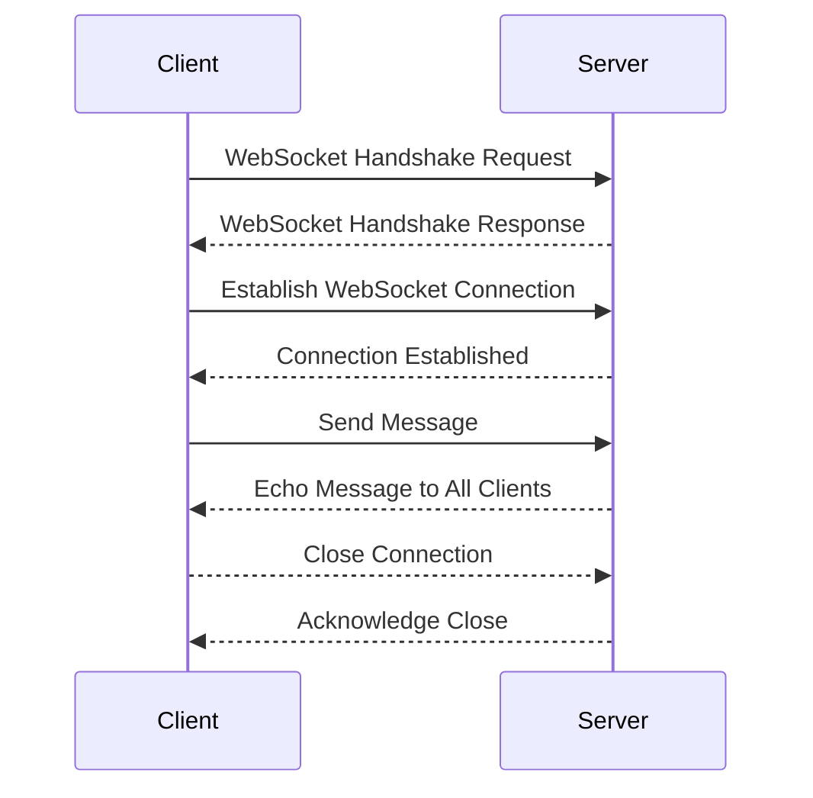

### WebSocket Communication Best Practices in Python

#### Overview
WebSockets provide a full-duplex communication channel over a single TCP connection, making them ideal for real-time applications. Below, we will discuss best practices for implementing WebSocket communication in Python, using practical examples, and addressing potential issues, drawbacks, and advantages. We will also cover scaling, load issues, and security considerations.

### Practical Example: WebSocket Server and Client

#### WebSocket Server (using `websockets` library)
```python
import asyncio
import websockets

# Set to keep track of connected clients
connected_clients = set()

async def handler(websocket, path):
    """
    Handles incoming WebSocket connections.
    """
    # Register client
    connected_clients.add(websocket)
    try:
        async for message in websocket:
            # Echo the received message to all connected clients
            await asyncio.wait([client.send(message) for client in connected_clients])
    except websockets.ConnectionClosed:
        print("Client disconnected")
    finally:
        # Unregister client
        connected_clients.remove(websocket)

async def main():
    """
    Starts the WebSocket server.
    """
    async with websockets.serve(handler, "localhost", 8765):
        await asyncio.Future()  # Run forever

if __name__ == "__main__":
    asyncio.run(main())
```

#### WebSocket Client
```python
import asyncio
import websockets

async def listen():
    """
    Connects to the WebSocket server and listens for messages.
    """
    uri = "ws://localhost:8765"
    async with websockets.connect(uri) as websocket:
        while True:
            message = await websocket.recv()
            print(f"Received message: {message}")

if __name__ == "__main__":
    asyncio.run(listen())
```

### Detailed Explanation of Code

#### Server Code
- **`connected_clients`**: A set to keep track of all connected clients.
- **`handler` function**: 
  - Registers a new client by adding the WebSocket connection to `connected_clients`.
  - Listens for incoming messages from the client using `async for message in websocket`.
  - Broadcasts the received message to all connected clients using `await asyncio.wait([client.send(message) for client in connected_clients])`.
  - Handles client disconnection and removes the client from `connected_clients`.
- **`main` function**: 
  - Starts the WebSocket server on `localhost` at port `8765` using `websockets.serve(handler, "localhost", 8765)`.
  - Keeps the server running indefinitely with `await asyncio.Future()`.

#### Client Code
- **`listen` function**: 
  - Connects to the WebSocket server at `ws://localhost:8765` using `websockets.connect(uri)`.
  - Continuously listens for messages from the server using `await websocket.recv()`.
  - Prints received messages to the console.

### WebSocket Connection Process



### Best Practices

#### 1. **Connection Management**
   - **Keep track of connected clients**: Use a set to manage active connections.
   - **Handle disconnections gracefully**: Ensure clients are removed from the set when they disconnect.

#### 2. **Error Handling**
   - **Catch exceptions**: Use try-except blocks to handle potential errors.
   - **Log errors**: Maintain logs for debugging and monitoring purposes.

#### 3. **Security**
   - **Use SSL/TLS**: Encrypt WebSocket connections to protect data in transit.
   - **Authenticate clients**: Implement authentication mechanisms to ensure only authorized clients can connect.
   - **Validate input**: Sanitize and validate incoming messages to prevent injection attacks.

#### 4. **Performance Optimization**
   - **Broadcast efficiently**: Use `asyncio.wait` to send messages to multiple clients concurrently.
   - **Limit message size**: Set a maximum message size to prevent resource exhaustion.

#### 5. **Scaling**
   - **Horizontal scaling**: Distribute the load across multiple servers using a load balancer.
   - **State management**: Use a distributed state management system (e.g., Redis) to share state across servers.

### Example: Handling Load and Scaling

#### Load Estimation
Assume a server with the following specifications:
- CPU: 4 cores
- RAM: 8 GB
- Network: 1 Gbps

**Metrics:**
- Average message size: 1 KB
- Messages per second per client: 10
- Number of clients: 1000

**Calculations:**
- Total data per second: 1 KB * 10 * 1000 = 10 MB/s
- Network utilization: 10 MB/s / 1 Gbps ≈ 0.01 (1% of network capacity)
- Memory usage: 1000 clients * 1 KB = 1 MB (negligible compared to 8 GB RAM)

#### Scaling Strategy
1. **Load Balancing**: Use a load balancer (e.g., Nginx) to distribute connections across multiple WebSocket servers.
2. **Distributed State Management**: Use Redis to manage connected clients and message broadcasting across servers.
3. **Auto-scaling**: Implement auto-scaling policies to add/remove servers based on load.

### Security and Robustness

#### Methods to Enhance Security
- **SSL/TLS**: Encrypt communication using SSL/TLS.
- **Authentication**: Use token-based authentication (e.g., JWT) to verify clients.
- **Rate Limiting**: Implement rate limiting to prevent abuse.

#### Methods to Enhance Performance
- **Compression**: Use WebSocket compression to reduce message size.
- **Efficient Data Structures**: Use efficient data structures (e.g., sets) for managing connections.
- **Asynchronous I/O**: Leverage asynchronous I/O to handle multiple connections concurrently.


---
---
---
---
### TCP Raw Sockets vs WebSockets

TCP raw sockets and WebSockets serve different purposes and have distinct characteristics. Here's a comparison in tabular form with analogies:

| Aspect | TCP Raw Sockets | WebSockets | Analogy |
|--------|-----------------|------------|---------|
| Protocol | Low-level, general-purpose | High-level, web-specific | TCP: Raw ingredients, WebSocket: Ready-to-eat meal |
| Connection | Persistent, full-duplex | Persistent, full-duplex | Both: Phone call (two-way communication) |
| Overhead | Low | Higher (due to HTTP handshake) | TCP: Light backpack, WebSocket: Backpack with extra pockets |
| Web Compatibility | Not directly compatible | Designed for web, works through firewalls/proxies | TCP: Off-road vehicle, WebSocket: Highway-ready car |
| Data Format | Raw bytes | Text or binary frames | TCP: Blank canvas, WebSocket: Pre-formatted document |
| Handshake | Simple TCP handshake | Complex (HTTP upgrade) | TCP: Quick handshake, WebSocket: Formal introduction |
| API Simplicity | Complex, low-level API | Simple, high-level API | TCP: Manual transmission, WebSocket: Automatic transmission |
| Use Case | General networking, non-web apps | Real-time web applications | TCP: Swiss Army knife, WebSocket: Specialized web tool |

### Need for WebSockets

WebSockets were introduced to address specific limitations of HTTP in web applications:

1. **Real-time Communication**: Unlike HTTP's request-response model, WebSockets allow for true real-time, bidirectional communication.

2. **Reduced Overhead**: After the initial handshake, WebSockets have less overhead compared to repeated HTTP requests.

3. **Web Compatibility**: WebSockets are designed to work well with web infrastructure, including proxies and firewalls.

4. **Standardized Web API**: WebSockets provide a standardized API for web developers, making real-time features easier to implement.

5. **Cross-origin Communication**: WebSockets can easily communicate across different domains, unlike raw TCP sockets.

### Socket.IO

Socket.IO is a library that enables real-time, bidirectional and event-based communication between web clients and servers. It primarily uses WebSocket protocol but can fall back to other methods like long polling when WebSockets are not available.

#### Key features of Socket.IO:
1. **Fallback Support**: Automatically falls back to alternative transport methods if WebSockets are unavailable.
2. **Room and Namespace Support**: Allows grouping connections into rooms and namespaces for targeted messaging.
3. **Reconnection Support**: Automatically handles reconnection if the connection is lost.
4. **Multiplexing**: Can handle multiple "channels" over a single connection.
5. **Cross-browser Compatibility**: Works across various browsers and devices.

### Can Socket.IO be used for IPC between two apps?

While Socket.IO is primarily designed for web applications, it can be adapted for IPC (Inter-Process Communication) between two applications under certain circumstances:

1. **Web-based Applications**: If both apps are web-based or have web interfaces, Socket.IO can be used directly.

2. **Node.js Applications**: For Node.js applications running on the same machine, Socket.IO can be used for IPC.

3. **Hybrid Scenarios**: One app could expose a Socket.IO server, which the other app connects to as a client.

However, for native applications or more efficient IPC on the same machine, there are often better alternatives:

- Unix Domain Sockets
- Named Pipes (on Windows)
- Shared Memory
- Message Queues

These methods are typically more efficient for local IPC than Socket.IO, which is optimized for network communication.


